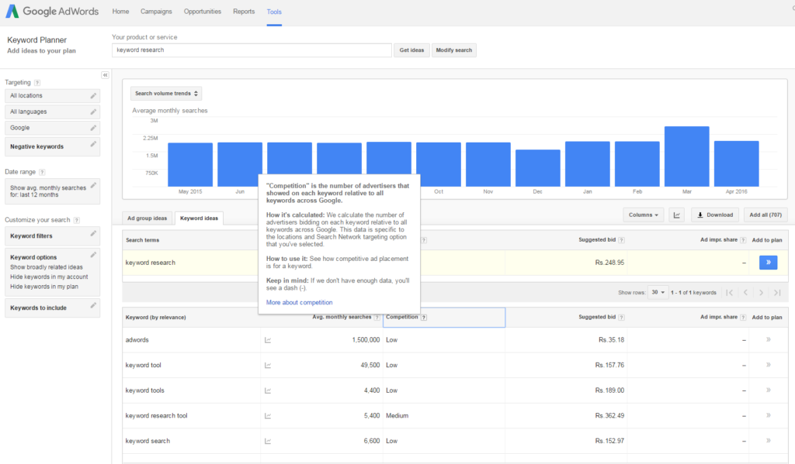

I have been blogging for quite some time now, and there have been times wherein I have written posts without doing any keyword research at all. And there have been times when I kept staring wildly at the Google keyword planner tool to suggest me a good keyword for my article. Though I do not use the AdWords keyword tool extensively, I have made mistakes using it. And anyone who is not doing keyword research at all should start using one of the many keyword tools out there to start reaping the benefits of organic search traffic. And in this post, I will share my experience about the mistake I made while doing keyword research. Though I am going to talk with respect to Google AdWords keyword planner specifically, this implies to all keyword tools out there.

One of the articles on my first blog, Tech4every1, gained thousands of page views. Increasing website traffic is an extreme desire of every blogger, but I never earned a penny from it. The reason for this kept looking me right in the eye, but the quest for driving more and more traffic to the website clouded my vision regarding revenue generation. And not looking for commercial intent while writing posts ended up being the reason for not getting any revenue.

## Commercial Intent, What?

As most of you might already know, the major reason for my blogging at [Wisdom Geek](https://wisdomgeek.com) is that I want to share the knowledge that I have learned. When you think in terms of an advertiser, a post that shares the basics of something, or informational content, has no or little value. For example, if someone is searching online for "how to use keyword tool", he or she is primarily getting started on how to do keyword research. And advertisers are smart enough to know that the person seeing the ads are not looking to buy their product since they are beginners. So only targeting search volume is never going to get you loads of money. And nothing can be worse than ranking for a keyword at #1 and still not earning money from it.

## How should I be using the Google AdWords keyword tool then?

There are two things for you to keep in mind.

**Do not focus your keywords for high search volumes, keep the buying attitude of advertisers in mind as well**: Everyone wants to drive more traffic to their website. But in the long run, monetization is the ultimate goal. More traffic does not necessarily mean more revenue. Finding keywords that have commercial value will increase your revenue, which in turn will keep you motivated to write more. So, start thinking in terms of the buyer's commercial intent and how advertisers are targeting it to sell products.  You have to be smart enough to earn those extra bucks.

For example, someone looking for an informational keyword, say "keyword research" is very less likely to buy some product related to keyword research since they are in the beginner stages of their research, and they are still learning about keyword research. On the other hand, someone looking for "keywords tool planner" knows exactly what they are looking for and thus a funneled target. The advertisers are willing to pay more for such highly targeted customers since they might as well buy their product. So you need to use those keywords from your keyword tools that show business intent amongst the customer. So start focussing on it and reap the benefits by not targeting traffic building keywords only.
**Low keyword competition does not imply low search engine ranking competition:** Novice SEO learners often confuse the competition tab in the keyword planner tool to be the SERP competition. It is not about the competition you will face when you try to rank for a particular keyword.

As you can see in the screenshot above, low keyword competition does not mean easy to rank. So next time you look at the keyword planner, remember that keyword competition and keyword difficulty for ranking in terms of SEO are two different things! No matter which one you use out of the many available keyword tools, this mistake will apply to all of them. And hopefully, after reading this post, you will incorporate this in your SEO strategy.
