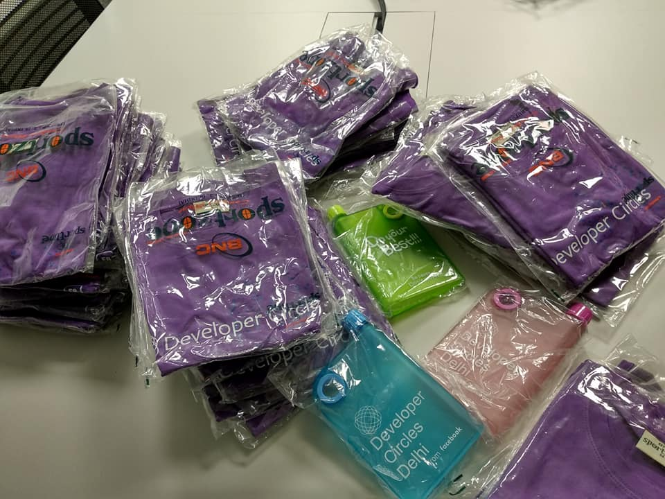
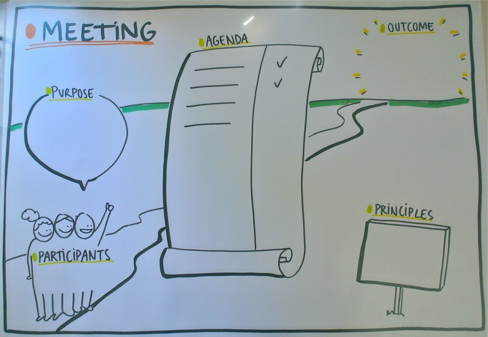

I have already written a detailed post about my [experiences as a community manager](https://www.wisdomgeek.com/community-management/lessons-learnt-from-scaling-facebook-developer-community/) in the past. It was a generic one containing some interesting insights life pro tips as well. However, in trying to make it generic, I omitted some community management tips that I wanted to share.

I intend to cover some of those community management tips in this post. These should help you effectively moderate your community as well as ensure quality engagement.

## 1. More swag does not mean more value

There is often a misconception among a lot of community managers that we should start giving away more swag to members to increase engagement. While giving away swag is an effective way to build engagement, many communities overdo it.

Giveaways and handing out swags in events have become so common that people do not care about the ones that they can get easily. The worth of such swag decreases and the receivers start gifting it to friends and family because there is an abundance of it.

On the other hand, if something is limited in supply, its value automatically increases. That is how the market and our psychology works! If you wish to know more about scarcity principle, you can read it [here](https://en.wikipedia.org/wiki/Scarcity_(social_psychology)).

At Facebook Developer Circle Delhi , we never gave away swag at every event. We limit our swag to speakers and volunteers who helped in organizing the event. This way these people have something exclusive and they are proud of it. It also brings in the additional benefit of motivating people to join the organizing team or become a speaker to get the swag as a prize.

It has really worked well for us as far as I know and I would highly encourage all community managers to limit the swag instead of just giving it to every attendee because they can. Make them work for it!

## 2. Meetings are useless without pre-defined agendas

This is more of a tip for the community management team than about engagement in the general community. We initially had a core team meeting every week to discuss about the community and how we could make it better. But quite a few times, there was nothing to discuss and that made the meetings less lucrative for the core team members to attend.

After seeing the drop in interest of members, I knew that we needed to work on it in order to make it more effective. After much research, I decided to create a dedicated space for the agenda for that week's meeting. I started adding points that needed to be discussed, or others contributed, if they had an idea that needed discussion. If the agenda was empty on the morning of the day the meeting was scheduled for, we canceled it!

Having an agenda beforehand also gave the advantage of people knowing what is going to be discussed. Sometimes with things that required research, core team members did some of that before coming to the meeting.

On a similar note, we also use the same dedicated space to share minutes of the meeting for people who had not been able to attend.

## 3. First come first serve is usually never a good idea for any offline event

When most communities are smaller, they have their events open to everyone. Once they reach a substantial number, they start having the rule of first come first serve for attendees. Though this is a fairly easy way of managing the audience and the turnout, I think it is not the recommended way of doing it.

The reason is that you lose control over the audience quality. Also, you are not sure about how many people will actually turn up since you do not have an idea of the number of people registered.

The first thing to do is have a registration link. Next, you can gate the registrations by mentioning that only people who receive confirmation emails will get entry to the event. Even if you are hosting free events, you can limit the attendees without feeling guilty about it. Just mention in the description that we confirmation emails will be sent later. This gives you the flexibility to set a selection criterion for the attendees.

I usually turn things a notch higher by enabling the waitlist as soon as the event is created. We do not wait for a single entry and turn it on as soon as the event is created. This way everyone explicitly knows that confirmation emails are mandatory. It also allows us to filter the attendees. This is especially useful for events wherein we require the audience to have some pre-requisite knowledge about the topic. It also allows us to have a better idea about the kind of people coming in. We can even prefer regular attendees over people who did not turn up for events in the past.

The analytics and tracking gives us metrics to help reduce the drop off rate as well.

## 4. First followers are crucial for engagement

I have previously written about the [importance of first followers](https://www.wisdomgeek.com/self-help/people/the-first-follower/). The first followers are even more crucial when it comes to communities. Most of the community members shy away from a discussion if there is no comment on it. If you have an organizing team member kick off the discussion, more people join in.

Or if you are the only one talking about things in the community, nobody will take the initiative by themselves to start contributing. Only when they start seeing other people engaging, do people start contributing themselves. This should be one of the few things that you should figure out as part of your community management goals.

## 5. Always try and be proactive instead of being reactive

It is human nature to be reactive by default. We tend to react to things happening around us instead of planning it out. Instead, we should try and document things, create lists to track your tasks, build systems and have things in an organized manner for being productive.

Planning things and making lists sounds like a mundane task. It feels like something that is totally not worth the time and efforts.

But it can go a long way if done right, specially when it comes to community management. Since you have so many moving wheels, keeping a track of everything in your head is never a good idea. Plus it becomes difficult to track and communicate as well. You end up forgetting things or figuring a lot of it at the end moment

 With everything down on paper, you also get clarity about things that are done, in motion, and the ones that need attention.

### Summary

This sums up my post about community management tips for effective moderation. Hope the points added some value to you as a community manager. I also hope that you incorporate some of the strategies in your community management agenda.

If there are some tips that you would like to add, feel free to drop them in the comments section below. If you have any other general question/feedback, feel free to add that as well.
