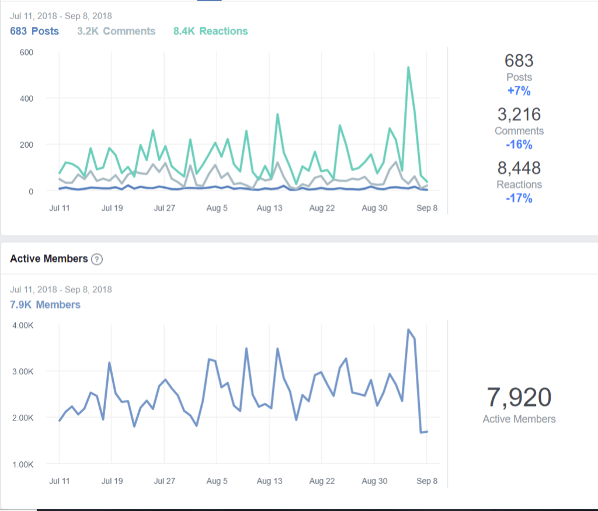
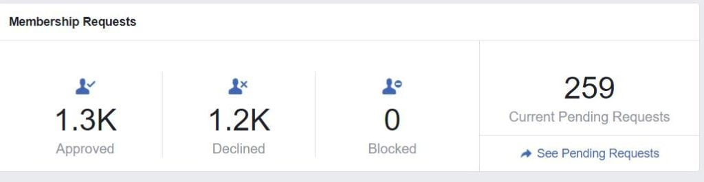
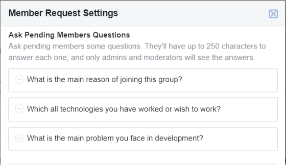
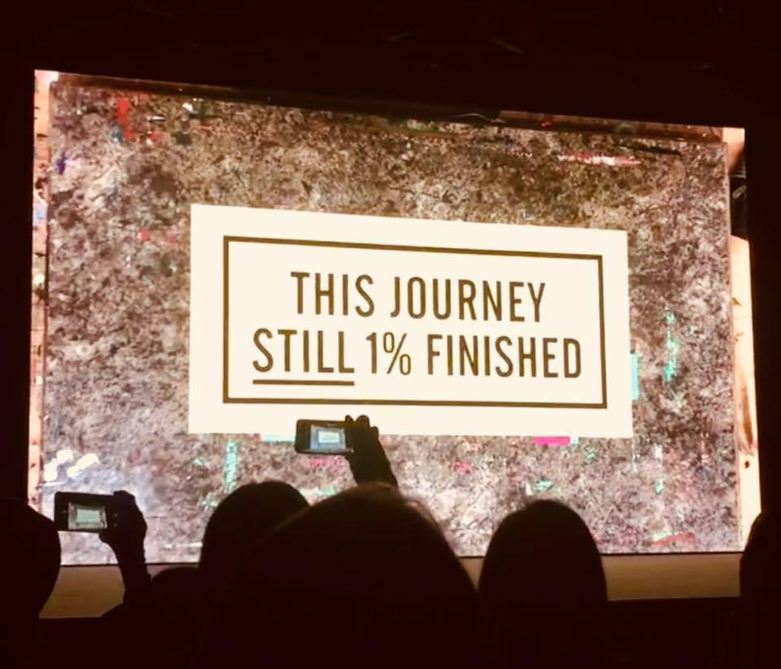

I have been running [Facebook Developer Circle Delhi, NCR](https://www.facebook.com/groups/DevCDelhiNCR/) for the past 2.5 years.

We have 15,000 members in the group as of today.

In this post, I will share all the lessons that I learned along the way. You can use these if you are to build something from scratch or trying to scale one. These can be some excellent life tips as well.

## 1. Both online as well as offline

I had been involved in other communities in the past, but Facebook Developer Circle Delhi, NCR was the first truly online as well as offline community. Other communities that I had managed in the past existed either as discussion forums online, or they were ones which had a bunch of offline meetups regularly.

With the inception of developer circle, we wanted to address both of these. We were a Facebook group, hence it was easy to have people discuss online. And we were anyway organizing events offline.

Having technical discussions in a Facebook group was difficult initially. People did not see Facebook as a platform for having those discussions. But eventually, it did start happening because of the ease of using a Facebook group. Here are some insights about the activity in the group for the past 60 days:

And for the offline piece, we have had around 40 meetups in the past 2.5 years.

## 2. Give without expectations

No community has ever succeeded if the community managers had a personal agenda of their own. The general attitude that prevails for community management is the "**How can I add value?**" nature.  This was already my perception, and after meeting a lot of community managers across the country, I realised it to be an important trait.

It sets you up for success in the long run because you genuinely care about the community and its members. When people know that you do not have any personal agendas, they are more likely to get involved with you and follow the mission statement.

Also, in this respect, I really love the Facebook folks. They did not ask us to limit ourselves to only Facebook technologies. In fact, we never had to market any Facebook technology in the group just because they were supporting us. This is one super cool thing about the program that I really like and have been super happy about.

## 3. Move fast and break things

I think we did justice to this Facebook motto. From the get-go, we started **experimenting** with all the ideas that came to us about the **kind of meetups** we should do, the **experiments to increase engagement** in the community and anything we thought would help the community become more engaging. We did not waste a lot of time in deciding whether the idea was a great one or not. After an initial sanity check, we started working on the execution of it instead of planning everything in depth.

As a result, we have had a variety of events (tech talks, workshops, hackathons, capture the flag, code labs, demo days, hack days, debates etc.) and also some online experiments which have solidified as regular events in the community (more on that later).

Another benefit of experimentation was that we were able to have meetups around all kinds of topics, and hence we became a hardcore development community which had had discussions around all development areas, be it machine learning, blockchain, web development, bots, data visualization, python, vim, AWS, Docker, Android, Go etc.

Instead of spending hours debating a thing, we execute the idea. Failing quickly and failing often allowed us to know what did not work and why.

This allowed us to switch to a mentality wherein we had **no failures, only learnings**. We came up to a solution to a problem we believed existed. If it did not work, we tried a different variation of it to understand it better.

## 4. Let data be the driver

When you start experimenting a lot, you cannot just rely on your gut or perception to figure out the outcomes. Everyone has some biases because of their experiences. The biases can at times make things seem to deviate from what was planned. So, **setting a metric** for analysing the outcome of an experiment helps track success in a better manner.

Treat everything as an experiment, **create a hypothesis, execute and get insights** from the outcomes of the experiment using data.

A sample learning from this was that college students wanted more of workshops instead of gaining exposure to different kinds of talks in the same day since they needed some spoon feeding instead of getting bits and pieces about different things happening in the technological world. Working professionals instead wanted to know about the latter so that they can pick and choose what to learn and then get in-depth knowledge about it from some MOOC course online. We got all of these insights because we had been looking at the data.

## 5. Set up feedback loops

Sometimes data can also point you in the wrong direction, or maybe you were tracking a wrong metric. It is always better to get **feedback from the community at multiple points instead** of doing it all by yourself.

We have polls before meetups in the group asking for topic suggestions for the event or the type of event that we should have next. Sometimes we had multiple speakers on multiple topics, and we asked the community what theme was more suitable for the meetup since we could not have them all. This kept the community involved as well as helped us to get feedback about the kind of sessions that we should be doing.

We even had a post-event survey after every meetup to get feedback from the attendees about the event.

We have also recently started to have a dedicated slot of half an hour towards the end of the event for having meta discussions about the community. The "Community hours" discussions involve talks about the community in general, people wanting to know how to volunteer, or getting some generic feedback about the community. These discussions have the additional benefit of community members networking with one another.

The process has helped a lot in increasing the honest discussions about the community since people know that we genuinely care about feedback.

## 6. Embrace open discussions

We have had discussions out in the open in the group. This helped the community define its shape and future. Although it is very problematic to cater to everyone's opinion, whenever we thought something should be discussed with everyone, we did it.

Community members decided the initial code of conduct for the group. And similarly, there were some challenging discussions for which we wanted the community to determine the next steps. Even though we got a lot of heat for discussing topics like women in tech in the group, we did gain some great insights from people who were genuinely concerned about it.

## 7. Communicating effectively is crucial

Good communication is vital for success is a known fact. Expressing your thoughts effectively within your organizing team is as important as discussing with group members to get feedback.

Sometimes you might assume that something is obvious, but it might not be. While debating about something in our organizing team, I did not point out an obvious solution since I thought there was no need for it. After some time I did, and nobody else had thought about it! The lesson learned here was to always put your thoughts across.

This is also true for assumptions. Many times we assume things and do not speak them out. It can lead to confusions or improper execution of ideas because of gaps. Hence, it is essential to communicate ideas effectively. It is better to inform in advance about things you know are bound to happen. You should also try and keep everyone updated about what you are planning to do.

Setting expectations upfront helps avoid conflicts later. Communicating more often also helps to keep misunderstandings away.

While communicating with the community, you need to** put your thoughts out, ask if that is the consensus, plan an execution, ask again and keep refining**. This gets you in rhythm with members, and you can better manage things avoiding some failures.

## 8. Start with baby steps

Instead of trying to lay down big plans, start small and plan baby steps towards the goal. Instead of trying to scale from the very beginning, focus on the community. Learn from experiences instead of thinking that this will not scale in the future. Once you do those things which cannot scale, you would learn meaningful insights from those experiences. Keeping those insights in mind, you will figure out a solution that can scale.

Also, if you **break down larger tasks in terms of logical steps** to make the task successful, it helps since you are not looking at a huge task which might consume a lot of efforts for completion. Instead, you eye the next logical step that drives the task towards completion. This way, you tend to get towards the ultimate goal by taking baby steps at a time.

## 9. Quality > Quantity

Focussing on quality was something that we had planned for from the beginning itself. It began with keeping a check on the members that were getting added to the group. We carefully vetted the profiles that were requesting permission to be added to the group. We checked if they were developers or at least were beginners and were interested in things related to development. This was a pretty tiring and a thankless task, but eventually, we reaped the benefits.

By filtering the requests initially, we were able to avoid a lot of spam in the group, have meaningful discussions which helped in better engagement in the longer run. Had we not done this filtering, we might have been at 15,000 members, but it would have reduced the quality of posts as well as increased spam posts in the group. This would have hampered the engagement in the longer run.

## 10. Strict moderation keeps things under control

Even though we did filter out a lot of requests, there always are people who spam events they are organizing or have other personal agendas. By proactively moderating all posts in the group, we maintained the quality of discussions in the group. Another achievement was having group members report spam posts within minutes of people posting it. Since there were more relevant posts for group members, they came back to the group more often and did not turn off notifications for the group which brought in more engagement.

## 11. Ruthless consistency

Consistency is something that you keep hearing about a lot, but we had a first-hand experience of why it is critical. Having set the metric of organizing at least one meetup per month, we saw people coming in because they knew that we were here to stay. And the assurance that there will be an offline discussion about some development topic every month provided them with an opportunity to learn consistently. This seems like a small thing, but meeting frequently was crucial for growth as well as engagement. People started meeting every month, and stronger bonds were formed as well.

## 12. Leaders cultivate more leaders with them

Instead of creating followers, leaders tend to create more leaders. An early realisation was that I could not lead the community alone and nor was I willing to have one or two more leads alongside. That did not seem to be a scalable solution. Instead, I decided to form **a team of intrinsically motivated people** who would help me in the journey. Having a group of like-minded individuals around was helpful to keep me motivated as well as get better insights into what can be done better.

We ended up having two groups. One was the core team which was people who were continually helping with organizing events. Apart from the core team, we started creating another group of people called the community influencers. These influencers were people who were active in the group or had been attending meetups. We moved these people to a separate group to get feedback from them, learn about what we can do better and also to get more ideas about things we had not thought of. In return, we gave them access to exclusive events, invited them as speakers for events with limited access, provided them with some personalized swag, and they got early access to some information than the other group members.

Forming a group of leaders is one thing, but letting them experiment freely is also important. Whenever someone suggested an idea, we helped them create an experiment. Allowing people to test their hypothesis was a better way of doing things instead of dictating what would happen.

Also, you have to be patient enough to let people fail and learn from their mistakes. There is always an urge to jump in and fix things. But it is the job of the member to finish the task once it has been delegated to them. This is not an easy process, but one that you must adhere to. If you are to succeed as a community manager, you have to let other people grow as well. And it is an important lesson in your community management journey as well. This also prevents you from burning out by being involved in every aspect of the process.

This ownership gives people the feeling of belongingness, leading to more contributions in the community.

## 13. Disagree and commit

I am blatantly copying this title from Jeff Bezos's speech. When working in a group, there are bound to be conflicts. This principle states that everyone is allowed to have an opinion and disagree while the decision is being made. But once a decision has been made, everyone commits wholly to it.

This has been extremely useful when executing experiments since it does not slow down the decision-making cycle. It has its uses in other scenarios as well. We had some decisions wherein there was no silver bullet about what approach would be better to increase engagement. Many times I did not agree with some posts made by members for the sake of engagement only. After some discussions, even though I disagreed with them in the longer run, I committed to them for the shorter term.

Similarly, I have had some heated discussions with some of our influencers for deleting their posts which I thought were not fit for the group. They were mad at me at times for doing that. But we all were in it for the group and kept participating irrespective of the heated arguments.

## 14. Learn to improvise

As an event organizer, you are bound to see a lot of things happen dynamically while organizing an event.  You need to be on your toes.

Expect anything to go wrong at any point in time. We have had speakers backing out at the very last moment, venues forgetting to arrange some logistics, venues forgetting about the booking for the date and whatnot.

The important thing is not to lose your calm, figure out ways to keep going on and focus on having a successful event.

## 15. Collaborate

Collaboration is another thing which communities should do more of. Joining hands helps reach a wider audience, and we tried doing it as much as we could.

We were even a part of a mega-meetup in which 8 communities were collaborating. It extends the reach for all the collaborators which always helps in diversification and growth.

We also had online collaborations with MOOC sites which gave some great educational content to our community members.

## 16. Automate the repetitive stuff

There always will be things that you would end up repeating after a while. You should start automating those since it does not add any value. Automating does not necessarily mean writing code for doing something. Here are some examples of things we did:

- We set up an introductions post in the group to let people introduce themselves. This proved to be more meaningful than tagging everyone in a new post once they join. Limiting to one post helped to have everyone's introduction in a single post, and also avoid multiple introductory posts. It also gave a central welcome point to people who were new to the community.

- We created a unit for all meta discussions about the group so that people had a central place to go to for all such discussions. The unit was split into multiple posts which included a post about FAQs about the community as well as a post to gather feedback from the community.

We set up a questionnaire of the following 3 questions which anyone requesting the group has to answer:

This allowed us to filter requests faster since we did not have to go through people's profiles anymore to know if they were a developer or not.
- Once we started getting a lot of posts and questions related to courses and similar content, we created a Github repository for it. The community members started curating all such links and resources in the repo. This served as a central place which could be referred to whenever a beginner wanted to know about where to start from.

- Also, after seeing that some students were shy to ask questions publicly, we created a Google form for people to ask questions from the community anonymously. These questions were then posted on a Github repo as issues. Community members answered them as comments on the issue. A moderator marked it as closed when they deemed that a satisfactory answer had been received.

- We also have a checklist of all the things to be done before an event. Since all the points are written down, all we have to do is check those to ensure that everything is in place. It is always better to mark things done on a list instead of forgetting something and repenting it later.

## 17. Let some fires burn

Sometimes you have to be smart about prioritization.

Initially, we were getting a lot of requests from students about having beginner level sessions. This was essentially students asking to be spoonfed with courses. But we were a community, not a coaching institute. And even though this was a repetitive request, we knew that we needed to focus on some intermediate level discussions in the group. Otherwise, we would lose the intermediate and expert level folks in the group because they will not participate in those events and discussions. Being left with college students was not a desirable outcome. We wanted to have a mix of all levels of experience so that everyone could learn from one another.

We deliberately neglected it for a good amount of time.

Once we had a sufficient number of developers with good knowledge, we started having a mix of events to cater to all audiences. Also, the Facebook team began creating and curating content for beginners. These helped the beginners ramp up faster on their own.

## 18. The 2-minute rule

This is something that I picked up from David Allen's Getting Things Done. It has greatly helped me when handling things for the community. It is not related to communities at all, but it's a productivity hack that I love.

According to research, if there is something that we have in a pending state, it occupies some space in our mind. These open loops take a lot of energy since you subconsciously keep thinking about it. So, if there is something that you can **finish in 2 minutes**, then you should **do it instantly** instead of putting it for later. Examples of such tasks could be responding to messages, making a call or shooting an email.

This rule helps in faster execution of things and also frees up your mental space for more important things.

## 19. Don't be afraid of asking for help

When it comes to asking for help from other people, we generally tend to hold ourselves back. It is human nature to do it all alone and not appear vulnerable by asking for help.

But it can do wonders if we just ask people for help.

I have personally experienced some fantastic outcomes when I just went ahead and asked for some help from the people in the community. Sometimes it helped us get connected to a great speaker. Other times we got some great discussions and tips about what can be done. Also, every time we are near a milestone regarding the member count (a multiple of 1000), we ask the community to help us reach there faster. And people helped us in doing that every time!

## 20. Be bold

When asked for feedback about the program, I was brutally honest with it. Many times, when things were not being done as they should have been done ideally, I spoke about it freely encouraging discussions.

One such incident was when we were asked to do something by Facebook employees. My thoughts contradicted with the direction being taken. A developer community is a bit different from other communities and I was sure that this tactic was not the right one. I started an open discussion about it with the people involved in making the decision. A Facebook employee pointed it out to me that this was something that inspired him since not everyone speaks out freely.

Most people keep their opinions to themselves because they fear that conflicting views will make them less likeable. Being bold allows you to put your point across and have discussions around it to get to better things.

## 21. Engagement hacks

We did a lot of experiments to increase engagement in the group. Though I have already mentioned some of them in other points, some did not fit under any. I am sharing those here for people who would be interested:

- We have created yet another feedback loop in the form of a quarterly community hours meetup. This is an extension to the community hours at the end of events. We do an FB live in the group and let people pitch in their suggestions and ideas giving us better insights into what the community wants.

- We have scheduled posts in the group for some days where we discuss specific things. For example, there is a "This week I learned" post every Monday in which the members share what they learned the previous week. Similarly, we have a "Dev Help" post for every Friday wherein people can freely ask questions pertaining to problems that they are stuck in and their peers help them resolve it.

- Apart from this, we have a biweekly discussion in the group on a topic decided upon by the influencers. The topic is posted in advance and there is a discussion about it in a post every alternate Wednesday at 9 PM. Pre-deciding the time and topic lets people know when to come online to learn more about it while participating in the discussion.

- There is a mentorship program running in the group (this is an FB groups feature which is currently in beta testing), and we were one of the first ones to start with it. We began pairing people on the basis of technologies, and the mentors have been guiding the mentees about the relevant topics. Apart from the group's discussions, the one on one mentorship helps bring group members closer. It also adds more value to the community members.

## 22. Document your journey

I had not done this until now, but I realized how important it is to share your experiences with other people. This post is an attempt to do that and also encourage other people to do so.

## 23. User-generated content

This is yet another thing that we had not focused on until now. The members of the community generate a lot of content when sharing posts. So, it only makes sense to give them a **public platform** for doing that. This gives them a **feeling of belongingness** and also allows the curation of content at a central place.

It can be in the form of blog posts (we would be starting a Medium publication for Facebook Developer Circle Delhi soon). It can also be a newsletter or a Facebook page which shares the most engaging posts in the group. Or it can be some other way of recognizing the active members. In our case, since we are a developer community, we can also have the liberty of launching open source projects. We would be starting some in our Github organization soon, and then look for community members to contribute to those.

## 24. Have fun

After the initial enthusiasm dies out, community management can become a thankless and daunting task. To avoid getting into a monotonous routine and making it a daunting task, it is very important to keep having fun. Enjoy the little things along the journey.

One thing that keeps entertaining us is the form we use to filter requests. We always get some hilarious answers to the form. And we keep sharing them in our internal messenger group to have a good laugh. (Someday we might start a meme page for it, who knows!).

The point is: you are around a group of like-minded individuals. Hence you have the best people to enjoy with. **Have a blast** while you can!

## 25. The journey is 1% finished

This is the last quote I will be taking from Facebook's mottos. I came across this quote at F8, and it has been with me since. Even though we have done some incredible work in the past 2.5 years, there is a lot more that can be done. Innovation and creativity have no dead end. **Let us keep moving forward**, bringing the world closer, one step at a time.

Remember, you are empowering people to have meaningful discussions and are making an impact in their life. Keep that thought in your mind and keep going on.
