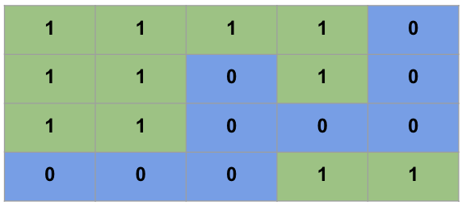

If you are reading this post right now, chances are high that you are not looking for the number of islands in the Pacific Ocean. But you are planning to appear for a programming interview in the future and/or you have appeared for a coding interview in the past.

I have appeared for many such interviews. Many of them went well. Some, not so good. However, all of them contributed to improving in a crucial domain that is necessary for arguably all Software Engineers (if not all Engineers): Problem Solving!

Through this article, I will be sharing my two cents about problem-solving and how to think of an algorithm, and how to optimize it if possible. I will do this by demonstrating how I approach solving [this LeetCode problem](https://leetcode.com/problems/number-of-islands/). If you have not heard about LeetCode before, I highly recommend that you check it out. LeetCode provides an online programming platform with around ~1600 problems covering an exhaustive range of concepts in data structures and algorithms.

## The Number of Islands Problem

The problem that we will be looking at today is titled Number of Islands. It requires us to devise an algorithm that would take in an input 2-D array of dimensions m x n comprising of 0’s and 1’s. In this array, the 0’s represent water, and the 1’s represent land. We need to output the number of islands formed by landmasses (1’s) connected horizontally or vertically.

For instance, if the input is the below array:

**1****1****1****1****0****1****1****0****1****0****1****1****0****0****0****0****0****0****1****1**

then the output of your solution should be 2.

## The Solution

Before solving this problem, let us first visualize the problem statement. Let us paint the 1's with green and 0's with blue:



We can clearly see two distinct green patches that are not connected either horizontally or vertically. Let us take a moment to appreciate how it became so much easier for our brains to see the 2 islands clearly in this colored image as compared to the earlier table with just 0’s and 1’s. In fact, this appreciation for color holds the key to the solution to the above problem. 

Changing the visualization a bit, we will start with a colorless table of 0’s and 1’s, but we will remove the boundaries between adjacent 1’s. This will lead us to a figure like this:


If we were to paint the 1’s in this image so that when we drop the paint, it continues to flow up, down, left, and right until it reaches a boundary. Starting from the top-left cell:


As the paint drips to the horizontal and vertical neighbors, the table will now start being more visual as below.


After some time, the paint will reach all cells reachable from the top-left cell and the table will look like this.


Once our paint cannot flow further because of the borders, we will stop this process and move to the next cell at the location (0, 1). Since this cell has already been painted, we can skip the painting process and proceed further till the point we reach another 1 cell that has not been painted already.

Therefore, in the above example, we will start the painting process for the 2nd time at the location (3, 3).


After completing the second painting process, the final table will look like below:


The painting process that we have been looking at so far is nothing but an example of Breadth-First Search. In this algorithm, we start at some location and continue observing all locations that are immediately reachable from the current location. We continue this traversal until we reach a point where no more locations are reachable.

In the above process, we traversed the table once looking at each cell and initiated a BFS painting whenever we encountered an unpainted cell with the value 1.

## The Code

Let’s translate the above algorithm to C++ code.

```
void paintBFS(vectorvectorchar>>& grid, int i, int j){
    queueint, int>> cellsToPaint;
    cellsToPaint.push({i, j});

    while(!cellsToPaint.empty()){
        pairint, int> currentCell = cellsToPaint.front();
        cellsToPaint.pop();
        int x = currentCell.first;
        int y = currentCell.second;

        // Check if this cell is out of the bounds of the array
        if(x 0 || x >= grid.size() || y 0 || y >= grid[x].size()){
            continue;
        }

        // Do not paint if the cell is 0 or if it has already been painted
        if(grid[x][y] == '0' || grid[x][y] == 'v'){
            continue;
        }

        // Paint the cell (x, y)
        grid[x][y] = 'v';

        // Spread the paint to the neighbors
        cellsToPaint.push({x-1, y}); // Up
        cellsToPaint.push({x+1, y}); // Down
        cellsToPaint.push({x, y-1}); // Left
        cellsToPaint.push({x, y+1}); // Right
    }
}

int numIslands(vectorvectorchar>>& grid) {
    if(grid.empty())
        return 0;

    int numberOfIslands = 0;

    for(int i = 0; i grid.size(); i++){
        for(int j = 0; j grid[i].size(); j++){
            if(grid[i][j] == '1'){
                // Start painting from an unpainted cell
                paintBFS(grid, i, j);
                numberOfIslands++;
            }
        }
    }
    return numberOfIslands;
}
```

## Space and Time Complexity Analysis of Breadth-First Search Solution

The next step would be to analyze the space and time complexity of our solution. Our solution's space complexity will be driven by the queue that we create for driving our BFS. Conventionally, the space complexity for a BFS implementation is O(|V|), where |V| is the number of nodes in the search space that would translate to O(nm) for our problem. However, the above bound is not tight for our example since, at no time will we have all n x m cells in the queue. In fact, at each time, our queue will only have the neighbors of the cells that we had just painted in the previous step and that can be a maximum of min(n,m). Therefore a stricter bound for the space required by our solution would be O(min(n, m)).

Next, we will analyze the time complexity of the algorithm. The time complexity for the Breadth-First Search algorithm is again O(|V|) as before, which translates to O(nm) for our problem. We are invoking the BFS method inside a double for-loop. To the uninitiated, at one glance, the complexity may thus seem O((nm)^2) because of the BFS calls in the nested for-loops. However, if we look carefully, we access each cell to paint it, which only happens once, or to check if it has been visited or not, which also happens a constant number of times.

Therefore the time complexity of our solution is much less. O(nm) to be precise!

So here it is—my take on solving the Number of Islands problem at LeetCode. Do not stop here, though. Solve the problem for yourself and relish the “Accepted” message that you very much deserve. And share this post with other fellow data structure and algorithms enthusiasts to help them better understand this problem! Do drop a comment below if you have any questions.
