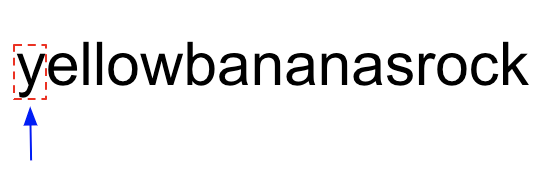
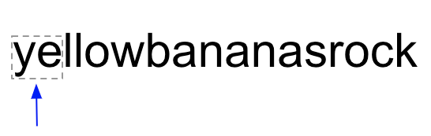
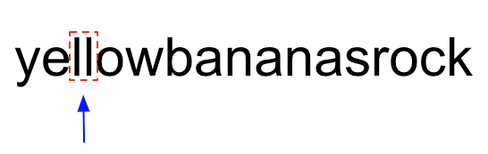
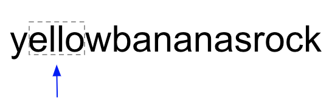

This is the second post in the Demystifying Programming Interview series, which aims at helping students and professionals who are planning to appear for programming interviews. If you are new to this series, you can check out the first post about [the number of islands problem](https://www.wisdomgeek.com/development/algorithms-and-data-structures/demystifying-programming-interview-number-of-islands/). We will solve the Palindromic Substrings problem on [Leetcode](https://leetcode.com/problems/palindromic-substrings/), which asks to count the palindromic substrings in a given input string. While doing that, we will also learn how to optimize the brute force solution to arrive at the optimal one.

## The Palindromic Substrings Problem:

The problem that we will be solving in this post is titled Palindromic Substrings. The objective here is to count how many substrings in an input string are palindromes. As a refresher, a string is a palindrome if it reads the same if spelled backward e.g. *madam* is a palindrome.

## Brute Force Solution to find the Palindromic Substrings:

The brute force solution to The Palindromic Substrings problem is pretty straightforward. We would need to look at all the input string substrings iteratively, and for each substring, we would check if it is a palindrome. For each substring found to be a palindrome, we would increment the count of palindromes by 1 and move on to the next substring. This brute force algorithm terminates once all the substrings of the input string are checked exactly once.

Let us analyze the time complexity of the brute force solution we just went through. This would be a great exercise to do by yourself. Give yourself a minute or two to think about the time complexity and then continue reading further.

Ready?

In the brute force solution, we look at each substring one by one and check if it is a palindrome or not. For an input string of length N, there would be a total of O(N^2) substrings. Checking each substring to see if it’s a palindrome or not would take linear time as we would have to look at each character of the substring exactly once if it is a palindrome. Thus checking each substring takes O(N) time.

Therefore, to check all the substrings and return the total palindromic substrings in the original input string the brute force method would take O(N^3) time.

## Can we do better?

The critical question to ask when trying to optimize any solution is: Are we doing anything extra? Is there something that is not needed? Often, the answer would be a &#8216;Yes'. Arriving at the optimal solution follows naturally if we figure out what extraneous work we are doing in the brute force solution.

For the remainder of this post, we will be using the following string to analyze and solve the palindromic substring problem.


Let us say that the brute force solution is analyzing the substring “nanas” and finding out whether it is a palindrome.


After that, let us analyze the substring formed by including a character on the left and right of “nanas.” The new substring to be analyzed will be “ananasr.” Since “nanas” is at the center of “ananasr” and we know that “nanas” is NOT a palindrome. Therefore we can be certain that “ananasr” is not a palindrome either.

Notice how we eliminated the substring “ananasr” without looking at all of the letters of the substring? We used the fact that “nanas” is not a palindrome which we had established earlier. This suggests that we do not have to perform a check on all the substrings to see if they are palindromes. We can eliminate substrings that have a non-palindromic substring as their center.

## Optimized Solution:

Carrying forward this idea that we just went through, we can modify the brute force solution to eliminate substrings that are not palindromes without even looking at them.

Before doing that, let us first introduce a new term: Pivot.

For the remainder of this post, we will use “Pivot” to denote the center of any string. What is the center of a string? It’s exactly how it sounds: the middle of a string. Or in other words, for a string of odd length, the center will be the character right in the middle. For a string of even length, the center lies between the two characters in the middle. For instance, the pivot (or center) for the string “pivot” is ‘v,’ and the pivot for the string “center” is between ‘n’ and ‘t.’

In our solution to obtain all the substrings, we will look at all the possible pivots of the input string and imagine a sliding window with its center fixed. The left and right edges are free to move by exactly one step at a time.

Now let us look at the string “yellowbananasrock” that we have been using so far to solve the palindromic substrings problem. All the string characters can serve as the pivots for some odd-length substrings of the given string. This string has a length of 17. Therefore, all odd-length substrings of “yellowbananasrock” have their pivots as one of these 17 characters. Similarly, all adjacent pairs of characters can serve as the pivots for some even-length substrings of the given string. If we look at pairs of 2 adjacent characters, we have a total of 16 such pairs (“ye,” “el,” “ll,”… , “ck”). Therefore, all even-length substrings of “yellowbananasrock” have their pivots as one of these 16 character pairs.

Let us look at ‘y’ which is the first pivot of the string “yellowbananasrock”.



The first substring with ‘y’ as its center is “y,” which is also a palindrome trivially as it has a length of 1. The left edge and the window's right edge are both at ‘y’ at the moment. Since the window's left edge is already at the left boundary of the string, we cannot expand this window centered at ‘y’ further even though we can expand on the right side. In other words, we don’t have any other substrings that are centered at ‘y’.

We now move to the next pivot which is “ye”.



The first substring that is centered at the pivot “ye” is “ye” itself. Since ‘y’ is not equal to ‘e,’ “ye” isn’t a palindromic substring. Therefore we will not expand the window pivoted at “ye” to look at the other substrings.

The next pivots that would be analyzed in order by the algorithm would be: &#8216;e', "el", &#8216;l' and so on. We would not be looking at these pivots in this post as they are trivial examples.

Let’s look at a more interesting pivot now: “ll.” Like the previous examples, the first substring pivoted at “ll” is “ll” itself.



Since “ll” is a palindrome, we will try to expand the window towards left and right to obtain the next substring pivoted at “ll.” The next substring, thus obtained, would be “ello.”



Since, ‘e’ is not equal to ‘o’, “ello” is not a palindrome, and we stop expanding the window pivoted at “ll” and move to the next pivot.

Moving on to a more interesting pivot: ‘a’ (index 9). Since “a” itself is a palindrome (trivially), we proceed to expand the window centered at ‘a’. 


As we move the left and right edges of the window, we obtain the substring “nan.” Since the characters at the edges of the window are equal and the substring at the center is also a palindrome, we know that “nan” is also a palindrome.


We can now expand the window further and obtain the new substring: “anana”.


Just like before, both the characters on the boundary of the window are equal. Since the previous substring was a palindrome, we can conclude that “anana” is also a palindrome.

As we expand the window again, we obtain the substring: “bananas”.


‘b’ is not equal to ‘s.’ We know that “bananas” is not a palindrome, and thus we can stop expanding this window further and move to the next pivot.

We keep doing this for all pivots in our given string and end up with an optimized solution.

## The Code:

The above algorithm can be formally represented in the following C++ code:

```
class Solution {
public:
    int countSubstrings(string s) {
        int count = 0;
        int len = s.length();
        // iterate through all pivots
        for(int mid = 0; mid 
            //odd length pal
            //increment the count as a string of length 1 is trivially a palindrome
            count++;
            
            //expand the window
            int i = mid - 1;
            int j = mid + 1;
            while(i >= 0 && j 
                //check the boundary of the window
                if(s[i] == s[j]) {
                    //increment the count of palindromes
                    count++;

                    //expand the window
                    i--;
                    j++;
                } else {
                    break;
                }
            }
            
            //even len pal
            i = mid;
            j = mid + 1;
            while(i >=0 && j 
                //check the boundary of the window
                if(s[i] == s[j]) {
                    //increment the count of palindromes
                    count++;
                    
                    //expand the window
                    i--;
                    j++;
                } else {
                    break;
                }
            }
        }
        return count;
    }
};
```

## Space and Time Complexity Analysis:

In the final algorithm, we look at 2*N – 1 pivots (N pivots for odd-length substrings and N-1 pivots for even-length substrings) that act as centers for possible palindromic substrings. For each center, we expand towards left and right one character at a time and expand the substring till the latest substring is not a palindrome. Therefore, for each pivot point, we look at a maximum of N characters. Thus, in the worst case, our algorithm takes O(N) time for each pivot, and there are O(N) pivots in the input string. Therefore, the worst-case time complexity of our solution is O(N^2).

Since we’re not using any auxiliary space in our solution, our solution's worst-case space complexity is O(1).

So there you have it! This was my solution to the Palindromic Substrings problem. Did you like this solution? Can you think of any other solution to this problem? Let me know in the comments.
