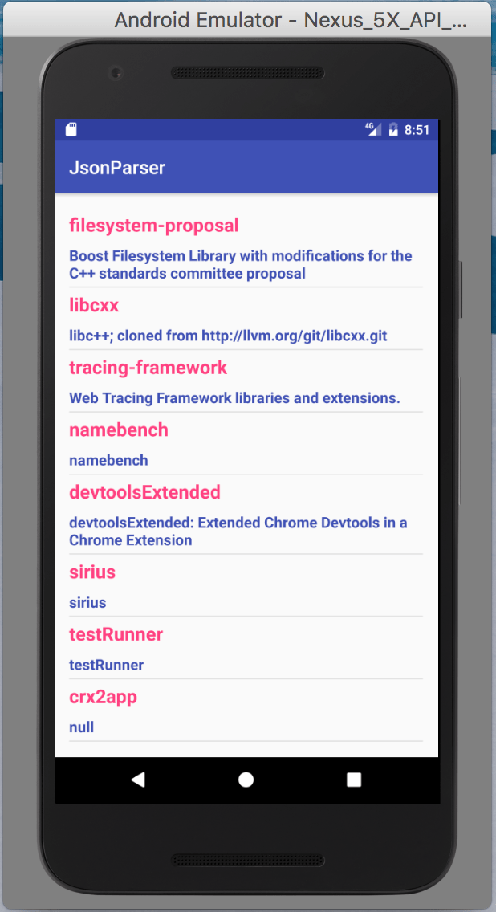

Note: If you are interested in seeing the implementation of this using retrofit, refer to our other post about [Using Retrofit 2 for parsing JSON in Android](https://www.wisdomgeek.com/development/android-development/retrofit-2-parsing-json-android/).

I recently got back to developing native Android applications after a long time and the first task of any large-scale application begins with consuming a web service. Usually, most servers have REST API's, and JSON is the preferred format for exchange of data amongst the server and clients. So I thought about writing a simple sample for people who are just getting started with android development. There are libraries available that will do the network request and JSON parsing in android for you. All you have to do is write a couple of statements. But I will talk about doing so by making use of HttpUrlConnection for making network calls and the built in org.json package for the purposes of parsing JSON in android.

In this post, I am going to create a very simple application, which will fetch all the repositories of Google from their Github URL, and display them in a list view. We would be using Github's rest API for fetching the JSON, and the rest of the parsing would be done without using any library. You can find the completed project on [Github](https://github.com/saranshkataria/JsonParserExample) if you are feeling too lazy to type things. Otherwise, you can follow along if you like learning by writing code yourself.

So after creating a new project in android studio, the first thing that you should do is add the permission for accessing internet in your application. We obviously need this if we have to fetch the JSON from Github's REST API. So we will add the following line in the android manifest file:

```
uses-permission android:name="android.permission.INTERNET" />
```

Also, we will set up a helper class to help us fetch the JSON data from Github's REST API. This class will have a single method which gets the HTTP response from Github, and returns it as a string. You can write all this code in your activity itself, but I like things in separate files. Here is the implementation:

```
HttpHelper httpHelper = new HttpHelper();
String httpResponse = httpHelper.getHttpResponse(url);
ListHashMapString, String>> result = new ArrayList();
if (httpResponse != null && !httpResponse.isEmpty()) {
    try {
        JSONArray repositories = new JSONArray(httpResponse);
        for (int i = 0; i repositories.length(); i++) {
            JSONObject repository = repositories.getJSONObject(i);
            if (repository != null) {
               String name = repository.getString("name");
               String description = repository.getString("description");
               HashMapString, String> repo = new HashMap();
               repo.put("name", name);
               repo.put("description", description);
               result.add(repo);
            }
        }
    } catch (JSONException e) {
        Log.e(TAG, "Json parsing error: " + e.getMessage());
    }
}
return result;

```

This is a very simple method which reads the response from the server and converts it to a string. Next up, we need to create a method that will call this method, parse the JSON that is retrieved and then give the converted JSON as a hashmap back to us. Before doing this, we need to know the URL which would be returning the JSON response, and also the structure of the JSON that it would return. So take a minute to check out the URL: [https://api.github.com/orgs/google/repos](https://api.github.com/orgs/google/repos). As can be seen, it will give us an array of JSON objects which contain information about repositories created by Google. Since it returns an array, we would be using the JSONArray class for parsing it. So this function's implementation will vary according to the type of the response being returned, that is, if it is an object or a collection of objects. But for this example, it will always be an array. And we would need to know the keys of the JSON object that is being retrieved. In our example, we are only concerned about the name and description of the repository. Using this information, we can parse the JSON we received from the previous method into a hashmap of string values using the following function:

```
HttpHelper httpHelper = new HttpHelper();
String httpResponse = httpHelper.getHttpResponse(url);
ListHashMapString, String>> result = new ArrayList();
if (httpResponse != null && !httpResponse.isEmpty()) {
    try {
        JSONArray repositories = new JSONArray(httpResponse);
        for (int i = 0; i repositories.length(); i++) {
            JSONObject repository = repositories.getJSONObject(i);
            String name = repository.getString("name");
            String description = repository.getString("description");
            HashMapString, String> repo = new HashMap();
            repo.put("name", name);
            repo.put("description", description);
            result.add(repo);
        }
    } catch (JSONException e) {
        Log.e(TAG, "Json parsing error: " + e.getMessage());
    }
}
return result;

```

Here HttpHelper is the class we created for getting the server response by making the use of the method named getHttpResponse. This above setup will allow us to achieve parsing of JSON in our android application. The above method would return a hashmap of string values containing the names and descriptions of repositories fetched from the Github URL. And we can then display it or do whatever we intend to do with that. As mentioned before, I have uploaded a sample application which displays this data in a list view on my [Github](https://github.com/saranshkataria/JsonParserExample). You can reference it for more information or if you are stuck.

The program that we wrote above, when hooked into an async task and rendered on a list view, looks like the following:



There are other ways you can do parsing of a JSON in android. Libraries like gson, retrofit, or you can also use jackson's streaming API exist which do the work of parsing JSON strings to POJO's if the keys match the variable names created inside the classes. I can write a detailed post about those as well if needed. Let me know in comments if you want one or if you are facing any issues in the sample written here.
