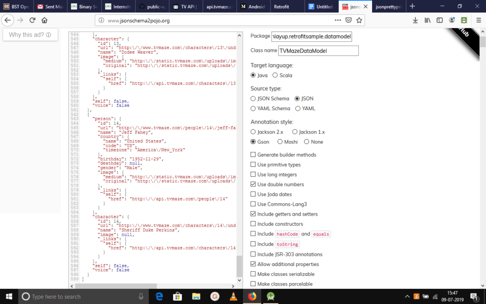
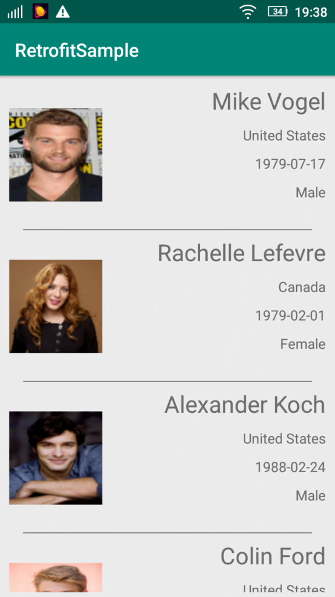

We have previously written about parsing JSON in Android without using any libraries in this [post](https://www.wisdomgeek.com/development/android-development/json-parsing-in-android-tutorial/). In this one, we will use a library (Retrofit) for doing the same.

Retrofit 2 is a HTTP client written in java. It is a type safe library that makes HTTP API calls. You can then convert it into different formats and parse them to java interfaces or classes as neeeded. Type safety means that the conversion happens according to the types that you have specified in the interface and if those do not match, Retrofit does not parse them at all.

We will be using GSON for parsing JSON in our android application. For people who are unaware of GSON, it is a Java serialization/deserialization library to convert Java Objects into JSON and back. The benefit is that you do not need to worry about using a lot of try parse statements to do the parsing of JSON.

For the purpose of this example, we will use the [TV maze API](http://api.tvmaze.com/shows/1/cast) as our backend. The API gives information about TV show's cast and their personal information like Date of Birth, country etc. This is a public API. Hence, there is no need to sign in to get any API key.

### **Adding dependencies**

As with any third party dependency, we will first add Retrofit 2 to our gradle dependencies. So we will add &#8216;com.squareup.retrofit2:retrofit:2.6.0' to our application's build.gradle file.

We will also be using GSON to serialize and de-serialize our JSON object. So we will add &#8216;com.squareup.retrofit2:converter-gson:2.6.0' as well and that will take care of the conversion for us.

### **Creating the data model**

We can write the data model interface manually if we wanted to. But there are always ways to get around from doing the monotonous work. And there is a [website](http://www.jsonschema2pojo.org/) dedicated to doing exactly that. All we have to do is take a sample JSON response from our API, paste it in here and it will take care of the rest. It will generate a data model class for us which we can use in whatever format we want to.

We need to select the appropriate output file properties such as the package name, the class name that we want it to be and other properties in the right sidebar. Also, since we will be using GSON for parsing JSON in our Android application, we need to set the annotation style to GSON too. We will set a few other properties such as the ability to use double numbers, include getters and setters, and allowing additional properties. It would look like the following:



## **Setting up Retrofit**

We will be setting up Retrofit next, and since we are going to invoke the GET method for the cast API, we will create an interface which has an annotation of @GET to the relative path of the URL and a method name which we will use later. It will look like the following:

```
public interface APIInterface {
    @GET("/shows/1/cast")
    Calllist> getHeroList();
}
```

### **Creating a Retrofit Instance and adding GSON**

Next up, we will create a class named ServiceGenerator.java. This will act as our main instance that handles all Retrofit related operations.

We will create a static instance of Retrofit in here and configure it according to our needs. We will add the base URL that this instance will talk to, and also pipe in the GSON converter from the Retrofit GsonConverterFactory to handle the conversions. We will set the base URL in a separate constants file which so that we can easily change it later, if needed.

```
public class ServiceGenerator {
    private static Retrofit retrofit;
    private static Gson gson;

    public static Retrofit getRetrofit() {
        gson = new GsonBuilder()
                   .create();

        if (retrofit == null){
            retrofit = new Retrofit.Builder()
                        .baseUrl(CONSTANTS.BASE_URL)
                        .addConverterFactory(GsonConverterFactory.create())
                        .build();
        }
        return retrofit;
    }
}

```

The Retrofit.Builder() method returns a new instance and then we configure it as mentioned above. We then return the configured object and this will now act as our point of interaction wherever we need it.

### **Adding Network permission**

Since we are going to be making network requests, we will need to add the network request permission in the project manifest file. That is:

```
uses-permission android:name = "android.permission.INTERNET"/>
```

That is all we need to do from a functionality point of view to get things up and running. We will set up the UI now to view the response.

### **Creating the RecyclerView and adding RecyclerAdapter data binding**

We will create a RecyclerAdapter for binding the data fetched from the API and bind it to our RecyclerAdapter. We will create the ViewHolder and add the corresponding XML markup, and set things up to show the actor name, their country and their date of birth.

```
public class RecyclerAdapter extends RecyclerView.Adapter    
{
    private Context context;
    private List tvMazeDataModels;
    private TVMazeDataModel tvMazeDataModel;
    public RecyclerAdapter(Context context, List tvMazeDataModels) {
        this.context = context;
        this.tvMazeDataModels = tvMazeDataModels;
    }

    @NonNull
    @Override
    public ViewHolder onCreateViewHolder(@NonNull ViewGroup viewGroup, int i) {
        View view = LayoutInflater.from(context).inflate(R.layout.list_item,viewGroup,false);
        return new ViewHolder(view);
    }

    @Override
    public void onBindViewHolder(@NonNull ViewHolder viewHolder, int i) {
        tvMazeDataModel = tvMazeDataModels.get(i);
        viewHolder.tv_actorname.setText(tvMazeDataModel.getPerson().getName());    
        viewHolder.tv_actorcountry.setText(tvMazeDataModel.getPerson().getCountry().getName());
        viewHolder.tv_actordateofbirth.setText(tvMazeDataModel.getPerson().getBirthday());
        viewHolder.tv_actorgender.setText(tvMazeDataModel.getPerson().getGender());
        Picasso.with(context)
                .load(tvMazeDataModel.getPerson().getImage().getOriginal())
                .resize(100, 100)
                .into(viewHolder.img_actor);
    }

    @Override
    public int getItemCount() {
        return tvMazeDataModels.size();
    }

    public class ViewHolder extends RecyclerView.ViewHolder{
        private AppCompatImageView img_actor;
        private AppCompatTextView tv_actorname,tv_actorcountry,tv_actordateofbirth,tv_actorgender;
        public ViewHolder(@NonNull View itemView) {
            super(itemView);
            img_actor = (AppCompatImageView) itemView.findViewById(R.id.img_actorimage);
            tv_actorname = (AppCompatTextView)itemView.findViewById(R.id.tv_actorname);
            tv_actorcountry = (AppCompatTextView)itemView.findViewById(R.id.tv_actorcountry);
            tv_actordateofbirth = (AppCompatTextView)itemView.findViewById(R.id.tv_actordob);
            tv_actorgender = (AppCompatTextView)itemView.findViewById(R.id.tv_actorgender);
        }
    }
}

```

This should set up the recycler view for being used and then we do the final setup for connecting it to the API call using Retrofit.

### **Using Retrofit and GSON for parsing JSON in the Android application**

For the final pieces, we will go into our main activity and initialize everything, and connect all of the pieces. We will also set up the interface we created earlier to be invoked and get the API response, and once we get the response, we will enqueue it in the form of a callback and provide it to the Recycler view we created.

```
protected void onCreate(Bundle savedInstanceState) {
        super.onCreate(savedInstanceState);
        setContentView(R.layout.activity_main);
        loadProgress = (ProgressBar) findViewById(R.id.progressBar);
        recyclerView = (RecyclerView)findViewById(R.id.recyclerview);
        linearLayoutManager = new LinearLayoutManager(MainActivity.this);
        linearLayoutManager.setOrientation(LinearLayoutManager.VERTICAL);
        recyclerView.setLayoutManager(linearLayoutManager);
        APIInterface service = ServiceGenerator.getRetrofit().create(APIInterface.class);
        Calllist> call = service.getHeroList();
        call.enqueue(new Callbacklist>() {
            @Override
            public void onResponse(Calllist> call, Responselist> response) {
                loadProgress.setVisibility(View.GONE);
                tvMazeDataModels = response.body();
                recyclerAdapter = new RecyclerAdapter(MainActivity.this,tvMazeDataModels);
                recyclerView.setAdapter(recyclerAdapter);
            }

            @Override
            public void onFailure(Calllist> call, Throwable t) {
                result.setText(t.getMessage());
            }
        });
}
```

And that should set things up and we can now successfully run the application using our android studio project. You can refer to the completed source code [here](https://github.com/AbhiAndroidManiac/RetrofitSample). After running, you will see the application running like the following:



If you have any questions, feel free to leave a comment down below.
