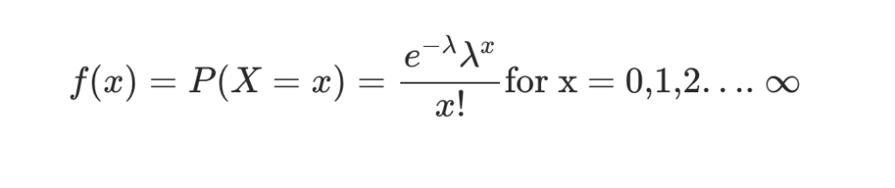
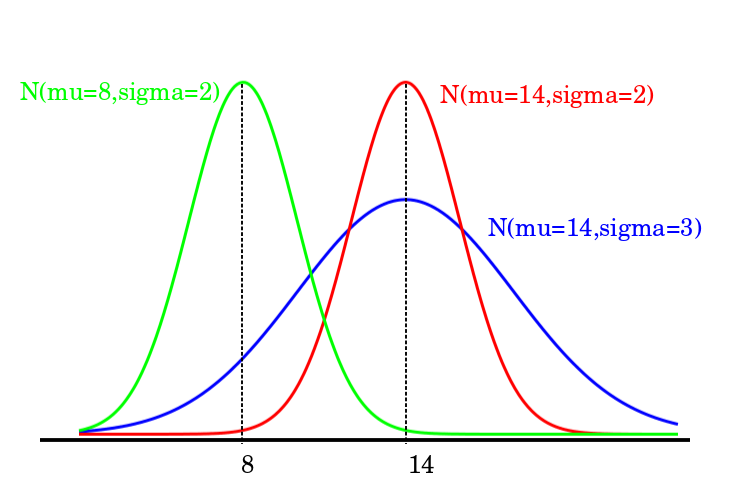
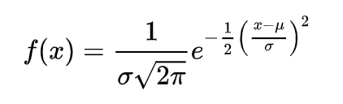

Data distributions lie at the heart of all the machine learning algorithms and data science techniques. A machine learning algorithm is only as good as the data it gets. Hence, it is important to fully understand the data and data distributions before we build our models. Consequently, explore and understand its shape, size, nature, and relevance. Figuring out such details about the data helps us make informed decisions. It can help us figure out which algorithm to use. Which data pre-processing techniques to employ. How is the new data likely to impact the existing one. The list is practically endless. In this article, we will try and understand one such aspect – the shape of the data. 

So, without any further ado, let us begin. 

## Data Distributions

The shape of the data is often analysed by looking at its distribution. Data distributions are a pictorial representation of the data. By looking at the plot, one can estimate its nature. Subsequently, preliminary conclusions can be made. Some of the most commonly known data distributions are –

1. $1
2. $1
3. $1
4. $1
5. $1

Let us understand about each of them in detail. 

## Bernoulli Distribution

Named after Jacob Bernoulli, Bernoulli distribution is a probability distribution to plot discrete data. It works well in scenarios where the output is binary (yes/no, success/failure scenarios). For example – tossing a coin. If &#8216;P' is the probability of getting heads, then &#8216;1-P' will be the probability of getting a tail. Another application can be in the medical domain and clinical trials indicating whether a person has a disease or not.

## Binomial Distribution

This is the generalized form of Bernoulli Distribution. While Bernoulli distribution applies only to events happening only once, binomial extend the same logic to an event happening infinite times. Simply said, it is the probability of success/failure of an event, repeated multiple times. However, it is important to note that each event has to be independent. In other words, the output of one should not impact the output of others. 

One more important thing to note is the fact that the probability of success (or failure) is the same across all the events. Binomial distribution summarises the outcomes over different trials. 

For example, the probability of a political party winning an election is 0.5. However, if we analyse the response from 100 different voters, the summarised results may provide a different picture of which party is likely to win the election.

## Poisson Distribution

The Poisson distribution is a discrete probability distribution. It is useful in situations where discrete events occur in a continuous manner. For example, the number of emails received by an organization in a day. It is used to estimate the probability of occurrence of an event during a given time frame when the average value of that event is known.

It is mathematically denoted by the following formula – 

Poisson Distribution Function

where λ is the average frequency of success in the given time interval.

 A Poisson model has the following properties – 

- The event count must be in whole numbers
- The probability of success of an event is independent of any of its previous occurrence
- The average frequency of successes is known

For example, a business has been selling an average of 500 items in August for the past 5 years. By using this data, a business person can forecast the probability of whether more inventory will be required in the current year.

## Normal Distribution

This kind of data distribution is every data scientists' and statisticians' dream. It is a probability distribution curve that is symmetric about the mean. The values closer to mean implies that they occur more frequently. The values farther off from the mean taper off gradually in both the directions. 

*Normally Distributed Data With Different Means and Standard Deviation*

The probability density function for a normal curve is given by the formula –

Normal Distribution Formula

where **μ** is the mean,  σ is the standard deviation. Normal distribution curve is also known as bell curve. One of the most commonly used empirical rules for a normal distribution is – 

**Mean +- Standard Deviations****Percentage of Data Contained**168%295%399%Empirical Relationship between Standard Deviation and Data Coverage 

## Uniform Distribution

True to its name, uniform data distributions are for the data that are uniform in nature. In other words, when the probability of all the outputs of an event is equally likely, we call that a uniform distribution. For example, the probability of drawing a specific card from a deck of cards. 

Logically, one can infer that uniform distributions are also called rectangular distributions. Uniform distribution has 2 attributes, upper bound &#8216;X' and lower bound &#8216;Y'. Like all probability functions, the area under the curve for uniform distribution is equal to 1.

## The end!

We have reached the end of this article. We hope you liked this article. If you did, do not forget to drop a comment below. Also, do check out our other data science and machine learning articles on [time series analysis](https://www.wisdomgeek.com/development/machine-learning/sarima-forecast-seasonal-data-using-python/), [neural networks](https://www.wisdomgeek.com/development/machine-learning/beginner-guide-to-artificial-neural-networks/) and [much more](https://www.wisdomgeek.com/development/machine-learning/).

Until next time, keep learning!
