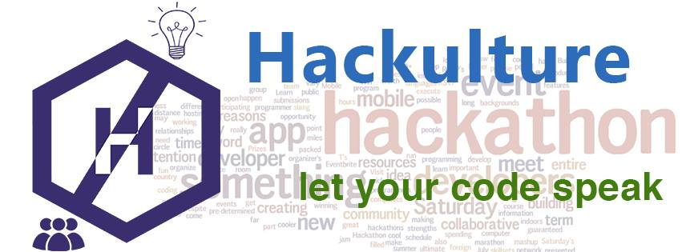

There are times when you have an idea and you go crazy thinking about it, you wish to implement it but you have no clue on how to proceed. Hackulture is one such initiative, which is currently going through the same phase of not knowing how it will get implemented but once it does, it will be a platform for helping others implement their ideas.

Demystifying the saga above, I started working on the concept of creating a community around hackathons which helps novice programmers get together and implement their ideas. For those of you who are unaware about what hackathons are, they are collaborative programming events where people who have some sort of skills in computer programming, graphical designing, interface designing or even hardware development come and sit together for consecutive 24-48 hours of time span with the intentions of converting their ideas into a reality.

The purpose is to get at a common place, network, eat, have fun and get some shit done. You necessarily don't need to be a coder to attend a hackathon. All you need is passion. The benefits of attending a hackathon are way too many and I can only explain a few of them here. For the rest, you actually need to attend one.

- You get an environment of like-minded people who understand the adrenaline rush for building things on their own.

- You get to build a product of your own. This does not necessarily make you an entrepreneur but definitely helps you know how to make things, get feedback on them and iterate. (Even Pinterest was started at a hackathon if you are looking for some motivation!).

- There is a cash prize to be won in the end. Though we believe this should never be the prime motivation for attending, but it still is good motivation for building awesome things.

- You get to know amazing people who you would not have networked with otherwise. You get to share ideas, chat and possibly find people you can work with on your next idea.

- You get to find mentors, learn new things and even implement things, all over a weekend.

- Free food and beverages, there’s always a good supply of those.

- You learn how to make pitches and what to put in your idea deck to impress the judges. That helps a lot in the long run in many phases of life.

- The energy during the duration of hackathon is far more than a normal day and we believe it is an experience which cannot be described in words.

And yes, for those of you who are seasoned hackathon attendees, hackulture is not just another hackathon that will happen over a weekend and end there. We intend to be a community which will continue till our very own existence, and then maybe someone will carry forward the legacy 😉

We are not going to be focused only on a single technology/API, you can use anything you wish to build your ideas. And we will try our best to provide you with mentors on the same. So you get access to mentors and network with people inside the community to eventually showcase your talents and collectively build something you always wanted to.

And if you are still not sure about hackathons, here's one of my favorite TED talks by Dave Fontenot:

And even though I was supposed to go live with a website, a video and some more cool stuff, I couldn't do it. But I am still in the process of implementing it and hope this post gives you an insight into what is coming. The first hackathon will be in August at a weekend. Till then you can join in on the [Facebook group](https://www.facebook.com/groups/hackulture/) to let us know what you think and if you have any ideas on how we can take this further or you wish to be a part of the organizing team!
