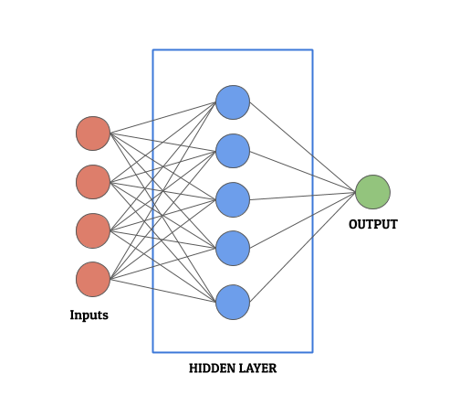
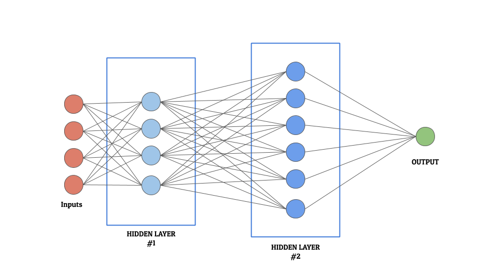
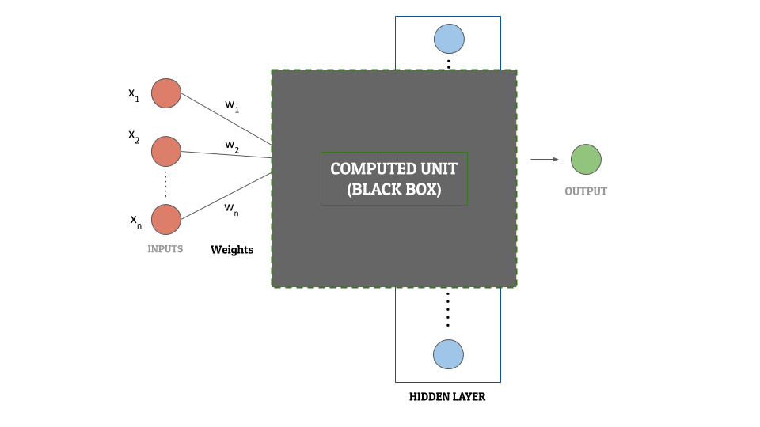
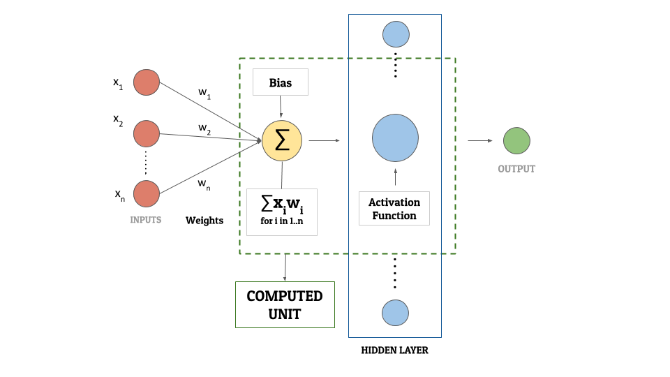

In this article, We would like to talk to you about artificial neural networks. Yes, you read it right. We will try and understand what are artificial neural networks. What are its different types? And finally what type of neural network suits which situation. The idea is simple – I want to explain artificial neural networks in the simplest language possible so that even those who do not have a background in data science and machine learning are able to relate and make sense out of the information. I promise to use as little technical terminology as possible.

**Note **– Throughout this article, we would use ANN and Artificial Neural Networks interchangeably.

So, let us begin.

## What are Artificial Neural Networks?

Artificial neural networks aim to mimic the human brain. They are designed to replicate the human brain’s learning mechanism and give output based on what they have learned from historical data. This is similar to how the human brain draws inferences from past experiences. The unit in the brain processing and relaying the information is called a “*Neuron*”. Each neuron in the brain takes information as input, processes it, and sends the output to the next neuron.

I like to define Artificial Neural Networks as – 

A ***complex arrangement of neurons,*** spread over ***several layers***, to resemble the output to the closest.

### But ANNs have no past. So, how do they learn?

Well, they learn by the training data being fed to them. To draw a parallel, remember when you were a child? How you used to learn about recognizing colors, faces, alphabets, etc. You “trained” your brain to understand that if something has eyes, eyebrows, nose, lips, and ears, it was (most probably) a face. Similarly, we “train” neural networks to understand and recognize patterns to arrive at the output.

*So far so good?*

Next, we will try and understand the general structure of a neural network. Each neural network has the following layers –

1. $1
2. $1
3. $1

                                                               **A Simple Neural Network with 1 hidden layer**

## Basic Functioning of an Artificial Neural Network

### Overview

Neural networks take input through the input layer and pass the data to the next layer, that is, the processing layer. The processing layer performs several mathematical computations. It tries to transform the input into the output based on several parameters. Once we achieve the optimum level of transformation to most resemble the output, we say the neural network is ready. Therefore, it is fair to say that this is the layer that does the heavy lifting in the neural network.

Consequently, for most machine learning experts, optimizing this layer is paramount. It is exactly this layer that defines the complexity, structure, and depth of the neural network. Since this layer is convoluted and complex and can vary in number, it is often called the “**Hidden Layer**”. It can have 1 or more layers of neurons (as shown in the figure below)

Neural Network with 2 Hidden Layers between the input and the output

### Detailed Working

For someone with little/no knowledge of machine learning, this section can be a bit overwhelming. So, for the sake of simplicity, I have divided this section into 2 parts, to address the concept better. Please feel free to explore either one (or both) on the basis of your comfort level and curiosity. Let us begin – 

#### 1. **The Black Box Approach**

Let us consider the hidden layer as a black box. For each input, this black box performs complex mathematical calculations and gives an output. Since it is a black box, we are not concerned about what those mathematical functions are. Or about what actions they are performing. All we care about is – for some input, we have a mathematically computed output. We will call this output a "**computed unit**". Each neuron (aka node) in the hidden layer can be referred to as a computed unit.

To transform the input layer into the output layer using the black box, we need to fine-tune each computed unit. This is essential so that the network is able to perform this transformation with minimum "loss". In other words, we are aiming to get the calculated output values as close as possible to the actual output values. Fine-tuning is essential to increase the accuracy of the neural network. Once the tuning of these parameters of the computed units in the hidden layer is done, we have a neural network ready!

Here is a diagram for you to understand this concept better – 

Artificial Neural Networks – Black Box Concept – Computed Units

The 3 main components of what we called a computed unit before are – 

- Activation Function
- Bias
- Weights

If you plan on skipping the machine learning approach because of all the mathematics, we have explained each of these in a table at the end of that section. Feel free to read and explore more about them there. There is also a diagram following it that shows how these components form the computed unit.

**Note:** This article uses the concept of computed units for understanding purposes only. It does not exist in the real world.

#### 2. **The Machine Learning Approach (Mathematics Alert!)**

Let us get straight to business. There are 3 fundamental components (as mentioned above) to any neural network: Activation Function, Bias, and Weights. We would first explain how they fit into the overall picture. And then we will understand what each of them means. Each neural network works in the following manner –

Assume that there are some **inputs**–

X1, X2, ......, Xn

and some **weights**–

W1, W2, ......, Wn

We first calculate the **weighted sum of the inputs** as-

X1W1 + X2W2 + X3W3 + ..... + XnWn

We add a **bias** term to this weighted input-

X1W1 + X2W2 + X3W3 + ..... + XnWn + **B0**

Finally, this value is used an an input to an **activation function** to get the output-

Activation Function (X1W1 + X2W2 + X3W3 + ..... + XnWn + B0
)

#### *Okay, I get the procedure but what do **weight, bias **and** activation function** mean?*

#### Weight

Weights are the coefficients of the equation which we are trying to resolve. For an analogy, compare them to the coefficients in linear regression. The weights keep changing as the neural network processes the data. As we had mentioned before, they are optimized during the "training" period to minimize the "loss". They represent how important an input value is. Negative weights reduce the value of an output. There are many ways to assign initial weights to a neural network. For the sake of the scope of this article, we will not be covering those ways here. The point to take away from here is –

**Weights are machine-learned values from neural networks.**

#### Activation Function

Activation functions are mathematical equations that determine the output of a neural network. The function is attached to each neuron in the network, and determines whether it should be activated (“fired”) or not, based on whether each neuron’s input is relevant for the model’s prediction or not. Activation functions help normalize the output of each neuron. Each activation function should be computationally efficient because there are a large number of neurons in a network and the function is calculated for each data point. Since neural networks are designed to handle large sets of data, it is important that this processing is fast. Some of the most commonly used activation functions are – 

1. $1
2. $1
3. $1
4. $1
5. $1
6. $1

#### Bias

Bias in neural networks is similar to the constant in a linear function, whereby the line is effectively transposed by the constant value. This is done so that the given model (in this case neural network) fits the data better. For example, consider that the output from an activation function yields output values from &#8216;0' to &#8216;1'. However, the actual output values range from &#8216;4' to &#8216;5'. In such a scenario, we add a bias term of &#8216;4' to the output of the activation function, so that the network is able to produce the output better and thus minimize the loss.

By increasing the bias, we reduce the variance in the system. However, a good model strikes a good balance between the bias and the variance.

Bias is important as it helps avoid both over-fitting and under-fitting problem in machine learning.

Here is an illustrative neural network diagram (*because a picture speaks more than a 1000 words!*)

Artificial neural network showing weights, bias and activation function

#### WEIGHTS, ACTIVATION FUNCTION AND BIAS

ParametersExplanation (Machine Learners)Explanation (Non Machine Learners)**Activation Function**Mathematical equations that determine the output of a neural network. Since they are associated with each neuron, they should be computationally efficient. They help the neural network normalise the output.
Imagine this as a trigger that helps your brain in the decision-making process. For eg, When you see red color, your brain perceives danger. That means the “input” information is being analyzed by the neurons using a “function” that is “activating” the sense of danger inside your brain.**Bias**Analogous to constant in a linear equation, they help shift the activation function to left or right. They help prevent over-fitting and under-fitting of data.Inconsistencies arising because of prejudiced thoughts. For example, algorithms can have built-in biases because they are created by individuals who have conscious or unconscious preferences.**Weights**Weights are the coefficients of the equation which you are trying to resolve. They are machine-learned values from neural networks.
Values that define the relative importance of an input variable with respect to the the output. Usually, larger the number, more is the impact of this value on the output.

## THE END!

Phew, this has been a long article. I hope this article was helpful in understanding neural networks. If you liked the article, do not forget to drop a comment below and show your support. Also, if you have any suggestions, please do let us know. We are always eager for feedback!

Until next time, keep learning!
