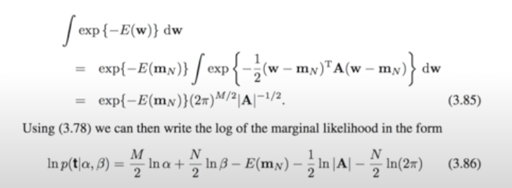

There has been a rapid advancement in technology and machine learning in the past decade. This has been accompanied by accelerated and innovative growth in the field of cloud computing. For example, Google introduced TPUs which are now available through Google Colab. And one can use it to experiment and explore the world of Artificial Intelligence and Machine Learning. With state-of-the-art hardware at one's disposal, model building has become a very easy task. Consequently, these advancements have aided many software developers to get acquainted with the field of machine learning. Having worked in the software industry myself, I personally feel the layers of abstraction that are provided through machine learning libraries make the process of model building very easy, fast, and intuitive. However, there are quite a few machine learning misconceptions that have become popular among software developers.

Note – throughout this article, we will use Machine Learning and ML interchangeably.

## Is model building the same as software development?

A common line of thought is – I am a developer, I write code using Java (or React, iOS, Angular, PHP etc). ML involves coding. Therefore, I can do well if I transition to machine learning and surely my background in development will be beneficial. However, there is a big flaw in this corollary. Let me explain.

## Not all the code is same!

Yes, you read it correctly. If you are a developer, you will be able to appreciate the nuances that each programming language or a framework brings with itself. Likewise, you may need to reconsider the correlation between your background in development with your ability to do well in machine learning. Here are the 2 major machine learning misconceptions that a developer may face while trying to learn it – 

## Pitfall #1 – Think of Machine Learning as algorithmic in nature

That is right. This is the most common machine learning misconception anyone new to this field might have. There is no step-by-step guide to explain how to build a model. It is a very subjective process and involves several checks at different steps. ML models do not produce a meaningful intermediate output. So much so that some ML models act as a black box. You will not be able to understand what is happening behind the curtains. You will only be able to see the output. 

Unlike the traditional development applications which can have a realizable and meaningful output at each step of the process, ML models generally do not yield any output until they are finished executing. Sure, through exploratory data analysis, we can understand the data better. But, that in itself is not sufficient to build a ML model.  

## Pitfall #2 – Machine Learning models do not equal Machine Learning APIs

Making ML models is not equal to implementing ML APIs. This is similar to saying that you know networking because you use the internet.

However, you may say that you need not be an electrical engineer in order to switch on the television. Or a mechanical engineer to drive a car. It is okay to make models using APIs and not know much about its implementation. 

You are absolutely right, but – 

Have a look at a piece of text from one of the best books in machine learning. Its called – "Pattern Recognition and Machine Learning" by Christopher Bishop. 

If you look closely, there are no APIs/code in this. Leave aside this piece of calculation, there is no use of any code in this entire book. And nobody can argue that this book is not about machine learning. Remember, ML is mathematics, APIs are just its abstracted implementation. 

PS: I have made a brief mention about it in my [previous article](https://www.wisdomgeek.com/development/data-science/business-analyst-data-scientist-ecosystem/). Do have a read.

Saying that you know machine learning after implementing APIs alone is similar to saying I know how to build a car because I know how to drive one.

**Opinion** – I am not against the use of APIs/frameworks to implement ML algorithms. The point I am trying to drive over here is that it is not just about them. It goes way beyond it.

### Conclusion

It is important to understand the depth of the field that you are working in instead of just using black box models and claiming proficiency in machine learning. While that is one side of it, it is similar to writing Hello World in a programming language and putting it in your resume as a language that are a master of. Instead, use the API as a starting point and then dive deeper to understand what machine learning really is rather than falling to the hype and have these machine learning misconceptions in your head.
