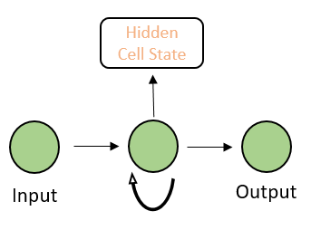
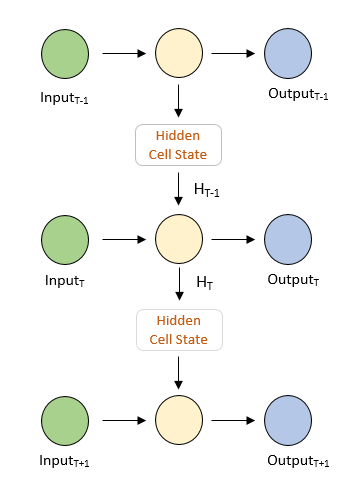
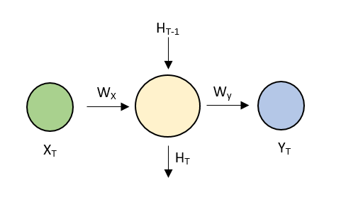

In this article, we will explore recurrent neural networks. For all the readers who are not versed with the concept of neural networks, I will recommend that you go through one of our previous articles and get a basic understanding of [how a neural network works](https://www.wisdomgeek.com/development/machine-learning/beginner-guide-to-artificial-neural-networks/).

**Disclaimer **– The concepts in this article may get confusing. I will try to keep the language as lucid as possible.

## Shortfall of Classic Neural Networks

The input to a basic neural network is often independent of each other. In other words, the input is not a part of a series. For example, consider time series data. The input can have a correlation with the past values at a given lag. In such scenarios, the classic neural networks fail to perform well.

**Why?**

Since it considers each input as an individual value, it does not account for any relationship that may exist between different input values. Additionally, there are separate weights and biases at each layer to do the transformation on the input data. It is this limitation of the classic neural networks that make them unfit for ‘series input data’.

## Enters – Recurrent Neural Network

Recurrent means – occurring repeatedly. Recurrent neural networks or RNNs, accomplishes exactly that. It takes past values into account while calculating the current values. By being cognizant of the past values, it is able to understand and analyze patterns. Since RNNs are able to make decisions based on present as well as past values, they are also said to ‘remember’ from data. Or, they have a memory of their own.

So far so good?

Let us also understand one other nuance of RNNs. Unlike the classic neural networks, which take a fixed-size input to produce a fixed size output, RNNs have the flexibility to accommodate variable-sized input-output scenarios. They take variable sized inputs and thus produce a variable-sized output.

Now that we have a fair bit of idea about RNNs, let us dig a little deep to understand them better.

## Structure of a Recurrent Neural Network

This section of the article assumes that you are familiar with the working of a neural network. However, if you are not, we recommend that you go through one of our previous article on neural networks. In a neural network, nodes in one layer are connected to other layers and their relationship is defined by the "weight" and "bias" for that node. Hence, for different nodes, we have different weights and biases. RNNs operate differently in the sense that these weights and biases are the same for all the nodes. This is called "parameter sharing". 

A basic RNN has the following schema.

Recurrent Neural Network Schema

If we unroll the RNN, it will look something like this – 

Unfolded Recurrent Network

**Side Note** – Almost all the illustrations on the internet have a horizontal view of unfolded RNNs. While trying to understand the concept behind RNNs, I had a tough time visualizing the network in my head. Hence, I made this illustration for the sake of simplicity for all of you. Hope it helps!

One important thing to notice is that each input in the above RNN produces an output. Therefore, it is important to understand that RNNs are of the following types – 

1. $1
2. $1
3. $1
4. $1

## Behind the scenes in a recurrent neural network

By now, we hope that you are familiar with the basic functioning of a recurrent neural networks. Now, let us deep dive into some mathematics behind it. For simplicity, we will consider one node in the neural network. The preceding and following nodes follow the same principle and hence, can be extrapolated.

A single node in a recurrent neural network

Following are the meanings of the notations used above – 

- XT – Input to the neural network at time T
- WX – Weight of the input node
- HT-1 – Previous state
- HT – Current state
- Wy – Weight of the output node
- YT – Output at time T

WX, Wy are shared across the network (part of parameter sharing explained above). Mathematically, they are linked to each other by the following formula – 

**YT = HT x Wy + By **

and

**HT = f(XT x WX + WH x HT-1 + B) **

where **By** and **B **are bias at output and hidden state, **WH** is the weight of the hidden state.

While RNNs are said to perform better than the conventional ARIMA time series models, they too have some limitations. They are computationally slow. Owing to its dependence on the past value, it sometimes has difficulty in accessing from a very old time frame. 

### THE END!

We have reached the end of this article. If you liked the article, do not forget to drop a comment below. Until next time,

Keep Learning!
