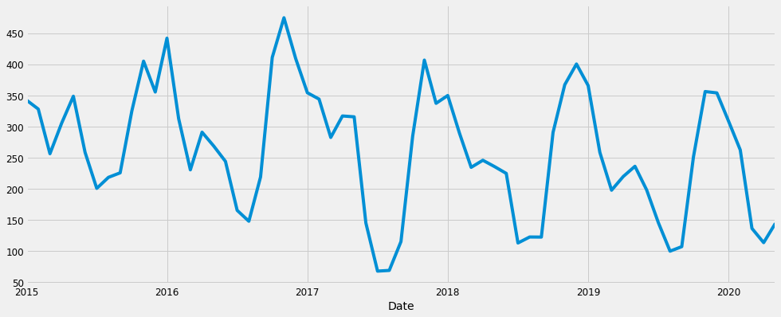
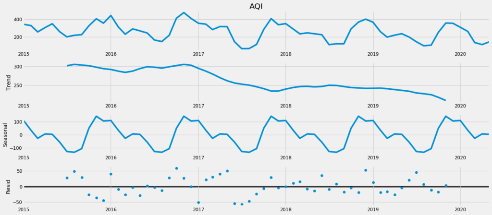
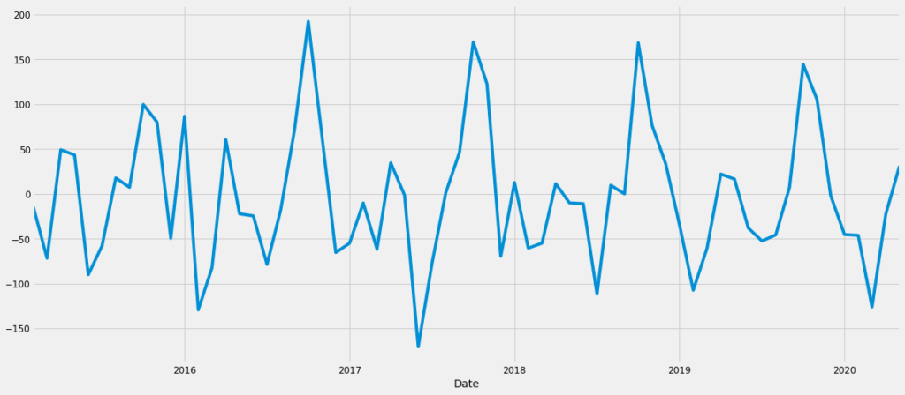
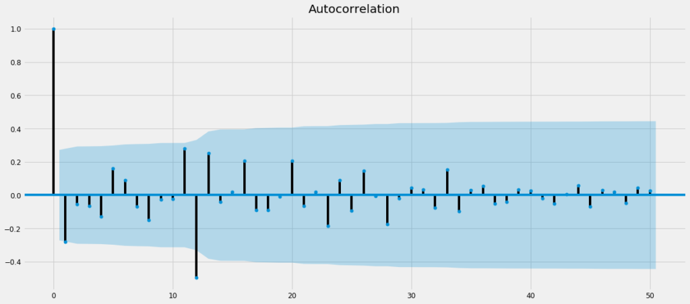
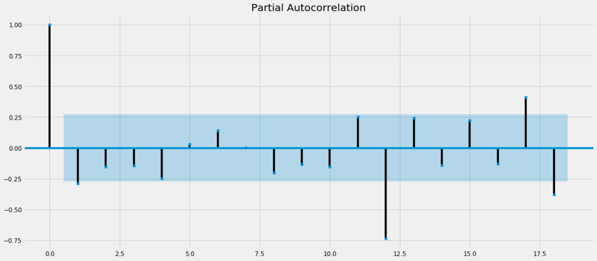
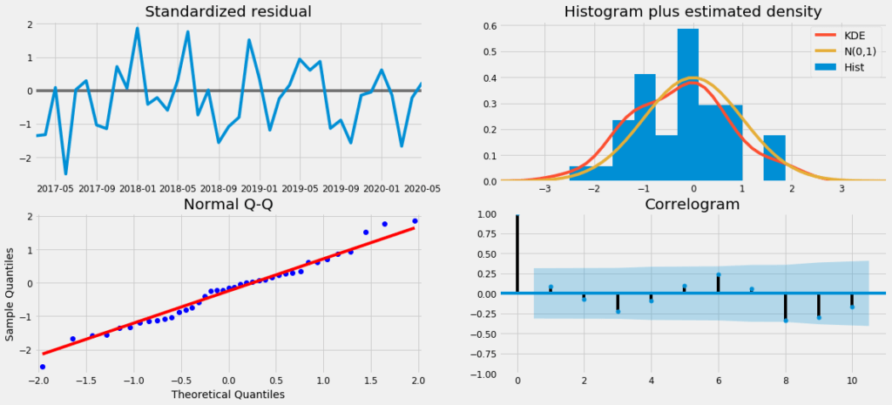
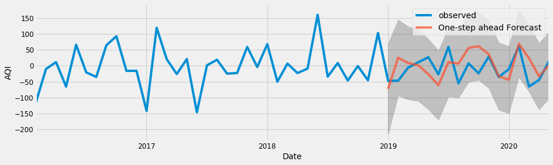

In this article, we explore the world of time series and how to implement the SARIMA model to forecast seasonal data using python. SARIMA is a widely used technique in time series analysis to predict future values based on historical data having a seasonal component. For example, the sales of electronic appliances during the holiday season. The weather forecast over several years. For this article, we will use the AQI dataset of different cities in India available on [Kaggle](https://www.kaggle.com/rohanrao/air-quality-data-in-india), to predict the future AQI levels.

Without further ado, let us begin!

## What is SARIMA?

SARIMA is Seasonal ARIMA, or simply put, ARIMA with a seasonal component. As mentioned above, ARIMA is a statistical analysis model that uses time-series data to either better understand the data set or to predict future trends. It consists of 3 components – 

ComponentExplanation**Autoregressive**A model that uses the dependent relationship between an observation and some number of lagged observations.**Integrated**The use of differencing of raw observations (e.g. subtracting an observation from observation at the previous time step) in order to make the time series stationary.**Moving Average**A model that uses the dependency between an observation and a residual error from a moving average model applied to lagged observations.

It will go beyond the scope of this article to explain each of the above components in detail. However, for all the leaning enthusiasts – please read [**Forecasting: Principles and Practice** by Rob J Hyndman and George Athanasopoulos](https://otexts.com/fpp2/). This book is a one-stop-shop for understanding the concepts of time series in-depth.

## SARIMA Equation

A typical SARIMA model equation looks like the following – 

SARIMA(p,d,q)x(P,D,Q)lag

The parameters for these types of models are as follows:

- ***p*** and seasonal ***P***: indicate the number of AR terms (lags of the **stationary series**)

- ***d*** and seasonal **D**: indicate differencing that must be done to **stationary series**

- ***q*** and seasonal ***Q***: indicate the number of MA terms (lags of the forecast errors)

- **lag**: indicates the seasonal length in the data

#### **Making a Time Series Stationary**

A stationary time series is the one that does not have any trend or seasonality. It is essential to remove any trend or seasonality before modeling the time series data because if the statistical properties do not change over time, it is easier to model the data accurately. One of the popular ways of making the series stationary is **differencing**.

## SARIMA Modeling

Modeling a time series data is a highly subjective and individual process. One may have different parameters for the same time series. Hence, there is no fixed solution. The best solution is the one that successfully fulfills the business requirements. Owing to this level of subjectivity involved, it sometimes gets tough to understand the model building process. 

Several studies, tutorials, and implementations later, I was able to crunch the findings into a framework. This framework helps to understand the model building process in a structured manner. It involves the following steps – 

1. $1

2. $1

3. $1

4. $1

5. $1

6. $1

7. $1

8. $1

**Please note that the above-mentioned list is not exhaustive**. It does not cover all possible scenarios. However, by following these steps, one would be able to build a basic working SARIMA model. The later subjectivity, in terms of finding the ideal parameters, will still remain. 

Now that we have set up the basic context and the framework on which we need to build the model, let us get our hands dirty by doing some coding.

## Implementation

Let us start by importing the required python packages – 

```
import warnings
import itertools
import numpy as np
import matplotlib.pyplot as plt
import pandas as pd
import statsmodels.api as sm
import matplotlib
import pmdarima as pm
```

#### Data Preprocessing

Once we are done importing the packages, we import the AQI dataset from the local machine. Alternatively, the data can be imported using the [Kaggle API](https://www.kaggle.com/docs/api) directly into the project. For the scope of understanding, we will use the AQI data of Delhi to do the analysis.

```
series = pd.read_csv('/Users/pranshu/Documents/Work/Datasets/city_day.csv')
series_delhi = series.loc[series['City'] == 'Delhi']
ts_delhi = series_delhi[['Date','AQI']]
#converting 'Date' column to type 'datetime' so that indexing can happen later
ts_delhi['Date'] = pd.to_datetime(ts_delhi['Date'])
```

After importing the data, we will extract the &#8216;Date' and &#8216;AQI' columns. We then check for empty/NaN fields and remove them. Finally, we index the data frame by &#8216;Date'. (*Index refers to a position within an ordered list. Here is a link to understand the concepts of indexes in python*)

```
ts_delhi.isnull().sum()
ts_delhi = ts_delhi.dropna()
ts_delhi.isnull().sum()

ts_delhi = ts_delhi.set_index('Date')
```

```
Date    0
AQI     0
dtype: int64
```

We then aggregate the data from daily to monthly in order to carry out the analysis (Working with daily data can be cumbersome). Plotting the series should yield the following – 

```
ts_month_avg = ts_delhi['AQI'].resample('MS').mean()
ts_month_avg.plot(figsize = (15, 6))
plt.show()
```

Plot of AQI data from 2015 to 2020

Voila! Our data is ready to be used.

#### Identifying Variance, Trend and Seasonality in the data

As we can see from the plot above, the mean and the variance of the data remains same throughout the data. Hence, there is no need to transform the data. We now proceed to check the trend and seasonal components of the data. Each time series can be decomposed into 3 components – 

- Trend

- Seasonality

- Noise

Let us see our decomposed time series – 

```
from pylab import rcParams
rcParams['figure.figsize'] = 18, 8
decomposition = sm.tsa.seasonal_decompose(ts_month_avg, model='additive')
fig = decomposition.plot()
plt.show()
```

Time series data decomposed into trend, seasonality and residuals

As we can see, there is a downward trend and an annual seasonality (lag = 12) in the data. We can also verify the presence of seasonality by looking at the ACF plot. It shows spikes at lag values 12, 24, 36, and so on. Therefore the series is not stationary. We have to remove it in order to do the analysis. It will be done by **differencing** and verified using statistical tests like ADF (for trend) and OSCB (for seasonality). 

#### Thumb Rule for Statistical Tests – 

**ADF**: if the p-value is less than the critical value, the series is stationary
**OSCB**: if the value is less than 0.64, the series is stationary

```
from statsmodels.tsa.stattools import adfuller

def adf_test(timeseries):
    #Perform Dickey-Fuller test:
    print ('Results of Dickey-Fuller Test:')
    dftest = adfuller(timeseries, autolag='AIC')
    dfoutput = pd.Series(dftest[0:4], index=['Test Statistic','p-value','#Lags Used','Number 
    of Observations Used'])
    for key,value in dftest[4].items():
       dfoutput['Critical Value (%s)'%key] = value
    print (dfoutput)

print(adf_test(ts_month_avg))
```

After running the ADF test on the time series, we obtain the following output. Since the p-value of **0.96** is greater than the critical value of **0.05**, we can statistically confirm that the series is not stationary. Hence, we would do **first-order differencing** for the trend and re-run the ADF test to check for stationarity.

```
Results of Dickey-Fuller Test:
Test Statistic                  0.041809
p-value                         0.961856
#Lags Used                     11.000000
Number of Observations Used    53.000000
Critical Value (1%)            -3.560242
Critical Value (5%)            -2.917850
Critical Value (10%)           -2.596796
dtype: float64
None
```

```
ts_t_adj = ts_month_avg - ts_month_avg.shift(1)
ts_t_adj = ts_t_adj.dropna()
ts_t_adj.plot()

print(adf_test(ts_month_avg))
```

Differenced data to remove trend and seasonality

The trend now seems to have disappeared from the data. Running the ADG test validates the observation. The p-value is less than the critical value of 0.05. Hence we can confirm that the series is now trend stationary. 

```
Results of Dickey-Fuller Test:
Test Statistic                -6.654613e+00
p-value                        5.020683e-09
#Lags Used                     1.000000e+01
Number of Observations Used    5.300000e+01
Critical Value (1%)           -3.560242e+00
Critical Value (5%)           -2.917850e+00
Critical Value (10%)          -2.596796e+00
dtype: float64
None
```

Let us now move onto seasonal differencing. Since the data is showing an annual seasonality, we would perform the differencing at a lag 12, i.e yearly. 

```
ts_s_adj = ts_t_adj - ts_t_adj.shift(12)
ts_s_adj = ts_s_adj.dropna()
ts_s_adj.plot()
```

**Quick Hack – **use the following python functions in the [pmdarima](https://alkaline-ml.com/pmdarima/modules/classes.html#module-pmdarima.arima) package to identify the differencing order for trend and seasonality. These functions perform the statistical tests mentioned above out of the box.

- [ndiffs](https://alkaline-ml.com/pmdarima/modules/generated/pmdarima.arima.ndiffs.html)(time_series) – count differencing order for the trend

- [nsdiffs](https://alkaline-ml.com/pmdarima/modules/generated/pmdarima.arima.nsdiffs.html)(time_series, lag) – count differencing order for seasonality

Alternatively, if nsdiffs() shows &#8216;0' as output and there is a clear seasonal component in the data, use the following code snippet – 

```
Insert Code here

#pitfall 
#takes default_lag_value = 3. Change it to the lag for seasonal component as per the data.
```

Now that the data are stationary, let us proceed to the next step in the process – the ACF and PACF plots.

#### ACF and PACF Plots

By now, we have been able to identify 3 out of 7 components for our SARIMA equation. Those are **trend differencing order(d)**,** seasonal differencing order(D)** and **lag = 12**. Let us now try and figure out the other 4 components, i.e – ***p*** and seasonal ***P***, ***q*** and seasonal ***Q***. In order to figure these out, we would need to plot the ACF and PACF plots.

ACF stands for Auto Correlation Function and PACF stands for Partial Auto Correlation Function.

```
from statsmodels.graphics.tsaplots import plot_acf, plot_pacf
    plot_acf(ts_s_adj)
    matplotlib.pyplot.show()
    plot_pacf(ts_s_adj)
    matplotlib.pyplot.show()
```

The code yeids the following – 

ACF Plot

PACF Plot

We can see that –

- For ACF plot, initial spikes at lag = 1 and seasonal spikes at lag = 12, which means a probable AR order of 1 and seasonal AR order of 1

- For PACF plot, initial spikes at lag = 1 and seasonal spikes at lag = 12, which means a probable MA order of 1 or 2 and seasonal MA order of 1

So, our probable SARIMA model equation can be – 

**SARIMA(1,1,1)x(1,1,1)12**

#### Model Creation

Since we are unsure of the exact model equation, we will perform a grid search with the list of possible values around our estimated parameters. We will then pick the model with the least AIC.

```
p = range(0, 3)
d = range(1,2)
q = range(0, 3)
pdq = list(itertools.product(p, d, q))
seasonal_pdq = [(x[0], x[1], x[2], 12) for x in list(itertools.product(p, d, q))]
print('Examples of parameter combinations for Seasonal ARIMA...')
print('SARIMAX: {} x {}'.format(pdq[1], seasonal_pdq[1]))
print('SARIMAX: {} x {}'.format(pdq[1], seasonal_pdq[2]))
print('SARIMAX: {} x {}'.format(pdq[2], seasonal_pdq[3]))
print('SARIMAX: {} x {}'.format(pdq[2], seasonal_pdq[4]))

for param in pdq:
    for param_seasonal in seasonal_pdq:
        try:
            mod = sm.tsa.statespace.SARIMAX(y,
                                            order=param,
                                            seasonal_order=param_seasonal,
                                            enforce_stationarity=False,
                                            enforce_invertibility=False)
            results = mod.fit()
            print('ARIMA{}x{}12 - AIC:{}'.format(param, param_seasonal, results.aic))
        except:
            continue
```

From the output we can see, the model yields – SARIMA(0, 1, 1)x(2, 1, 0, 12)

#### Running the SARIMA model

Upon obtaining the model orders from the grid search above, we fit a SARIMA model to our data. 

```
Optimization terminated successfully.
         Current function value: 4.299277
         Iterations: 5
         Function evaluations: 301
==============================================================================
                 coef    std err          z      P>|z|      [0.025      0.975]
------------------------------------------------------------------------------
ma.L1         -1.0000      0.424     -2.359      0.018      -1.831      -0.169
ar.S.L12      -1.2291      0.176     -6.991      0.000      -1.574      -0.884
ar.S.L24      -0.6744      0.156     -4.321      0.000      -0.980      -0.369
sigma2      2697.9323      0.000   1.72e+07      0.000    2697.932    2697.933
==============================================================================
```

#### Residual Check

Once we have a fitted model to the data, it is necessary to check the residual plots to verify the validity of the model fit. A good forecasting method will yield residuals with the following properties:

1. $1

2. $1

Residual Plot

As we can see from the image above, the residuals are uncorrelated and have zero mean. Hence we can say the model is fitted well.

#### And the final output

Fitted Model into the data

To evaluate the model performance, we use Root Mean Squared Error (RMSE).

```
y_forecasted = pred.predicted_mean
y_truth = ts_s_adj['2019-01-01':]
mse = ((y_forecasted - y_truth) ** 2).mean()
print('The Mean Squared Error is {}'.format(round(mse, 2)))
print('The Root Mean Squared Error is {}'.format(round(np.sqrt(mse), 2)))
```

Which yields – 

```
The Mean Squared Error is 2083.03
The Root Mean Squared Error is 45.64
```

### Hurray! We have reached the end.

As promised, the complete code can be found at this [github repository](https://github.com/aggpranshu53/SARIMA-in-Python/blob/master/Time%20Series%20Analysis.ipynb).

If this article was helpful, do let us know in the comment section below. Till then, keep learning!
