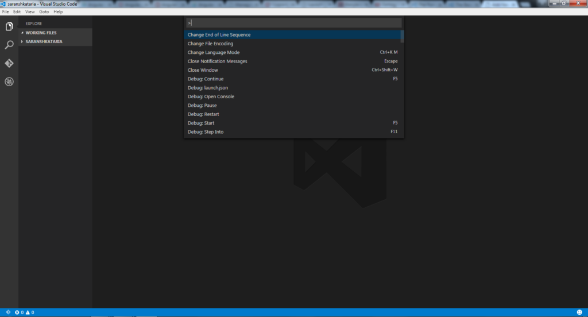

Visual Studio Code is the latest cross platform editor by Microsoft and I started looking into it since I wanted a fast editor which provided me Intellisense similar to what Visual Studio provides. At first I thought it is an IDE, but it is not. It is a code optimized editor, and I am not disappointed at all by its features. To get started, you can download Visual Studio Code from [code.visualstudio.com](https://code.visualstudio.com). You can then explore the editor's various functionalities such as

- Debugging

- Intellisense

- Git integration

- Task runner integration (gulp, grunt etc.)

- Rich refactoring

- Keyboard centered usage

These are a few of the features that made me interested in trying the editor for a hybrid mobile application I intend to build in the near future since I do not need any of the IDE features of Visual Studio which reduce the speed of the development process. In this post, I will write about a few features which I explored about the editor.

## Structure of Projects

If you come from Visual Studio background, and expect a csproj or xproj file which decides how the files load up in the IDE, Visual Studio Code is nothing like it. It is a plain files/folders based editor. You do not need to provide it with a context file to load everything. You can simply load a file or a folder inside the editor. However if you have files like package.json, project.json or bower.json (which are used in npm, ASP.NET MVC 5 or bower), Visual Studio Code provides you with some additional options.

Here's what the editor looks like:

The command palette can be opened using Ctrl + Shift + P and is one of the most used features in case you forget other keyboard shortcuts. The Viewbar on the left has 4 icons.

- The first one allows you to explore files and folders and clicking it while the sidebar is open closes the sidebar.

- The second one is the search button, which allows you to search in all open files. (Replace all is not supported as of now, but the website mentions it is coming soon, which is something I really want on a priority basis).

- The third is git integration.

- The fourth one is the debugger.

The sidebar changes according to what button you click on the left. And the editor is towards the right of the sidebar. The bottom bar is the status bar, which tells the git branch you are using, the number of errors and warnings, line number, file format and language.

The explorer view splits the sidebar into two halves, the working files (which are the files you opened recently) and the working directory you are in.

## Using command line to launch VS Code

When using windows, you really do not feel like using command prompt a lot. And when you have the option to edit with Visual Studio Code in the context menu while right clicking a file, this does not make much sense. But what the command line parameters allow are options to open the editor in a new instance versus opening it in an already running instance. Moreover, it allows you to open a specific file with the cursor at a specific line number and a column number as well. These can be useful at times. The parameters available are:

- "code ." : Opens current folder in code

- "code <path> -r" : Opens in running instance

- "code <path> -n" : Opens in new instance

- "code <path>:<row_number>:<column_number(optional)> -g

## A few useful features of Visual Studio Code

- In the options in the menu bar, under File menu, you have the option to ***auto save*** files if you need so. If you have this unchecked, files with a circle next to them are the unsaved ones.

- In the bottom left, the ***errors and warnings*** are shown. If you click on them, they will open up as a list telling what was expected. This is neat since the editor provides you with common mistakes with respect to programming context. On clicking the error, it takes you to the location where it is.

- In the command palette, colon followed by a number ***highlights the line number ***in the current file and scrolls to it as well.

- You can ***split the editor*** and navigate among the files using Ctrl + number of tab you want to navigate to. Ctrl + 1 navigates to first tab and so on. Three is the maximum limit for side by side editing as of now. You can use Ctrl + \ to split current pane into multiple panes.

- You can also drag the panes to resize them. When you resize one, and then click on another pane, it will ***resize that pane*** to maximum width automatically.

- ***Ctrl + W*** closes the current pane.

- You see different buttons in the top right corner based on the file you have opened. For example there is a preview button for html files which shows how it will look like.

- ***Ctrl + P*** gives you a list of recently viewed files and also it does pattern matching for similar files in the working directory.

- Repetitively pressing Ctrl + P without releasing the Ctrl key allows you to toggle in the list shown and open the previous file that was recently opened.

- If you have references to a file in another file (javascript files in html etc.), you can use ***Ctrl + click*** on it to open the file.

- In the Command Palette, typing a ***question mark*** shows you all commands you can use.

- In command palette, type ***@ followed by symbol name*** (function name or other names inside the file) and those will be highlighted in the current file. Use @: to categorize the results by category, for example, strings and functions would be categorized separately.

- You can install themes, other snippets or more extensions using the command palette as well (Works just like other editors such as sublime etc.) Use the command "***ext install*** " and it will load a list of all available options. One thing that needs a fix here is that this loads a list of all the available extensions, and clicking anywhere else while this is loading cancels the operation. So you need to be patient for it.

If you are using a mac, you need to use the Command key instead of Ctrl. For a list of all the command shortcuts, you can visit the [Code website](https://code.visualstudio.com/docs/customization/keybindings) to get an extensive list.

Do let me know in comments of what you think about the editor and your favorite features of Visual Studio Code!
