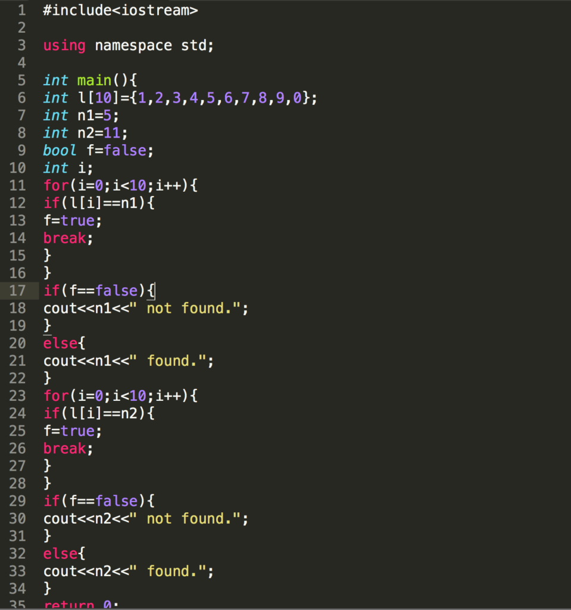
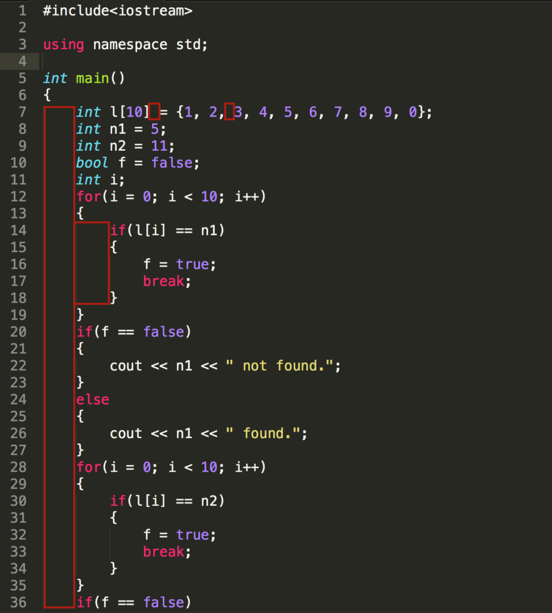
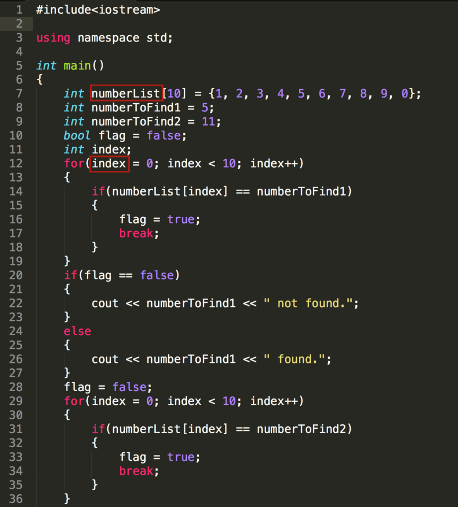
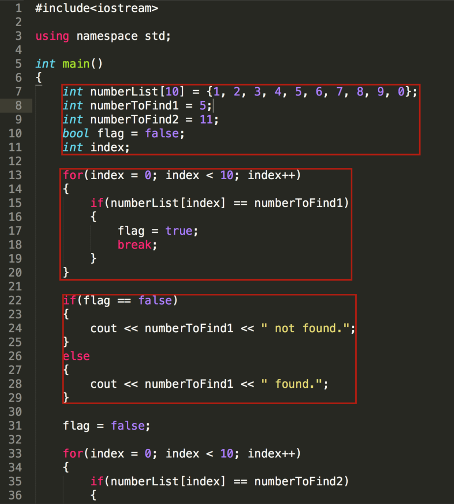
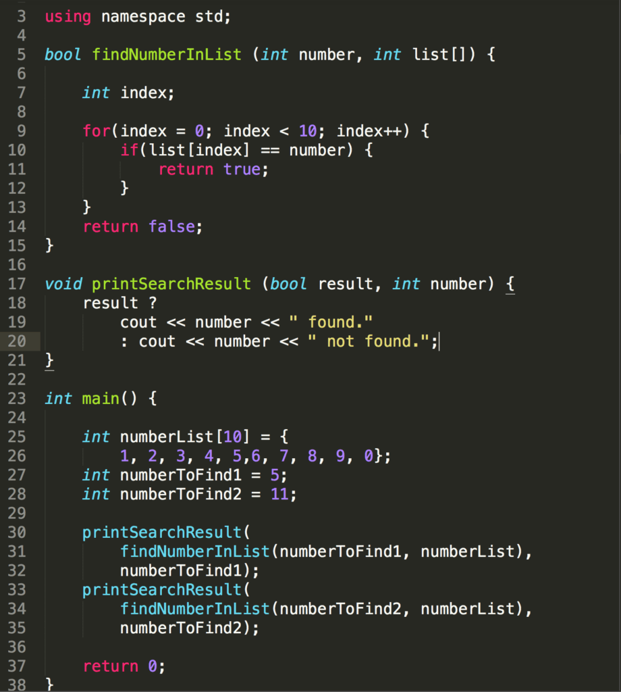

One of the most popular questions from inexperienced programmers is about the quest of becoming a good programmer. Aspiring programmers are often found cutting corners and not following some of the basics of good programming. As my first blog post ever, it would make sense to write about the most basic etiquettes of programming. If an aspiring programmer starts following these, they will find a very clear distinction between good and bad code. And this would help a newbie programmer give their code base a professional look and feeling.

Do note that this post will not cover any design patterns or any of the design paradigms. I am majorly going to talk about code readability.

Let us start by looking at the following example:

Here you can see a simple piece of code which searches for a number in a given list. The above mentioned code will look okay to a fresher, but a good programmer will consider it as poorly written code. Let us try and walk-through some points and apply them to the above-mentioned piece of code to make it look better.

## 1) Spacing and Indentation

I am pretty sure everyone knew that this was coming. This is the first thing that comes to my mind when I think about good/professional code. Code without correct indentation and spacing can never please the eyes of a good programmer. How difficult is it to press those few extra &#8216;spacebars' and &#8216;tabs'? Not much I think. but the result is significantly improved code, visually.

Also do not be afraid to use line breaks where ever you see a line of code extending beyond the editor's screen. For example, if a function takes 10 arguments for some reason (though it should ideally never do so), then it is perfectly all right to insert line breaks after every single or two parameters. Doing so removes the need to scroll right to see the complete code block.

## 2) Descriptive variable/function names or comments

The second most common shortcut that unprofessional programmers practice is using declarations such as &#8216;Class A', &#8216;Int x', &#8216;string s'. This is the next thing that needs to be corrected. Good programmers give proper names to variables, functions, classes, files, and pretty much everything. Name them in a way that it gives intent of what that variable is for and what purpose it is going to solve.

Calling a Class as &#8216;Employee' with data members as &#8216;int Id' and &#8216;string name', gives a lot more context about the usage of the variable. Similarly here, changing &#8216;l' to &#8216;numberList' and &#8216;i' to &#8216;index' does the same thing, increasing readability of the code.

The next approach is a little bit controversial about which one is better and is always debatable.
**Usage of comments in code:** Start commenting your code. This helps others who read your code understand what it intends to do. Although I personally, prefer avoiding comments. I like writing more descriptive variable and function names (trying to keep them short as well). But the primary motive is to make your code more understandable and more readable.

## 3) Naming conventions

Start using camel casing or follow a similar naming convention throughout the code. Also, following the naming conventions of the language you are using should be considered. It will help you write more understandable code. Even if for some reason you decide not to, the least a good programmer should do is have a consistent casing format throughout the project.

For those who do not know, &#8216;Camel Casing' is one of the most popular naming conventions in programming. The first letter of each word, apart from the first, in any name, is capital. So, a function name &#8216;shouldfindthelargeroftwonumbers' becomes &#8216;shouldFindTheLargerOfTwoNumbers' which is relatively easier to read.
Some languages have a slight variation in naming conventions, like C# recommends using the letter &#8216;I' in front of the name of an interface, which many other languages do not follow. Thus, it is always good to know of these naming conventions.

## 4) Group similar parts together

While writing functions, we end up with multiple parts within a function itself. Do not hesitate to use line breaks and group code which is similar in nature. Like grouping all the declarations together and then adding a line break when all the required declarations for the functions are done.

## 5) File arrangement

Managing multiple files becomes a cumbersome task as the code-base grows. Thus, it is remarkably helpful if the files are arranged in a proper manner. This arrangement can vary according to your personal preference. There are no rules (exceptions exist for a few languages).  You can arrange them in folders according to how it pleases you and what you find most relevant.

## 6) Understand the motive of the language

This point might seem like a repetition, and one might think that it is evident because of some of the previous points. But this is also a crucial thing to keep in mind while programming in any programming language. That is why I wanted to make it explicit. Every language is written with some ideas in mind and with the intent of improving some aspects of an already existing language. Thus, it becomes imperative for a good programmer to understand the language before starting to work on it.

## 7) Think like a lazy person

This point is different from the entire list as it is not essentially an etiquette but a particular way of thinking that can do wonders to your programming skills. Something to be clarified beforehand is that I am not asking you to be lazy. Good programmers tend to think like a lazy person and thus &#8216;get the job done' with the least amount of effort required. Again, highlighting the part of getting the job done correctly implies following all the earlier points.

So, how can we achieve that?  By writing code that has the least amount of effort and repetition. A perfect example would be using functions. Stop copy pasting code multiple times in a program. Make a simple function that does the job for you and call it everywhere.

## Other things that you should consider

Apart from the programming tips mentioned above, there are a few things that you should start working on to feel like a professional programmer.

- Start using all your fingers to type on the keyboard and not only a few favorite ones. The keyboard was designed in such a manner that we can work with 8 fingers and 2 thumbs and we should start doing that to maximize the usage.

- Stop using your mouse while you are writing code. Learn the shortcuts of an IDE, editor, anything. This significantly improves your productivity and speed as a programmer.

- Do not hesitate in using any shortcuts or refactoring provided to you by IDEs. The intent is to increase the speed while doing the obvious things. It is never bad to do so take the help of available technology.

I agree that few points in this post are debatable, but I personally believe that following these points will never harm any programmer. And for the relatively newer and aspiring programmers, this will be very useful. These points will help them see a distinction between normal code and the better quality code they write keeping all these points in mind.

And after all the simple efforts, this is the end result:

 Take your pick and let me know if you think I have missed any of the basic tips to become a good programmer and I will add them.
