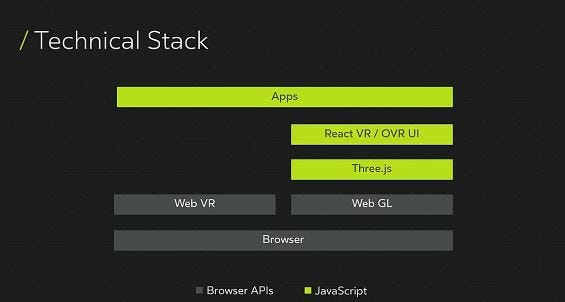

At Oculus Connect 3, [Oculus](https://www.oculus.com/), the virtual reality giant, announced that they are working on something pretty awesome regarding virtual reality! They like to call it as “WebVR” ie. Virtual Reality for the Web! This certainly is something which should excite a virtual reality developer.* *Though it is worth mentioning that this is currently in preview mode and [not many browsers support it](https://github.com/facebookincubator/react-vr#will-my-web-browser-support-my-vr-headset). But it does give us a glimpse of how the APIs would look like down the line. Another interesting thing to note is that these APIs can be seamlessly used with VR devices, and they promise a seamless frame rate of 60 fps on the Web. This could very well be the future of the web, and might also define how we scroll and view immersive content. Both Oculus and Facebook have vested interests in that section.

And now that they have launched a React VR pre-Release, all the Javascript developers are going nuts! First client-side, then node.js, then Cordova, React, React-Native…. and now one can build Virtual Reality apps and games using Javascript. Such a crazy Javascript dominated world we are living in.

Technical Stack of ReactVR

ReactVR stands on the shoulders of the best JS libraries for 3D rendering and it has been optimised for hardware usage. These can be utilised to very easily develop virtual reality games and applications.

“It [ReactVR] combines the clarity of components together with code that controls them” -Michael Antonov — Chief Software Architect @ Oculus

This WebVR project (codenamed “Carmel”) will be available from 13th Dec 2016 for trial. Oculus’ [blog posts explain the getting started](https://developer.oculus.com/blog/introducing-the-react-vr-pre-release/) process for a developer. Just like [Facebook’s React framework](https://facebook.github.io/react/), Oculus provides a bunch of components to plug and play. These components are very customizable and [well documented](https://facebookincubator.github.io/react-vr/docs/getting-started.html). It is also worth noting that Oculus has not open-sourced the project for contributions. And there seems no news of that happening in the near future either. They do have an issues-only [Github repository](https://github.com/facebookincubator/react-vr/issues).

Microsoft has also been venturing the domains of augmented reality with *["Mixed](https://www.youtube.com/watch?v=_xpI0JosYUk)*[ Reality"](https://www.youtube.com/watch?v=_xpI0JosYUk) and HoloLens*. *It seems that every major company is trying to "bring the (virtual) world closer" and the future of the web is clearly not restricted to laptops and mobiles.

Here is the stream of the event if you are interested:

 

I recommend everyone to try out the preview and play around with it to build something cool! Do let us know about what you would be building with it.
