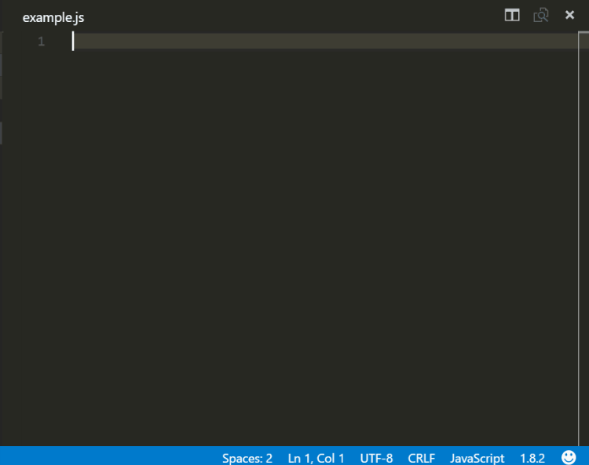

As developers, we always want to be more productive. And who does not like to write more code using a lesser number of keystrokes? Code snippets provide is with exactly that. Let us dive deeper into Visual Studio Code snippets in detail in this post.

Code snippets refer to common functions, or file structures or templates that are great for rote work and boilerplate stuff. It is not something new. Traditionally, we used to store them in a file, and manually copy-pasted them wherever they were needed.

Some of you might be shaking your heads about having a file to copy-paste from. We are modern programmers. We use Google and Stack Overflow for those things! And I would not argue with that either. But code snippets do not refer to just the one-liners that we copy from Stack Overflow (okay, we might copy a lot more than that, but shhh!). But when I refer to snippets, I am generally referring to relatively larger pieces of code.

The next step in that evolution was Auto Hot Keys, which were keyboard combinations that allowed pasting in specific snippets into the editor. But we can always take it a notch higher?

## Visual Studio Code snippets



Visual Studio Code snippets go a bit further than just pasting the code at the current pointer location. Before talking about the fancy stuff, let us first see how to create a Visual Studio Code snippet.

## Creating a snippet

Pressing Ctrl (or Cmd) + Shift + P on the keyboard opens the command palette in VS Code. We can then search for the "Configure User Snippets" option. And it allows us to choose the language we want to create the snippet for. For our example, we will choose JavaScript.

The snippet editor that opens shows a comment telling us how to create a Visual Studio Code snippet on our own. Snippet files are JSON files, and a user can define an unlimited number of custom Visual Studio Code snippets. They support C-style code comments if we want to add some.

A snippet has 4 parts:

- **Name:** What IntelliSense will display for this snippet (also the key for the JSON object)

- **Prefix:** The character combination that triggers the snippet

- **Body:** The content to be copied over

- **Description:** An optional description of the snippet (displayed in the tooltip of Intellisense)

Starting with our very own "Hello World" snippet:

```
{
  "hello world": {
    "prefix": "hello",
    "body": "Hello World"
  }
}
```

The above snippet will spin out a hello world statement whenever we invoke it. The body can also be an array of strings so that we can split it into multiple lines.

## Ways to invoke a code snippet

1. $1

2. $1

3. $1

```
[
    {
        "key": "ctrl+k 1",
        "command": "editor.action.insertSnippet",
        "when": "editorTextFocus",
        "args": {
            "langId": "javascript",
            "name": "hello"
        }
    }
]
```

But what good is a simple Hello World snippet? There is more to Visual Studio code snippets than that! Let us dive into it.

##  Addin variables to code snippets

We can use values such as selected text, system dates, clipboard content, environment variables, and so on and so forth. Let us put our hello world string in a comment block.

```
{
  "hello world": {
    "prefix": "hello-world",
    "body": "$BLOCK_COMMENT_START Hello World $BLOCK_COMMENT_END"
  }
}
```

The above snippet will insert the string `/* Hello World */` in JavaScript files. But in HTML files, it will insert: `<!-- Hello World -->`

Similarly, we can use TM_SELECTED_TEXT for inserting currently selected text, CLIPBOARD for copying clipboard, CURRENT_YEAR for the current year, and similar variables.

## Dynamic snippets using Tab stops

We do not just copy-paste things off the internet. We change a few things in it too, right?

We name the variables the way we like them.

Visual Studio Code snippets allow us to have different kinds of dynamic snippets that can make it feel like a wizard-like experience. We can have:

### **Tab stops**

We can have numbered stops that we can circle through in order by using the tab key. They are specified by a dollar sign followed by the order in which we want to circle them through. These can be declared using `$1`, `$2` etc.

`$0` is the final cursor position. If specified, VS code exits out of snippet mode on reaching this position.

```
{
    "Hello variable": {
        prefix: "div",
        body: ["Hello ","$1", "$0"]
    }
}
```

### **Placeholders**

A tab stop with a default value that is overwritable on focus. They are written as a dollar sign followed by curly braces which contain the position and the value separated by a colon.

Example declaration: `${1:default}`

### **Choices**

It presents a choice to the user. A dropdown of values is presented to choose from when focused on these. Example declaration: `${1|one,two,three|}`

```
"Console Choice": {
    "prefix": "console-ch",
    "body": "console.${1|log,warning,error|}('$2');",
}
```

### **Mirrored Tab Stops**

The same tab stop can be used at multiple locations inside the snippet. Yes, the "i" variable in a for loop is the perfect example for this. Any edit to one of these stops will update them all.

Example: `import ${2:${1:module}} from '${1:module}'$0`

Or our favorite for loop can be written as: ("\t" has been added for formatting and indentation purposes).

```
"for ": {
    "prefix": "forarr",
    "body": [
        "for (let ${index} = 0; ${index} ,
        "\tconst ${element} = ${array}[${index}];",
        "\t$0",
        "}"
    ],
},
```

## Applying transformations

We can even apply regex transformations to a variable or placeholder. The format is:

```
${variable or placeholder/regex/replacement string/flags}
```

If you are aware of regex, this might be easy to understand. 

For example:

```
${CLIPBOARD/(.*)/${1:/upcase}/}
```

The above snippet would paste in the clipboard's contents in upper case.

## Conclusion

Now that we know what all is possible, we might want to make loads of the snippets. There is a [tool ](https://snippet-generator.app/)that can help us. Snippet Generator is a site that allows us to do so using a visual interface. Or we can search for the VS Code marketplace for snippets. There are thousands of them out there. My favorite one is the [ESES7 React/Redux/GraphQL/React-Native snippets](https://marketplace.visualstudio.com/items?itemName=dsznajder.es7-react-js-snippets).

And that is all there is to Visual Studio Code snippets! With a little amount of configuration, we can make VS Code even more powerful and adapt it according to our workflow. Do let us know in the comments below which custom code snippets you will create?
