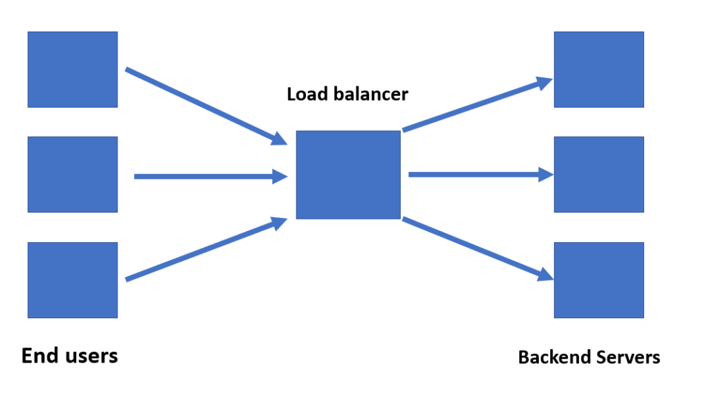
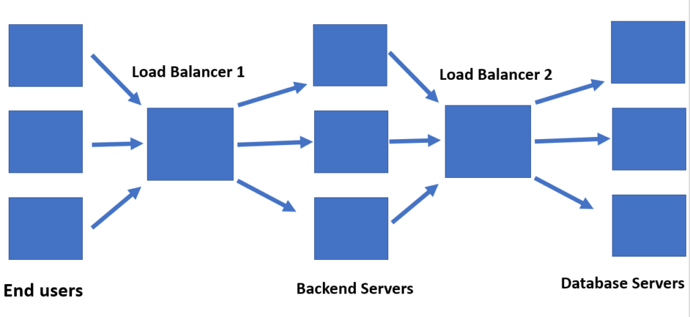

As our application scales to multiple users, we need to start thinking about scaling our servers and applications with it. Load balancing is the activity of effectively distributing traffic load across multiple servers.

This is how we achieve highly available applications that help us achieve scaling effectively.

## What is load-balancing?

Since nobody can afford a web server overload, we scale out our backend servers to multiple machines. The aim is to have a distributed architecture and to avoid having all users connecting to a single server and choke it up. Therefore we distribute the incoming traffic by making use of a load balancer.

The load balancer thus becomes a key component in our architecture, diverting traffic based on different techniques that we will discuss later in this post. Its main responsibility is to avoid convergence of traffic and thus avoiding choking of the system.

Load balancers thus become the first point of contact for the client requests.

There can be multiple load balancers in a system as well. One each for various tiers of the application. This would help handle the separate application tiers more effectively and also scale them independently if needed.

It is also important to mention that when a load balancer redirects to a particular location, it might not hit an application server. It might hit another load balancer that is implemented at a location-based cluster in a data center if we were scaling globally.

**Note: **If a server goes down, the load balancer also ensures that no traffic is directed to that server until it is back up and running. This is done by performing health checks that ensure the load balancer is only sending traffic to servers that are online.

But how do we decide which machine the user will land upon? 

## Types of load balancing

There are three types of load balancing:

1. $1
2. $1
3. $1

As with everything, there are pros and cons to either of the approaches. Let us discuss them in detail.

## DNS load balancing

DNS load balancing is the most commonly used technique for load balancing. Instead of having dedicated hardware for resolving which server to redirect to, a nameserver is responsible for managing traffic.

The nameserver has a list of IP addresses that correspond to the various servers that can be routed to. Every time someone queries for a particular domain, the nameserver returns this list of IP addresses and changes the order of the addresses. The reordering is done in a round-robin fashion. Thus, every new request is routed to a different machine in a round-robin order And the load gets distributed among different servers.

The reason a list of IP addresses is returned and not a single IP address is to have a failover strategy. If the first IP address does not respond in a stipulated amount of time, the client can call the next IP address in the list.

Though this is a popular strategy, it has its limitations too. What the strategy does not factor in is the existing load on the server, the processing time of the server, their online status, etc.

Another limitation of this technique is that IP addresses are cached on the client machine's DNS resolver. This can be mitigated by setting a low TTL (time to live, or how long to store the mapping for). But it is a tradeoff since longer TTL means clients do not know about changes and shorter TTL may improve accuracy but increases DNS processing and DNS caching was implemented to mitigate that in the first place. Also, the client might choose to disregard your TTL value altogether. So it is not guaranteed.

Another limitation is of possibly routing to a machine that is not functional will exist. Though most cloud services these days do provide health checks along with DNS balancing these days, but it might not be true for all services.

The most common use case for this type of load balancing is for distributing traffic across multiple data centers, possibly in different regions. It is also preferred by companies because it is a cost-effective solution and easy to deploy.

## Hardware-based load balancing

As the name suggests, we use physical appliances as a load balancer. They sit in front of the application servers and handle the distribution of traffic.

These are highly performant pieces of hardware that factor in the number of open connections, how much compute is being utilized and several other parameters to decide where to route the traffic to.

Having dedicated hardware to take care of load balancing is highly performant. It also is efficient since a dedicated machine is responsible for evaluating load distribution. The throughput is fast because of the specialized processors. It also provides the benefit of increased security since physical access to the hardware can be limited by the organization.

But hardware is expensive to purchase, to set up and it requires maintenance and regular updates. It can also require network specialists since it can be a lot of work to do for a developer.

Another disadvantage is that we have to factor in the scenarios where there is extreme peak traffic and plan for purchasing hardware accordingly. This is not the case for software-based load balancers.

## Software-based load balancing

Software-based load balancing is the process of installing load balancing software on cost-effective hardware and VMs. They are cheaper and provide more flexibility than the hardware ones. They can also be provisioned and upgraded easily.

The major benefit of software-based load balancers over DNS load balancers is the flexibility and the advanced configuration options. We can configure load balancing on the basis of multiple parameters like cookies, HTTP headers, CPU utilization, memory consumption, network load, etc. We will discuss the different algorithms that can be implemented in detail later.

A benefit of the software-based approach over the hardware one is that we can scale beyond the initial capacity by just adding more VM based instances. No need to buy additional specialized hardware. We also would have to plan ahead of time for peak traffic if we were buying specialized hardware to manage it. In the cloud, there are no hardware balancers, and you purchase more virtual machines to fulfill your needs. This ends up being cheaper.

There are many "software-balancers as a service" services out there that allow us to use them without any configuration of our own. Or we can install the software from one of the open-sourced versions ourselves. [HAProxy](https://github.com/haproxy/haproxy) and [Nginx](https://github.com/nginx/nginx) are fairly common ones that many enterprises use as well.

Since there are a lot of ways in which the software-based load balancers can be configured, we will discuss the major algorithms to do so next.

### Traffic routing algorithms used by software balancers

**Round Robin: **Similar to DNS based routing, a software uses a list of IP addresses and rotates through this list on every request. Nothing else is taken as a parameter.

**Weighted round-robin**: A modified variation of the round-robin in which the traffic is routed in a weighted manner. The weights are determined by the server's traffic capacity and compute capabilities. Thus, machines that can handle more traffic get more of it relative to those that can handle less.

**Least connections:** Traffic is redirected to the machine that has the least amount of current network connections. Similar to the previous one, there are two approaches. One assumes that all requests to a server take equal server resources. The other takes into account the server's traffic capacity and compute capabilities while making the decision of least open connections.
This approach is a good candidate for scenarios where the connections are long-term ones and stay open for larger durations, such as live streams or gaming applications.

**Random:** The load balancer picks two servers randomly and then using the least connections mechanism, sends the request to the one that gets selected.

**Hash-based: **A key is defined on the basis of which distribution takes place. The key could be the client IP address, or the request URL, or both. Hashing the IP ensures that the requests from an IP are always redirected to the same server. This is useful in cases where the server has some in-memory data/cache about the user's information.

**Least time:** This builds up on the least connections method. The traffic is redirected to the server with the fewest active connections and the lowest average response time.

And that is all there is to know about the basics of load balancing. Load balancing plays a prominent role in distributed architectures and helps in scaling our applications. It also helps improve responsiveness and achieve high availability.

If you have any queries, feel free to drop a comment below.
