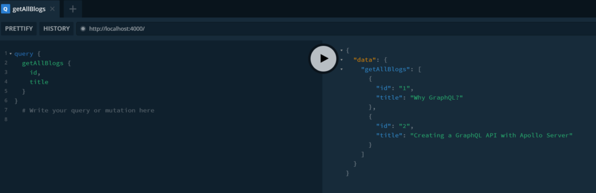
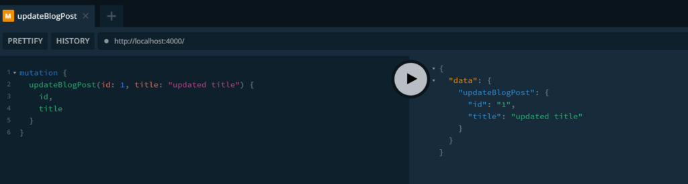

One of the many complaints about the GraphQL ecosystem is that there is a lot of indirection around what packages to use to create a GraphQL application. Even after selecting one, there is a lot of boilerplate code that one must create to make a GraphQL server work. While that is true, it does not have to be complicated. In this post, we will use Apollo Server to create the simplest possible GraphQL Server.

## Why Apollo Server?

From all the available options for creating a GraphQL server using JavaScript (graphQL.js, Express GraphQL, GraphQL Yoga, Apollo Server, and GraphQL Helix), Apollo Server 2 is what we will be using in this post.

GraphQL Yoga seems to not be maintained anymore, thus it was easy ruling it out.

GraphQL.js was a too low level of implementation to consider.

GraphQL Helix did not seem to have a lot of community support.

The only other alternative to Apollo Server was Express GraphQL, but Apollo Server has a lot of convenience features that I preferred over Express GraphQL. Apollo Server's Readme had a comparison with express-graphql at some point, which can help understand the differences. You can find it [here](https://github.com/apollographql/apollo-server/tree/cfb086227e623ba1531bb887c3919e224682ccbc#comparison-with-express-graphql) (Git never forgets!).

There are other tools like Hasura, Prisma, etc., but those are related to ORM's and other functionalities, and we will not be discussing those as options for this post.

Other benefits of Apollo server include:

- A plethora of built-in features

- Huge community support (plus used at enterprises)

- Frequently updated

- Loads of additional libraries and tooling for different purposes

- Interoperability with other frameworks

With that, let us get started building a fully functional GraphQL API using Apollo Server. Our API will support both queries and mutations for reading and updating data. If you do not know about the [GraphQL types (queries and mutations)](https://www.wisdomgeek.com/development/web-development/graphql-basics-types-queries-mutations-schema/), we recommend reading our previous post about it. And if you are new to GraphQL itself, the post regarding [Why GraphQL ](https://www.wisdomgeek.com/development/web-development/why-graphql/)might be helpful to understand the advantages of GraphQL.

## Using GQL to create our type definitions

Before doing anything, we will create a directory and use npm/yarn to install apollo-server in our project. Assuming that we have already done that, we will create a server.js file in our folder.

Apollo server provides us a named export "gql" that allows us to declare type definitions and resolvers. gql uses JavaScript template literals as a parameter passing mechanism. So instead of invoking it as a function, we invoke it using the tagged template literal syntax.

A schema definition contains the type definitions and all their relationships. But it needs to be enforced by the server. And that is what a type definition is. We use the gql named export, passing in our schema definition to get our type definitions.

```
const { gql } = require('apollo-server');

const typeDefs = gql`
  # Our schema will be written here
`;
```

With the type definitions in place, we have a definition that apollo knows about, but we cannot call these queries because they do not do anything right now. For the GraphQL API to be functional, we need to define resolvers.

## Defining Resolvers for the GraphQL Server

Resolvers are functions that are responsible for populating the data for fields in our schema.

Resolvers are not a part of the GraphQL specification. But they are the typical way most GraphQL servers implement and process GraphQL requests. Every field defined in the type definition must have a corresponding matching resolver field for it to participate in the GraphQL request. 

The GraphQL specification requires a root level query definition in the GraphQL type definition. We will create a resolver object in our code next. Taking a subset of our schema from the previous post:

```
type Post {
  id: ID!
  title: String!
}
type Query {
  getAllBlogs: [Post]
}
```

We will start defining our resolver. Resolvers are an object which references all the types in the schema and their resolver functions.

### Resolver function

 A resolver function is a convention used to map all fields in the type, and it takes in 4 parameters: parent, arguments, context, and information. It returns a result whose type is defined in the schema.

The parent parameter gives us the parent resolver of the current resolver. Since queries can be nested, this parameter helps us know the parent that invoked the current resolver. For a top-level resolver, it will be undefined.

The arguments parameter tells us what gets passed into the GraphQL request.

The context typically is some global configuration for our application (for example a database connection string).

The information parameter contains information about our application like the state of the application.

### Creating resolvers

For our getAllBlogs resolver, the return type needs to be a list of posts. Let us create a JavaScript object for this and return it for now.

```
const resolvers = {
  Query: {
    getAllBlogs: () => {
      const blogs = [
        {
          id: 1,
          title: 'Why GraphQL?',
        },
        {
          id: 2,
          title: 'Creating a GraphQL API with Apollo Server',
        },
      ];
      return blogs;
    },
  },
};
```

Before we get to the next step, it is important to point out that Apollo can do automatic generation of resolver functions. If the parent argument has a property with the resolver's name and a corresponding value associated with it, Apollo server return's the property's value. If there is a mismatch in the name, it returns undefined. If the value is a function, it invokes the function and return's the function's return value.

For this case, we will explicitly create a resolver for each of the fields in the Post type as well. This is optional. But this gives us an idea of how the parent parameter can be used. Our resolvers object becomes:

```
const resolvers = {
  Query: {
    getAllBlogs: () => {
      const blogs = [
        {
          id: 1,
          title: 'Why GraphQL?',
        },
        {
          id: 2,
          title: 'Creating a GraphQL API with Apollo Server',
        },
      ];
      return blogs;
    },
  },
  Post: {
    id: (parent) => parent.id,
    title: (parent) => parent.title,
  },
};
```

## Putting things together

Now that we have our type definitions and resolvers written, we need to put those together, passing them to apollo server, and launch it. Just like we launch an express server with configurations, we start our apollo server:

```
const server = new ApolloServer({ typeDefs, resolvers });
server.listen(4000).then(({ url }) => {
  console.log(`Server started at ${url}`);
});

```

If we run node server.js in the command prompt, the server should be up and running. Next, we go to localhost:4000 in our browser. We get a GraphQL playground that lets us send post commands to the server we just built. We will use this to query for our posts. IntelliSense can be used here to create our query. Upon execution of the query, we will get our hardcoded posts from the server.



## Implementing Mutations

Now that we know how to do queries, implementing mutations seems like an easy task. We need to add a mutation property to our type definition and implement it in the resolvers. Let us write a mutation to update the title of a blog post.

We add it to the type definition:

```
type Mutation {
  updateBlogPost(id: ID!, title: String!): Post
}
```

And the resolver has an additional property:

```
const resolvers = {
  Query: { ... },
  Mutation: {
    updateBlogPost: (_, args) => {
      let blog = blogs.find((blog) => blog.id == args.id);
      if (blog) {
        blog.title = args.title;
        return blog;
      }
    },
  }
}
```

We can then invoke the mutation in our playground after running the server and get the updated value back.



The final code for our working server thus becomes:

```
const { gql, ApolloServer } = require('apollo-server');

const blogs = [
  {
    id: 1,
    title: 'Why GraphQL?',
  },
  {
    id: 2,
    title: 'Creating a GraphQL API with Apollo Server',
  },
];

const typeDefs = gql`
  type Post {
    id: ID!
    title: String!
  }

  type Query {
    getAllBlogs: [Post]
  }

  type Mutation {
    updateBlogPost(id: ID!, title: String!): Post
  }
`;

const resolvers = {
  Query: {
    getAllBlogs: () => {
      return blogs;
    },
  },
  Post: {
    id: (parent) => parent.id,
    title: (parent) => parent.title,
  },
  Mutation: {
    updateBlogPost: (_, args) => {
      let blog = blogs.find((blog) => blog.id == args.id);
      if (blog) {
        blog.title = args.title;
        return blog;
      }
    },
  },
};

const server = new ApolloServer({ typeDefs, resolvers });
server.listen(4000).then(({ url }) => {
  console.log(`Server started at ${url}`);
});

```

We hope this helps in getting started with Apollo Server! If you have any queries, drop a comment below, and we will help you out.
