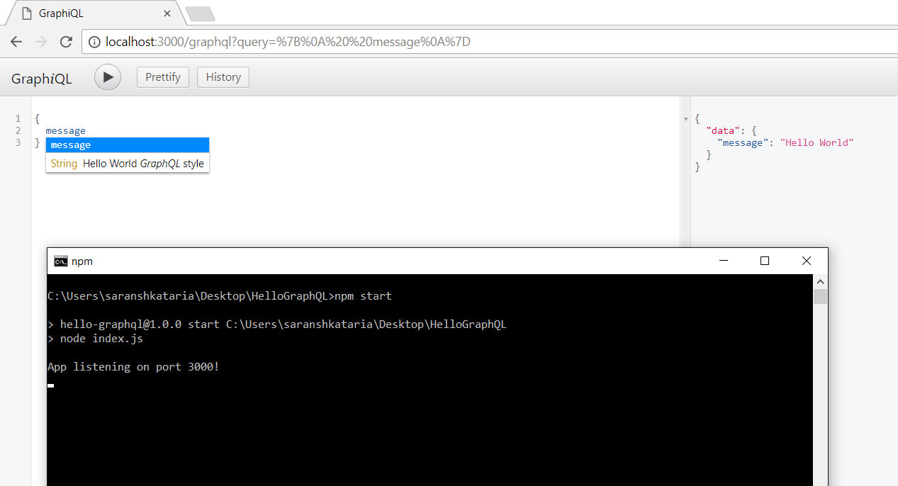

GraphQL is a query language and a runtime for data querying over an API. It is something that you put in between your front-end application and a backend data service. The first question that comes across in people's mind is that we already have REST, what problem can then GraphQL possibly solve? The value of GraphQL can be understood when one starts looking into the shortcomings of REST.

## Shortcomings with REST?

If I need to add a new model to my API, I need to add multiple methods to fetch the corresponding data. Also, to get complex data, I need to make multiple REST calls sequentially to get all the data that I need. And I might have to talk to multiple endpoints to do so. These challenges often hinder productivity and also cause performance issues. Suppose, I want to display only the title of a blog post on the home page. When I will query a REST endpoint, it will return the following response:

```
{
 "blog": {
   "id": "1"
   "title": "Hello GraphQL using Express",
   "content": "A brief introduction to GraphQL and how to get started using Express, node.js and graphql.js",
   "tags": "javascript,node,graphql,web-development"
 }
}

```

As can be seen, I only needed the title, but since the API has an endpoint that returns the complete object, I will have to fetch all unnecessary information as well.

## What does GraphQL bring to the table?

GraphQL tackles these problems in a very efficient manner.

- It ensures that you are never over fetching or under fetching data from the server. That is, you are fetching only the fields that you need and not everything that is being returned from the API endpoint.

- It saves on network bandwidth which can be an important factor when building applications for low bandwidth regions.

- It also provides a strong type system and a declarative way to fetch data, which helps better understand what data is being fetched.

## Structure of a GraphQL query

A sample GraphQL query would look something like this:

```
{
 blog(postId:1) {
   title
 }
}
```

This query asks for the resource (blog in this case) with postId equal to 1. The field we are interested in is the title of the post. So, the above query will return only the title of the post which has id as 1. Every field defined in the GraphQL schema has a type. For this scenario, the title is a string field. There can be other types or a resolver function which maps the logic for reading the field. The above query will map to the following response:

```
{
 "blog": {
   "title": "Hello GraphQL using Express"
 }
}

```

As can be seen, the response matches the request query. So the query that we send determines the shape of the response that will be received from the GraphQL server, and vice versa can be done to construct the query. It is important to note that GraphQL does not have any preferences over what protocol should be used for communication, but we will be using it over HTTP since it is the most used scenario.

## Enough theory, let's get to some code

We will be using express-graphql in this post. If you are looking for a tutorial using [apollo-server](https://www.wisdomgeek.com/development/web-development/graphql/creating-graphql-api-apollo-server/), we have a different post about it.

To use GraphQL over HTTP, GraphQL operations are written in documents on the client-side. These are then sent to the server at a GraphQL endpoint like /graphql. The body of the message contains the query and the server responds with a JSON. For our Hello World example, we will query the server for a message, and it will return the magical string to us.

The output can be seen using a GUI called graphiql, and will look like the following:

[](https://www.wisdomgeek.com/wp-content/uploads/2017/06/graphql-hello-world.png)

On the left is the query that we have sent to the server, and in the right pane is the response received.

## Setting up Express

For getting started, you will need to set up a node project which has express and express-graphql as dependencies from NPM. The express-graphql is a wrapper above graphql.js library.  I am assuming you already know how to add packages using NPM in node and you can do some basic setup for it. So I will be skipping that part. If you don't know about that, you can refer to the [NPM docs](https://docs.npmjs.com/cli/install), since that is pretty basic.

With those things setup, we will create an index.js file that will contain the logic for hosting our express server. In the file, we will require the express module and execute it to initialize the server. We also need to define endpoint routes to tell express what to do on which route.  We do that by making use of the "use" function which takes the URL endpoint and a function as arguments. And then we make the application listen on a port. And test if our express server is running or not.

```
const app = require('express')();
  app.use('/graphql', (req, res) =>{
  res.send('Hello World');
});

app.listen(3000, function () {
  console.log('App listening on port 3000!')
});
```

This should set up an express server that shows a Hello World message on loading the page. For testing it, save this file as index.js and then run `node index.js` in your terminal, and browse to `localhost:3000` in your web browser. The message "Hello World" should be visible. You can see this [Github commit](https://github.com/saranshkataria/HelloGraphQL/tree/9f78405127ff2b2e9a7b7215ee050163639cef02) if you are stuck with any issue.

## Adding GraphQL Schema

Now that you have express set up, we can start adding GraphQL to the project. For setting up the server, we first need to define the schema for it. We will create it in a separate schema file. In this file, we will have a schema object that will be exported to our express server. The GraphQL javascript library already has type helpers declared for us to simply import and start using in our project. For our project, we would be needing the schema, object type, and string helpers. The schema to declare it, the object type to declare the configuration object inside the schema, and the string for returning are message string. Using these three, we will create the schema for the project as follows:

```
const {GraphQLSchema, GraphQLObjectType, GraphQLString} = require('graphql');

const rootGraphQlObjectType = new GraphQLObjectType({
    name: 'root',
    fields: {
        message: {
            type: GraphQLString,
            resolve: () => 'Hello World'
        }
    }
});

const schema = new GraphQLSchema({
    query: rootGraphQlObjectType
});
```

We have destructured the three helpers we needed from the graphql.js library and then created a root object which has only one field message (this is what the query will be to get our message). The resolve method gets invoked whenever the message field is queried for. And since GraphQL is a strongly typed language, we need to specify the type of response being returned by the query, which is done as shown. The name of the object can be anything you want it to be. We then export this schema and that is all there is to this file.

## Integrating Express and GraphQL

In the index.js file, we will import the schema. To use the query that the client sends to us, we need to extract it, query it against the schema that we just created, and then return back the response. The express-graphql library does exactly these three steps for us. All we need to do is import it, and pass it an object which contains the query. There are other optional configurable properties that can be sent using this object. And in our case, we will use the graphiql key and set it's value to true so that we can get a graphical editor to send the query to the express server. graphiql helps us a lot during development and debugging and we avoid the hassle of manually constructing queries. We also get IntelliSense with it and it enhances our understanding of GraphQL as a beginner. So our server file will now look like the following:

```
const expressGraphql = require('express-graphql');

app.use('/graphql', expressGraphql({
  schema,
  graphiql: true
}));
```

I have used the ES6 syntax when referring to the schema, which essentially would be the same as saying `schema: schema` but I personally prefer the lazier and shorter version. With this, we have all our systems plugged in, and we are ready to go! `node index.js` and you should be able to successfully run the project. Thereafter go to the browser, visit `localhost:3000/graphql` and you get the graphical editor. Enter the query as message inside parenthesis and voila, you get the response! I have uploaded the code on [Github ](https://github.com/saranshkataria/HelloGraphQL)if you need to refer it. With that, you should be up and running with GraphQL. Happy exploring!

Let me know what you think about it in the comments section below.
