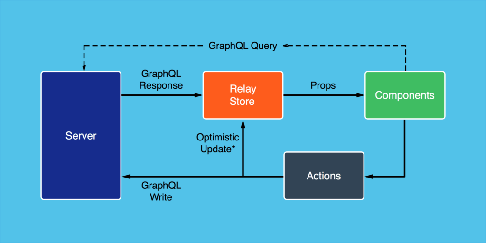

If you are a javascript developer, chances are you would have heard about React, Relay, and GraphQL recently.

And if you are a react developer who has been happily using redux for a while now, the very first question that comes to mind is **why another set of technologies? **Why should I invest time in learning newer libraries and how does this help me?

## GraphQL

The primary advantage of GraphQL is that it helps you define the data that you need from the server. You make a single request to the server to fetch nested complex data saving round trips to the server. This helps you save bandwidth. GraphQL also helps you reduce under-fetching and over-fetching of data.

It also enhances client-side developer productivity by bringing in a strongly typed mechanism to fetch data.  Also, there is inbuilt tooling for documenting your API in the form of GraphiQL. GraphiQL also provides a GUI for developers to interact with the GraphQL backend.

GraphQL also provides validation and strong type checking that fails fast when the developer makes a mistake while querying for the data. It also removes the hassle of maintaining separate versions of your API as long as your schema is backward compatible.

I have already talked about [Why GraphQL](https://www.wisdomgeek.com/development/web-development/why-graphql/) in a different post. And if you want to take a look at the [GraphQL basic terminologies(type, query, mutation, schema)](https://www.wisdomgeek.com/development/web-development/graphql-basics-types-queries-mutations-schema/) to get a better understanding, there is a post about that too.

## Relay

Even with GraphQL set up on the server, working with data is always challenging.

Relay helps you handle some common scenarios that you tend to apply to all kinds of data that you fetch and some edge cases. A single relay store handles these data management operations include batching, pagination, caching, optimistic updates, rollbacks, retries, and error handling. It acts as the central source of data for your application.

Essentially, Relay connects your React components with GraphQL services and helps you reduce boilerplate regarding data fetching and mutation.

Every component defines its data dependencies in its definition using GraphQL queries. After this data gets fetched, it is available via props to the component.

A sample relay component would like the following:

```
export default createFragmentContainer(
  class TodoInput extends React.Component {
    focus() {
      this.input.focus();
    }

    /* suggestedNextTitle is available via props after being fetched from the GraphQL server
       The component does not get rendered until then */

    render() {
      return input type="text" /> { this.input = node; }}
        placeholder={this.props.data.suggestedNextTitle}
      />;
    }
  },
  graphql`
    fragment TodoInput on TodoList {
      suggestedNextTitle
    }
  `,
);
```

As can be seen above, the TodoInput component is defining its data dependencies in its definition and the values being fetched are rendered there itself. You can read more about this example in the [documentation here](https://facebook.github.io/relay/docs/en/fragment-container.html).

If you are already familiar with JSX, Relay adds the data fetching logic in the same component as well. This might seem unconventional at the first look but helps in querying for only the data that you need. This colocation of data fetching inside the component helps you reason if that property is even required in the component or not. If not, you can safely remove it and be sure that it will not impact anything else.

Using relay also allows the developer to move the components anywhere in the rendering hierarchy without having to worry about doing cascading modifications to achieve this.

One constraint for Relay explicitly mandates GraphQL to be present at the backend. You cannot use it with anything else.

## React

React already has taken the web development ecosystem by storm. Its declarative nature and developer friendliness have made it the defacto choice for many developers when building client-side applications.

Each React component specifies what data it needs in the component itself. And Relay stitches all of these by composing the queries into the parent (root) component.

The root component then makes a single request to the server and gets a batched result for it. The response received from the server gets split according to which component had requested what data. Hence there is an overall performance gain since there is only one request to the server. If multiple components had asked for the same data, it gets fetched only once. Subsequent reads get served from the Relay store.

## Putting it all together: React, Relay, and GraphQL



Just like react fostered the idea of a declarative API for front-end code, Relay and GraphQL apply the same concepts for data fetching and mutation.

The entire stack empowers the developer to declare all the functionality of the component along with the data that is required inside the React component. The architecture handles the implementation details like fetching, batching, caching, etc. You get a lot of performance benefits as well as increased developer productivity.

Using the React, Relay, and GraphQL architecture truly makes your application composable and helps you think in terms of component-driven architecture at all levels.

And if you are not sold yet, here is a video explaining how all React, Relay, and GraphQL work together. It also explains why Facebook is heavily investing in these technologies:

So, are you going to start learning the React, Relay, and GraphQL stack? Let us know in the comments below.
