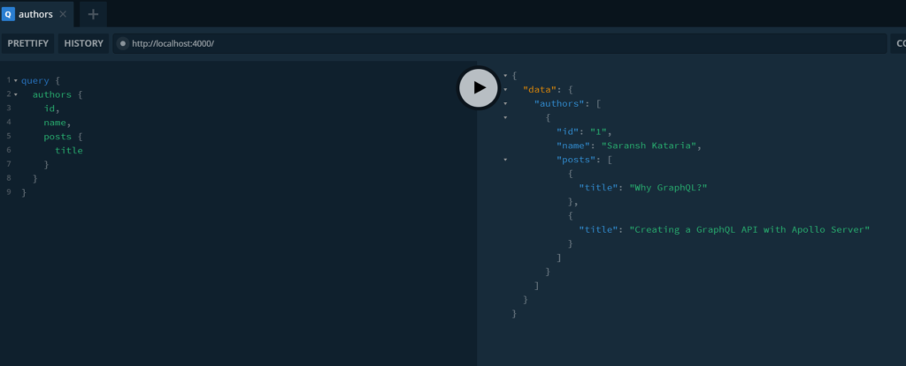

When creating a GraphQL server with relational data, we want to return the data in a hierarchical format with those relationships in a single query. After all, that is where GraphQL comes in handy, right? Let us look into how we can do this using nested queries in GraphQL.

This post assumes you have knowledge of [GraphQL queries](https://www.wisdomgeek.com/development/web-development/graphql/graphql-basics-types-queries-mutations-schema/) and [how to create a GraphQL server using Apollo Server](https://www.wisdomgeek.com/development/web-development/graphql/creating-graphql-api-apollo-server/). You can reference those posts if you are new to GraphQL.

Let us assume we have a blogging application wherein we have users and posts. The types for these are defined as:

```
type Post {
    id: ID!
    title: String!
    authorId: ID!
  }

  type Author {
    id: ID!
    name: String!
    posts: [Post]
  }
```

Adding some sample hard-coded data for our application.

```
const posts = [
  {
    id: 1,
    title: 'Why GraphQL?',
    authorId: 1,
  },
  {
    id: 2,
    title: 'Creating a GraphQL API with Apollo Server',
    authorId: 1,
  },
  {
    id: 3,
    title: 'This should not be returned',
    authorId: 2,
  },
];

const authors = [{ id: 1, name: 'Saransh Kataria' }];
```

Now that we have our initial setup done. Let us look at what we are expecting out of our query:

## The expected output

We want to query all users and get their corresponding posts for the hardcoded values above. So our query will look like this:

```
query {
  authors {
    id,
    name,
    posts {
      title
    }
  }
}
```

Posts are related to an author, we are querying for the authors and then sub-querying their posts. Since the posts are not a scalar type but a custom type, we need to specify which of their properties must be retrieved.

And we expect the output for our use case to be:

```
{
  "data": {
    "authors": [
      {
        "id": "1",
        "name": "Saransh Kataria",
        "posts": [
          {
            "title": "Why GraphQL?"
          },
          {
            "title": "Creating a GraphQL API with Apollo Server"
          }
        ]
      }
    ]
  }
}
```

## Creating the query and resolver for the authors

Without worrying about the posts field, we can set up the resolver for the authors' query. This will be:

```
const resolvers = {
  Query: {
    authors: () => {
      return authors;
    },
  },
}
```

We are returning the authors array when we receive the query for authors. This is pretty straightforward. The object already has all the corresponding properties that the type needs, they get resolved, and we get the expected response.

But for our relational field, posts, we do not have that. We only can determine the relationship of an author from the posts array.

## Resolving nested queries in GraphQL

When setting up a field whose value is a custom type, we have to define a function that tells GraphQL how to get that custom type. In our case, we want to tell GraphQL how to get the posts if we have the author. We do that by defining a new root property inside resolvers.

Alongside query, we will add a new property that will tell GraphQL how to resolve an Author. The author property will be an object, and we will create a method for each of the fields that are to be resolved.

Apollo Server can automatically resolve the scalar properties. We only need to create a resolver for nested properties. To resolve nested queries in GraphQL, we only create a method for the properties that reference other custom types. In our case, we only have the posts field which we are looking for. So we will define this as:

```
const resolvers = {
  Query: {... },
  Author: {
    posts: () => {...},
  },
}
```

Since posts is a resolver method exactly like other methods in Apollo server, we get access to all the 4 parameters that we get in other methods. The goal of this method is to return the correct posts corresponding to the author. To do that, we need some information from the author object, like the author id.

The posts query is invoked by the author resolver, the parent for the posts resolver will point to the current author. Thus, to resolve this nested query, we will be using that parameter that is passed to it. We can call it parent, but we already know that it will be an author. Thus, we can name the parameter as author.

Using the author, we can easily figure out which posts need to be returned.

```
const resolvers = {
  Query: {
    authors: () => {
      return authors;
    },
  },
  Author: {
    posts: (author) => {
      return posts.filter((post) => post.authorId === author.id);
    },
  },
};
```

## Final code

```
const { gql, ApolloServer } = require('apollo-server');

const posts = [
  {
    id: 1,
    title: 'Why GraphQL?',
    authorId: 1,
  },
  {
    id: 2,
    title: 'Creating a GraphQL API with Apollo Server',
    authorId: 1,
  },
  {
    id: 3,
    title: 'This should not be returned',
    authorId: 2,
  },
];

const authors = [{ id: 1, name: 'Saransh Kataria' }];

const typeDefs = gql`
  type Post {
    id: ID!
    title: String!
    authorId: ID!
  }

  type Author {
    id: ID!
    name: String!
    posts: [Post]
  }

  type Query {
    authors: [Author]
  }
`;

const resolvers = {
  Query: {
    authors: () => {
      return authors;
    },
  },
  Author: {
    posts: (author) => {
      return posts.filter((post) => post.authorId === author.id);
    },
  },
};

const server = new ApolloServer({ typeDefs, resolvers });
server.listen(4000).then(({ url }) => {
  console.log(`Server started at ${url}`);
});
```

## Conclusion

When we run the query now, we get our desired output:



The first function to be invoked is the authors resolver function since that is what the query asks for. It returns the id, name, and title for all the authors. In our case, we have only one, and that is returned.

Next, GraphQL checks what data was requested. If only name and id were requested, the function execution would end there since those are scalar types.

But we asked for posts. And posts do not exist on the authors object. So GraphQL is going to call the posts function for every individual author. And that is where our resolution of nested queries in GraphQL comes into the picture. Our posts resolver function gets invoked with the parent set as author ({ id: 1, name: &#8216;Saransh Kataria' }). 

If multiple authors were present in our hardcoded example, the posts function would be individually called for both of them. We use the id of the passed parent author to retrieve the author's posts and return them.

We can define the relationship differently by having posts defined in the author type and then create a nested GraphQL query in that manner. The schema definition, declaration, and it's execution is all up to us. And we can resolve nested queries in GraphQL however we want to, once we know how to do it.

If you have any questions, feel free to comment below.
