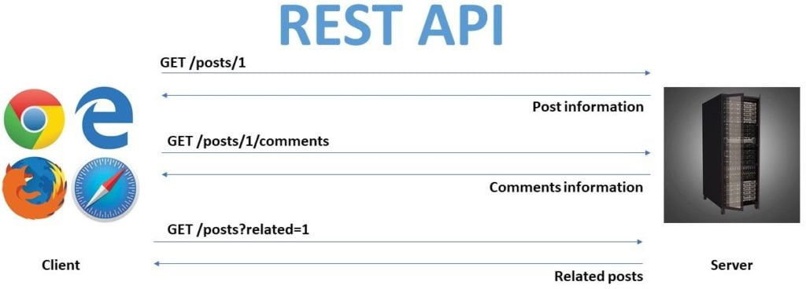
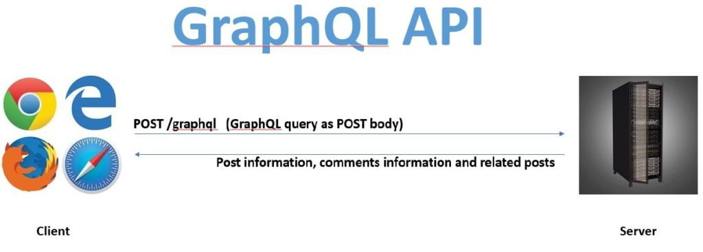

Developing APIs for the web has never been an easy task for developers.  REST has been the defacto standard for designing web APIs for the last decade. Considering REST's wild popularity, the first question that pops into anyone's head when they start reading about GraphQL is: Why GraphQL? Why do we need GraphQL when developers are already well versed with RESTful architecture?

While GraphQL is the new kid on the block, and REST is the old person with lots of experience. We need to understand why GraphQL even came into existence. Before diving into the why let us first understand what.

## What is GraphQL?

GraphQL stands for Graph Query language. It is a query language created by Facebook for Web APIs. It operates over HTTP, the same as REST. It is also to note that it is just a specification, not an implementation. That means we can implement it using any programming language we want with any database that we like, and any client we want while using GraphQL.

GraphQL is not an architectural pattern, nor a web service. It merely acts as a thin middle layer that enables declarative data fetching, giving the client the power to specify what data it needs. GraphQL is not a REST replacement, but an alternative. We can use it in combination with REST, or not, and that is up to us. 

## Where does GraphQL come into play?

The major focus of GraphQL is the optimization of network requests in order to fetch only the data that the client needs (preventing under-fetching and over-fetching). That was the key area that was being focussed on when GraphQL was being developed. This problem arose because the bar had been raised by the users who expect high-quality personalized experiences on all devices and platforms that they are using. REST endpoints were not good enough of a solution for such clients since REST is more of a point to point procedural API. And if a device wanted some specific data only, the developer either had to create another endpoint to return only the specific data. Or they had to add some boolean fields to the input parameters to specify what was needed. This ended up becoming way too complex to handle for large scale applications.

## What problems with REST does GraphQL try to solve?

The major benefits of GraphQL are :

- Speed
- Flexibility
- Easy to use
- Simple to maintain
- Developer-friendly

Let's take a deeper look at how GraphQL tackles these.

### GraphQL is faster

Let us see how we would architect a blogging application using REST.

For a simple blog post, like this one, we would need the details of the post that we need to display. So we will make a GET request for it. Let us assume the ID of this post is 1. Then we will make a request to an endpoint such as GET /posts/1 to get all the relevant details about this post.

But we also need the comments that anyone has made on this blog post. We will have to make another GET request for that too. That would look something like GET /posts/1/comments.

We also are showing some related articles down below. So we need another GET request for that. Let us assume we have an endpoint that takes the type of posts to be shown that takes a post id as a query string parameter. This would be another GET /posts?related=1.

This finally gives us everything we need to display this page. The whole process will look something like:

Now, if we were to fetch the same data from a GraphQL endpoint, we would not need so many HTTP requests. We will be querying a single endpoint (that would be /graphql). And we would be making a POST request to this endpoint, describing what all information we need from the server. In our case, we query for the post information, comments information, and related posts. We will be requesting these in the form of a GraphQL query.

We will not get into the specifics of the GraphQL query in this post since this is more about why GraphQL and not the how. But this is what it would eventually look like:

The important distinction is that instead of the server deciding what data gets sent back, the client describes what all it needs. The server then returns all of that information in a single request instead of having to make multiple requests.

There is no over fetching or under fetching of any data. Thus making GraphQL queries faster than REST.

### GraphQL is flexible

This probably is the biggest advantage of GraphQL over REST.

We could have argued in the above example that we could have put all of the information that we needed in a single REST endpoint since we knew that all of those would be needed for a blog post. We could have crammed all of those into a single endpoint GET /posts which returns all the information that we needed, just like the GraphQL solution.

That approach would have been perfectly valid on its own. But what would happen if we wanted to add another thing in there? Say we wanted to show other posts by the author of this post? We would have had to change a lot of things in the endpoint that we created. And what if we wanted to show these conditionally? We would have to add another parameter in there as a query string.

Let us take another example, for the same endpoint. On a mobile device, we do not want to fetch the comments and the related posts. So we do not want to hit those endpoints until the user has scrolled to the bottom of the page. But we already crammed everything into a single endpoint for the desktop version. If we make a request to that endpoint, we are over fetching data and compromising on user experience.

GraphQL comes in super handy in these scenarios. Since the client describes what data it needs, GraphQL provides a flexible way to query the information needed. The query can be modified according to the client and according to the information needed on the page. If we need to get posts by author, we add that to the GraphQL query itself.

The client has the power to define exactly the data that it needs. Nothing more and nothing less.

### GraphQL is simple to maintain and easy to use

As you have seen in the above examples, we would need to add a lot of new endpoints and query string parameters to the REST application to adapt a simple scenario such as blog posts.

But in the case of GraphQL, it is a single endpoint, with the client defining what it needs. Thus it becomes easier to maintain. The client can just change its query and the server will respond accordingly.

This approach does bring in its own challenges such as nested calls and other issues as well. But overall, it is generally more maintainable than REST endpoints.

### GraphQL is developer-friendly

GraphQL also introduces a strongly typed system which allows you to avoid mistakes while fetching data.

The GraphQL query makes the query language a declarative way of defining and fetching data from the server. This helps understand what all data is being fetched from the server.

GraphQL also removes the hassle of maintaining separate versions of your API as long as your schema is backward compatible.

All of these points together lead to a great developer experience.

## Is GraphQL going to replace REST?

While GraphQL has a lot of advantages over REST, it does not mean that GraphQL is the silver bullet. There are a lot of things that REST leverages that GraphQL cannot like HTTP Content types, HTTP caching, status codes, managing complex queries to ensure they are not making expensive joins, monitoring for endpoints, etc.

We need to understand the tradeoffs between the two and have both tools at our disposal. We can then select the correct one according to the application that we are building and its requirements.

Now that you have an idea of Why GraphQL, you can read more about the GraphQL [basic terminologies: Types, Queries, Mutations, and Schema](https://www.wisdomgeek.com/development/web-development/graphql-basics-types-queries-mutations-schema/) to get to understand GraphQL a bit more.  If you are interested in knowing more about the complete stack, the [React, Relay, and GraphQL ecosystem](https://www.wisdomgeek.com/development/web-development/how-react-relay-graphql-stick-together/), you can check that post out.

Let us know in the comments about what you think about GraphQL. And if you would be using it in your next application?
