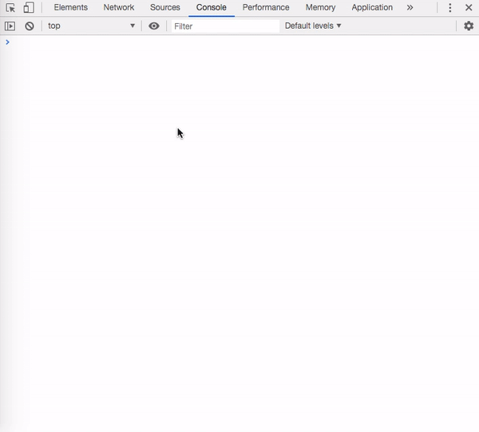

Chrome devtools has a collection of utilities that can be used to perform common debugging tasks and make our life easier. The $ sign shortcuts are one such set of utilities. Let us see how to debug better using these $ sign shortcuts in Chrome devtools.

## $_

Typing in `$_` in Chrome devtools gives the value of the most recently evaluated expression. This can be quite useful when trying to test some values in the console. Let us say we were creating an object and then wanted to do something with it.

```
{ "first": "foo", "middle": "bar", "last": "baz" }
// after we hit return the same object gets printed in console
// and thus $_ references that object now
Object.keys($_)
// would print:  ['first', 'middle', 'last']
```

## $0 – $4

Chrome devtools stores historical references to the last five DOM elements that were inspected (clicked upon) in the elements tab.`$0` references the most recently clicked element, `$1` references the one clicked before that, and so on.

Here is what this looks like:



## $(selector [, startNode]) aka alias for the query selector function

We do not need to type the whole document.querySelector command in the console. Chrome devtools provide a jQuery-esque shorthand for it.

`$(selector)` returns a reference to the first element that matches the specified CSS selector.

To return the first h1 in the HTML, we can simply type in:

```
$('h1')
```

This is equivalent to:

```
document.querySelector('h1');
```

Also, if you did not know this already, you can right-click on the element and choose "Reveal in Elements Panel" to show the element in the DOM. Or hit the "Scroll in to View" to show it on the page.

The selector function also takes in a second optional argument, which can be used to specify the element to search in.

For example:

```
$('h1', $('.head'))
```

Returns the first h1 inside the element with the class head.

## $$(selector [, startNode]) aka querySelectorAll

`$$(selector)` can be used to get an array of all elements that match the given CSS selector. This is equivalent to calling `document.querySelectorAll`. This one is not an alias but a wrapper above querySelectorAll since it returns an array and not a `NodeList`.

If we wanted to log the src attribute of all images in the DOM, we could use:

```
const images = $$('img');
for (const image of images) {
  console.log(image.src);
}
```

This function also takes a second argument, which can be used to specify which elements/nodes to search from.

If we only wanted to search for images within the main element, we would use:

```
const images = $$('img', $('main'));
```

And those are all the tips that we had to share with you. There is a lot more that can be done with the Chrome devtools. We will keep adding more posts around it in the future. And if you have not already, check out the "[Using logpoints for logging messages directly](https://www.wisdomgeek.com/development/web-development/javascript/chrome-devtools-using-logpoints-for-logging-messages-directly/)" post to learn more about another nifty feature of Chrome devtools!
