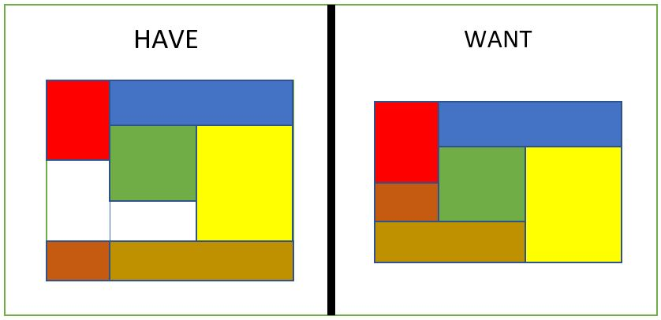
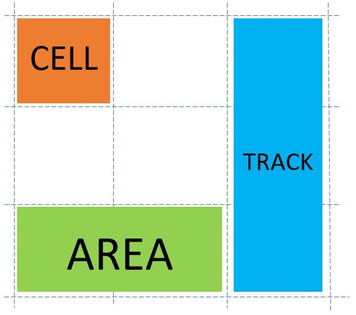
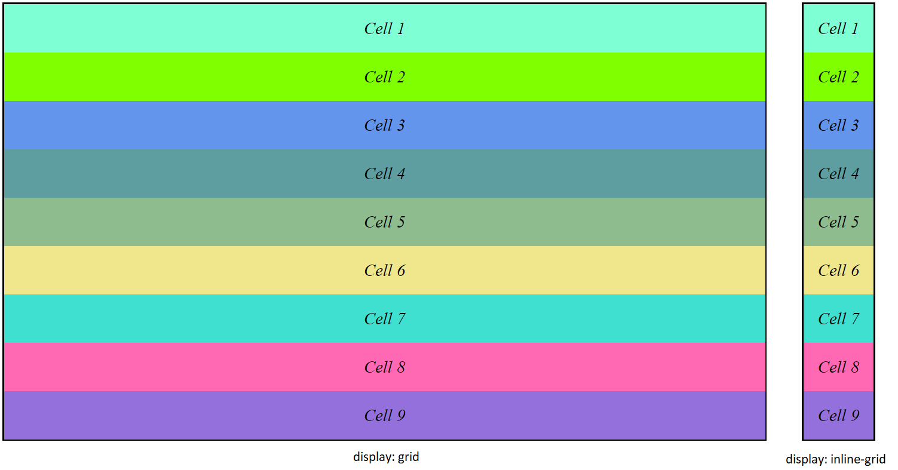
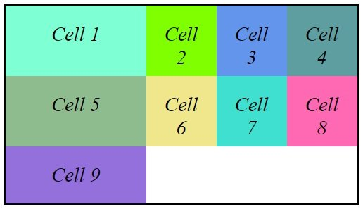
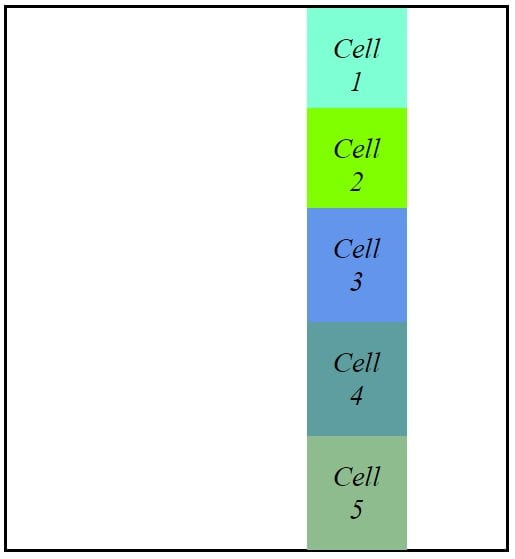
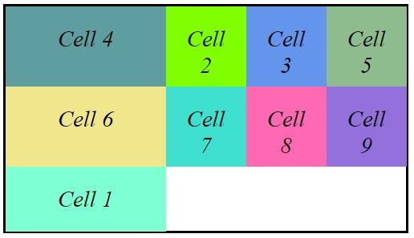
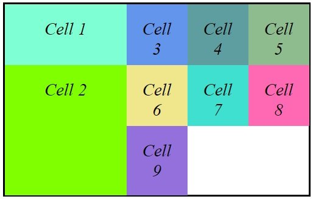

Building advanced layout designs using CSS is a troublesome process. Anyone who has ever worked on CSS has faced this challenge. At times, even the simplest div may not always position itself correctly, looking so messy and untidy – just like kitten litters. And right when you manage to perfect the layout, your luck kicks you in the behind, with someone shouting at you: "Hey! Why is your site so cluttered on mobile? Did you not do it correctly?".

There are multiple ways to control layout in CSS. The **box model** is the native way to treat elements using properties such as height, width, padding, borders, and margins. These divs were initially controlled by organizing them in a table. That was not a very scalable solution. Then came in the era of float and clear, which caused some more havoc. Fixed column heights, floats, and clear properties allowed us to align the boxes. But, it was a lot of work, and a bit of a hack.

Then, came in **Flexbox** – a layout mode which was specifically designed for creating responsive pages, without using floats and clears. It gave designers more control over the layout. In flexbox, we can flow items in either rows or columns (but not both simultaneously) by creating flex-containers, and flex-items. This makes Flexbox great for organizing the layout of certain components on your page—be it a navigation bar, a sidebar, or a footer—or even smaller-scale layouts.

You can apply styling to containers that govern how the items within them behave, whether that’s to make them grow, shrink, wrap, justify, align, and more. In short, flex containers provided developers with a very helpful shortcut to organizing a layout, but they too have some limitations.

And now is the time for the savior to rescue us, it is time for **CSS Grid Layout**. It is likely to blow your mind. Flexbox tells us how items flow in 1-dimensional space; CSS Grids, on the other hand, tells how items flow in 2-dimensional space, and it is perfectly suited to do so. You get way more control over your layout – something which is useful in creating larger-scale layouts. It is the most powerful layout option because of its unparalleled ease and flexibility.



The above image reflects a very complex problem to have if one was not using CSS grids, but with the CSS grid layout, it is very easy to achieve the layout shown above without any complex hierarchy of elements. Let us dive into it.

## CSS Grid Container

CSS Grid specifies how to define various grid lines on the grid container, but not how to size them or place the individual items. It does so by creating some virtual areas and then placing the items in them. It particularly defines the relationship between the parent grid container and its grid child items. Following is the terminology that you should be familiar with before starting to use the grid.



The container is made up of two sets of lines – columns along the column axis, and rows which are perpendicular to the column axis. Together, they make grid tracks. As in table layout, grid cells are the intersection of grid rows and columns. They are the smallest unit of the grid in which we can place items. And finally,  grid areas are defined as any segment of the grid that is contained within four grid lines. Next, we see how to start using CSS grid in our browsers.

**You can refer to this [pen](https://codepen.io/shubhamrolend/pen/OzJRrB), and follow along with the examples shown in the post by removing the comments for what you need.**

## Setting up a CSS Grid

First of all, you need a container element. The container element then manages the children items according to the properties specified. For creating one, you can make a simple `div` and set its display property. To do so, you can create a class `grid-container`. Next, you can set its properties like:

```
.grid-container {
    display: grid | inline-grid; /* depending on what you want */
}
```



As can be seen above with the inline-grid property, the items in the grid do not take any more space than what is required. The above div does not look like a grid yet because we have not defined any row or column properties.

For defining the height and width of the grid, you have to use properties like `grid-template-columns`, and `grid-template-rows`. The value of these properties will be a space separated list of width/height of the cells for the rows/columns. Adding the following piece of CSS to the `grid-container`,

```
.grid-container {
    display: inline-grid;
    grid-template-columns: 10em 5em 5em 5em;
}
```

gives you the following arrangement:



That is, you created a container with four columns with the first one having a width of `10em` and the remaining ones of width `5em`.

## Placing Grid Items

For placing individual items in the grid you can use grid properties – `grid-column-start`, `grid-column-end`, `grid-row-start`, and `grid-row-end`. The first two indicate the column in which the grid item will be placed. The latter ones’ deal with placing items in the row. If we have multiple items, then we can modify our style as:

```
.grid-item {
    grid-column-start: 3;
    grid-column-end: 4;
}
```

This will place all elements having the above class at a position starting from column 3 and ending at column 4. The grid having 5 columns will look like the following in that case.



## Auto Grid

In the examples above, you have defined a grid by explicitly defining rows, columns, and their heights, and widths, and then manually placed these items into these rows and columns. But that is not what you would want to do usually. A better idea would be having grid items that are automatically placed into cells and resize according to the width of the grid. This can be achieved using `grid-auto-flow` property which defaults to a value of `row`. Setting it to a value of column will make all items flow from top to bottom, and then left to right.

```
.grid-container {
    grid-auto-flow: row /* default */ | column;
}
```


You can also mix some auto-placed items with explicitly placed ones. If you were to take an item and set placement properties to it, then all other auto-placed items will wrap around it accordingly. If you just want to change the order the items, rather than resizing it, you can use the `order` property.

```
.grid-item {
    order: 1 /* after non-placed */ | 0 /* default */ | -1 /* before non-placed */;
}
```



This example is when we have set the order for cell 1 to be after non-placed (1) and that of cell 4 to be before non placed (-1). Hence cell 4 moves to the very beginning and cell 1 moves to the end of the grid while the remaining elements stay in between.

## CSS Grid Shorthand

There are a few shorthand properties that can be used to define the grid. First up, you can avoid explicitly defining `grid-template-columns` and `grid-template-rows` individually. To do so, use the `grid` property with column values, followed by a forward slash, and then row values.

```
.grid-container {
    grid: 10em 5em 5em 5em / 5em 5em;
}
```

Even better is that the `grid-column-start`, `grid-column-end`, `grid-row-start`, and `grid-row-end` properties can be replaced with the grid-area property. It is defined as `grid-area: row-start / column-start / row-end / column-end`.

```
.grid-item {
    grid-area: 2 / 1 / 4 / 2;
}
```



For repeated patterns, you can use repeat keyword: `*repeat(number of times you want pattern to repeat, actual pattern to repeat)*`.

```
.grid-container {
    grid-template-columns: repeat(4, 5em);
}
```

The `auto` keyword can be used for automatic sizing of rows and columns, according to their height and width.

```
.grid-container {
    grid: 5em 1em 5em / auto 1em auto;
}
```

The row, here, will size itself based on the content. This is used in responsive design because when the viewport shrinks, the content wraps and becomes taller. If it was fixed height, it is likely to break at some point.

## Browser Support for CSS Grid

CSS grid is one of the most powerful CSS modules ever introduced. So, it has been made compatible with almost all of the browsers by default, that is there is no need to set any additional features or flags as was the case initially.

As of 2nd quarter of 2017, many browsers have native and un-prefixed support for CSS Grid. Chrome (including the Android version), Safari (including iOS), Firefox, Edge, and Opera all support CSS grid. IE 10 and 11, on the other hand, support it but with an outdated syntax. All mobile browsers support CSS Grid, except some phone browsers like Opera Mini and UC browser.

You can get the whole list of browser compatibility at this [link](https://caniuse.com/#feat=css-grid).

I hope this helps you, and if you have any questions, feel free to ask them in the comments section below.
