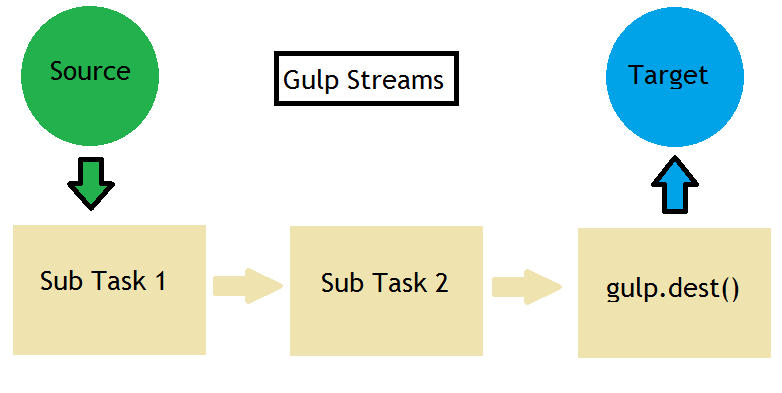

After I made my choice from the [Grunt Vs Gulp Vs npm](https://wisdomgeek.com/web-development/grunt-vs-gulp-vs-npm) confusion I had, Gulp turned out to be my task runner for a project. And in this post, I will explain what you get with it. The first thing you need to know is that gulp uses streams to process files. Think of it as a plumber, which plugs in pipelines in between the input (tap) and the output (destination). It process and examine your files, and it modifies them and can alter them to a new destination as well.



For using gulp, you need to know only 4 API's

## gulp.task

This is used to create a task (which is essentially a function). You can also declare dependencies in this task if you want to do so (optional). You usually create a task for testing/code analysis, optimizing files (concatenating, minifying) and for running your application.

The syntax for creating a task is:

```
gulp.task('task_name', [dependencies_list], function() {
 });
```

When you run a task which has multiple dependencies in the dependency list, they run in parallel before the task runs.

## gulp.src

This refers to the beginning stream for a particular task. It takes in a set of files as an input (also known as a glob) and an optional parameter which specifies the options. Globs are patterns in the form of wildcards such as *.js. Usually the * is the most used pattern, but if you are looking for something specific, you can find more details about glob from the [npm website](https://www.npmjs.com/package/glob). Another important scenario is if you wish to negate something, use the ! symbol in that case. gulp.src will emit all the files that match the  pattern. The syntax for gulp.src is

```
gulp.src(pattern, options);
```

The options specify a variety of things. But the only useful one in my opinion is base. It can be used to default to how much of the path specified in the pattern you wish to keep while emitting out the file stream. So if I write gulp.src(&#8216;app/js/*.js', {base: &#8216;app'}, the output will be in build/js/ instead of build/app/js/. That is the base part is trimmed from the destination path.

## gulp.dest

This refers to the destination where the files are to be written to. The syntax is similar to that of gulp.src:

```
gulp.dest(folder,options);
```

The options here can be used to provide mode for file/folder permissions (octal representation, using options.mode. The default is 0777.) or change the current working directory (using options.cwd)

## gulp.watch

This allows us to watch the files and if they get modified, perform some tasks. The files to be watched are passed in the form of a glob. The syntax is:

```
gulp.watch(files, options, tasks_list);
```

Instead of the tasks list, you can also pass in a callback function as well which takes an event parameter passed to it. The event parameter has a type (what happened, modified/added/removed) and a path (which file).

Although the above 4 are mentioned as the API's that you need to know in order to use the task runner, but I believe you should also know about one more thing. And that is

## pipe

These are used to stream data for processing it. What this means is that you can perform multiple sub tasks in a task using pipes. They allow you to chain streams without the need of buffers. You essentially take an input using src, pipe it to multiple sub tasks and then output it to the target using dest.

## Putting it all together

```
gulp.task('scripts', function() {
 return gulp
 .src('./js/*.js')
 .pipe(jshint())
 .dest('./build/js/');
 });
```

So this is what a very basic gulp task looks like. To try it out yourself,

1. $1

2. $1

3. $1

4. $1

5. $1

6. $1

7. $1

For a person who does not even know gulp, this been a very long article to know about a tons of things.  Do let me know what do you think about it, And happy automating!
