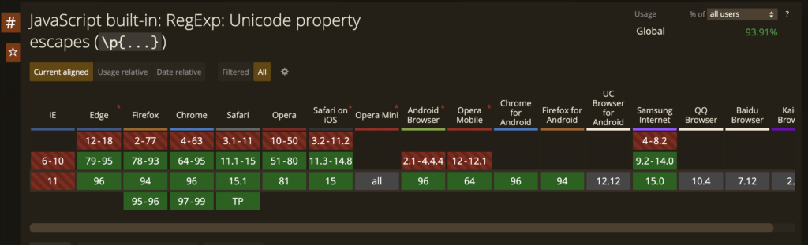

If you have user-generated content in your web application, chances are you have to deal with strings containing emojis. Since emojis are stored as Unicode, chances are that we want to detect these in our code and then render them accordingly. This article discusses how we can check if a string contains emojis in JavaScript.

A Unicode representation of emojis looks something like this:

```
'\u{1F60A}' // "😊"
'\u{1F42A}' // "🐪"
```

And JavaScript regular expressions have a Unicode mode now, so we can use [Unicode property escapes](https://developer.mozilla.org/en-US/docs/Web/JavaScript/Guide/Regular_Expressions/Unicode_Property_Escapes) to check for various things like emojis and currency symbols.

```
const emojiRegex = /\p{Emoji}/u;
emojiRegex.test('😊'); // true
```

And it has good browser support as well:



And if we wanted to do a replace, we can do:

```
'replacing emojis 😊🐪'.replaceAll(/\p{Emoji}/ug, '');

// 'replacing emojis'
```

The "g" flag was used to replace all emojis.

It is worth noting that some emojis are a combination of multiple emojis (or code points). So, this is not a fail-safe approach and there can be some more nuances:

```
"🇯🇵".replaceAll(/\p{Emoji}/gu, '-'); // '--'
"🙋🏿".replaceAll(/\p{Emoji}/gu, '-'); // '--'
"👨‍👩‍👧‍👦".replaceAll(/\p{Emoji}/gu, '-'); // '----'
```

The country flags are a combination of regional symbol indicator letters" (🇯 + 🇵), the emoji followed by a skin tone modifier is again a combination, and the family one is a combination of 4 different emojis.
