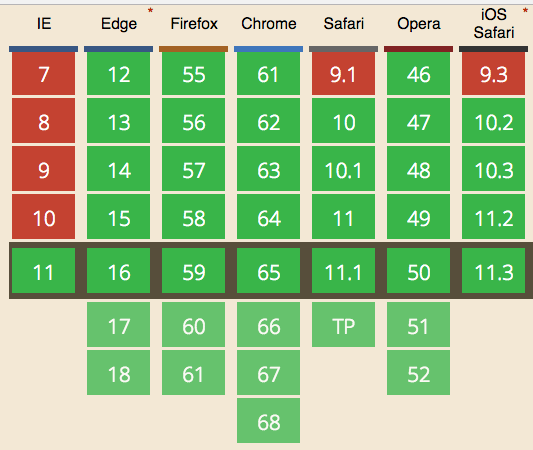

The process to format a number as currency can be a tedious task. It feels like a small task, but the number of lines and the edge cases can keep on increasing when considering factors such as internationalization and different formatting standards. Luckily, ES2015 introduced an internationalization API which can make the process to format a number as currency super easy.

## Writing our own formatting function

We can surely put together a hacky function for this, right?

```
let formatCurrency = (val, currency) => {
    let val;    
    switch (currency) {
        case 'USD':
            val = `$ ${val}`;
            break;
        case 'EUR':
            val = `€ ${val}`;
            break;
        default:
            throw new Error('Unknown currency format');
    }
    return val;
}
```

But what if we want to handle formatting such as $ 100 is good, but 1000 should be shown as $ 1,000? Let us make use of some Regex magic.

```
let formatCurrency = (val, currency) => {
  let currencyVal = val.toFixed(2).replace(/\d(?=(\d{3})+\.)/g, '$&,'); 
  switch (currency) {
        case 'USD':
            val = `$ ${currencyVal}`;
            break;
        case 'EUR':
            val = `€ ${currencyVal}`;
            break;
        default:
            throw new Error('Unknown currency format');
    }
    return val;
}

console.log(formatCurrency(1000,'USD'));
// "$ 1,000.00"
```

The challenges with this approach are:

- There are a bunch of currencies (~300)

- Some currencies use &#8216;.' as the separator between thousands instead of &#8216;,'

- Those currencies use &#8216;,' as the step separator
"$ 1000.05" would be "€ 1.000,05" in german euros

- Some currencies have the thousand's separators at custom positions
1000000 would be ₹10,00,000.00&#8243; instead of $1,000,000.00&#8243;

And so on and so forth. We do not want to be testing across all currencies and across all browsers.

## Formatting using the locale string (the better way)

Before ES2015 and the internationalization API, we could still format a Number as currency making use of locale and string formatting. A locale is a collection of parameters that allow the developer to specify region specific attributes such as:

- Currency format

- Date-time format

- Weekday format

- Number format

- Unit of measurement

```
const cashBalance = 10000; // 🤑

console.log(
  cashBalance.toLocaleString('en-US',
    {style: 'currency', currency: 'USD'}
  )
); // '$10,000.00'
```

This worked fine and was recommended before the ECMAScript internationalization API came into the picture. However, some (older) browsers use the system locale instead of the locale specified as a parameter. Also, since toLocaleString is a method for string manipulation in general, it is not a performant option. Thus, the Intl.NumberFormat specification was brought in, and it is the preferred way to format a number as currency in JavaScript.

## Format a number as currency using Intl.NumberFormat

```
new Intl.NumberFormat([locales[, options]])
```

The first parameter is the locale string which represents the language and the region settings. It comprises of the language code and the country code.

en-US: English +USA
de-DE: German + Germany
en-IN: English + India

The options parameter has a ton of options. But we will be sticking to style, currency and minimum fraction digits for this post.

Since this post is about currency, we will be using style as currency. Other possible values include decimal and percent.

you can check out these links for reading more about [language codes](https://www.w3schools.com/tags/ref_language_codes.asp), [country codes](https://www.w3schools.com/tags/ref_country_codes.asp), and the [list of currencies](https://www.currency-iso.org/en/home/tables/table-a1.html).

The minimum fraction digits tells the minimum number of decimal places to include while formatting.

Putting it all together:

```
const usDollar = new Intl.NumberFormat('en-US', {
  style: 'currency',
  currency: 'USD',
  minimumFractionDigits: 2
})

const rupeeIndian = Intl.NumberFormat("en-IN", {
    style: "currency",
    currency: "INR",
    minimumFractionDigits: 2
});

const euroGerman = Intl.NumberFormat("de-DE", {
    style: "currency",
    currency: "EUR",
    minimumFractionDigits: 2
});

const price = 1000000.0535;

console.log(usDollar.format(price)); // $1,000,000.05

console.log(rupeeIndian.format(price)); // ₹10,00,000.05

console.log(euroGerman.format(price)); // 1.000.000,05 €
```

Here is the browser compatibility if you want to see for yourself if you should use the internationalization API or not:



And that is all you need to know about how to format a number as currency using ECMAScript. If you have any questions, feel free to drop a comment below.
