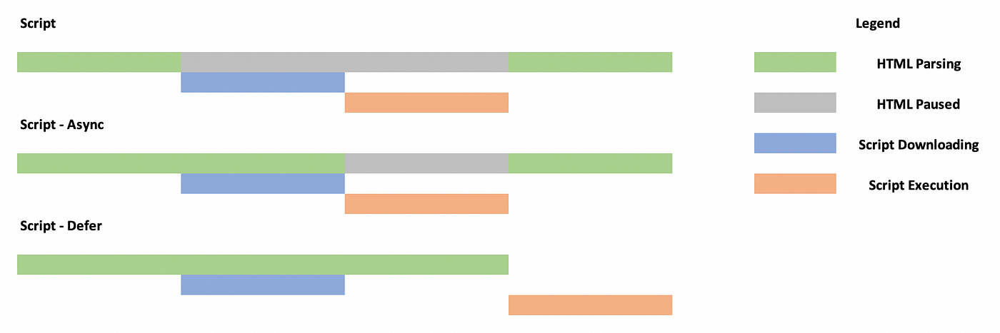

We are all used to using the script tag to load external JavaScript files in our HTML. Traditionally, the only workaround for having the scripts load after the HTML has been loaded was to move the script tags towards the end of the body. But JavaScript has come a long way since then. Attributes such as defer and async have been added to the specification in ES2015 that allow more granular control of how JavaScript gets loaded.

Let us take a look at what defer and async attributes are and how they help optimize JavaScript loading.

## Why do we need these tags?

If a script tag is placed in the header of an HTML page, the parsing of the HTML is paused until the script is fetched, and executed. The HTML parsing only resumes once the script execution is completed. This can lead to poor user experiences. Both defer and async help avoid this. They allow parallel download of the script tag while the HTML is being parsed.

## Defer and async

Both of these are boolean attributes with a similar syntax:

```
script defer src="script.js">script>
```

and

```
script async src="script.js">script>
```

It is worth noting that the tags are only useful if the script is in the head section of the HTML. They are useless if the script is put inside the body tag.

If both are specified, precedence is given to async.

## Async

When the browser encounters a script tag with the async attribute, it downloads the script in parallel while it continues to parse the HTML. Once the script is fully downloaded, the browser pauses the HTML parsing and executes the script file. This helps improve the overall loading time of the page.

## Defer

The defer tag is similar to the async tag in the sense that it allows the parallel download of the JavaScript file without pausing HTML parsing. It goes one step further by waiting for the HTML parsing to be completed before executing the script.

## Which one should I use?

Here is a graphic to help visualize the different processes:



Most of the time defer is the preferred option because it reduces page load time the most. It does not execute until the DOM is ready, and follows the script order. So you get more control about the script's execution as well.

Async sounds sexier but it is only useful if the script does not need the DOM or any other scripts.

And that is all you need to know about defer and async attributes on the script tag and how you can optimize the page loading time by using these. If you have any questions, feel free to drop a comment below.
