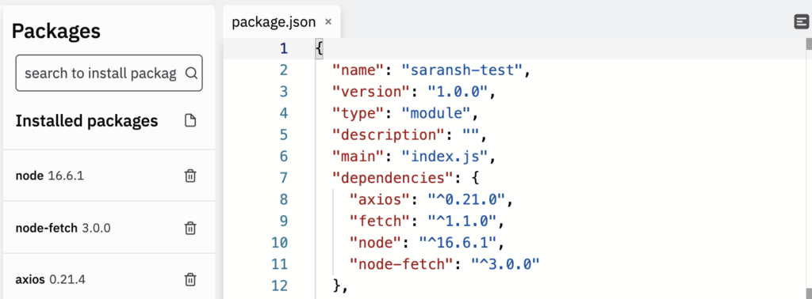

I was recently trying to use a later version of Node on Repl.it. I wanted to use a package that supported ES Modules, and the default version did not have support for it. So I wanted to use the latest node version in Repl.it. And found that there was no direct way of doing so. But it is still possible with a few custom steps.

## The setup

Repl.it allows specifying the node.js version as part of the package.json itself. But it does not use the installed version by default when running the script. But before we get to that, we need to install our node version in repl.it. To do so, we go to the package.json and add the version we want. Or we could have used the package manager interface to do so:



## Configuring Repl.it

Once this is setup, we need to use this version instead of the repl.it default Node.js version. We need to make use of a configuration for Repl.it by creating a file named .replit. You can read more about it [here](https://docs.replit.com/programming-ide/configuring-run-button) if you are interested.

In this file, we will add the contents:

```
run="npm start"
```

This will execute node from the shell instead of the console. And then all that is left to do is configure the start script in our package.json file:

```
  "scripts": {
    "start": "node ."
  }
```

If we wanted to start using the latest version for the shell as well, we can execute the following command in the shell:

```
npm config set prefix=$(pwd)/node_modules/node && export PATH=$(pwd)/node_modules/node/bin:$PATH
```

Optionally, we might want to re-install the packages installed if we want to target them to the higher version of node.js that we just installed.

And that should be it. Our custom node version in repl.it should be ready and good to go. As soon as we hit the Run button, the index.js script will be executed using the node version we specified in our package.json.

If you have any questions regarding this, feel free to drop a comment below!
