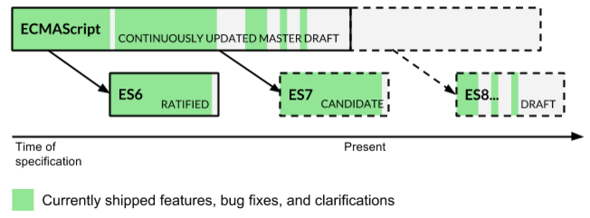

Most of you would already be aware that javascript is an implementation of ECMAScript (ES). ES is the standardized language specification, and javascript is the dialect or the implementation. After the ES5 standardization in 2009, there were no updates to it. And since then, javascript has evolved a lot. It is no longer a scripting language that runs on the client side. Nor is it restricted to the web. It goes further beyond. Hence there arose a need for adding more features to vanilla javascript. And it had to be done in a way that all browsers implemented all these changes. So, documentation for ecmascript 6 or ES2015 (code named Harmony) was started in mid 2014. It introduces a comprehensive amount of new syntax to the language and can be considered as one of the biggest changes to javascript (Except for ES4, which was abandoned).

Although ES7 is in draft status as of the time of writing this blog post, browsers are yet to implement all features of ES6. What is taking so long is the fact that the specification introduces a large amount of features  and new syntax to the language. And backwards compatibility needs to be maintained as well. Plus the ability to run everywhere and the dynamic nature of the language make implementing es6 a challenging task.

The key features introduced in Ecmascript 6 are:

- Block bindings (introducing let and const keywords)

- Rest and Default parameters

- Classes

- Functional javascript (Arrow functions)

- Destructuring

- Built in Objects (Sets and Maps)

- Asynchronous Programming (Promises)

- Modules

- Generators

- Template Strings

In this post, I will not get into the details about all these features. I would address the other common question:

## Should I start using es6 now or wait?

There is no simple yes/no answer to this question. The answer depends on various questions such as the scale of the project you wish to use it in, the features of es6 you intend to use, the browsers you want to support and a few other similar questions. The good news, however, is that the tooling exists for you to take advantage of es6 in production right now. Internet Explorer, as always, is yet to catch up, but as the edge website [states](https://developer.microsoft.com/en-us/microsoft-edge/platform/status/), they are working on it. For a real time comparison of which browsers have implemented what feature, you can refer to the es6 compatibility table om [github](https://kangax.github.io/compat-table/es6/) which gives an excellent overview of all the features supported by all browsers. For people planning to use ES6 in production, there are 2 options:

## Transpiling

The process of transforming and compiling is known as transpiling. This is different than compiling since the output is source code which is then executed. Transpiling es6 to es5 makes your es6 code run on existing browsers by converting it to es5 code. By adding this extra step in your build process (using an automation tool such as gulp or grunt), you can integrate a transpiler in your development workflow. And since es5 runs on all existing browsers, you get your code base running on all existing platforms. The 2 most common transpilers are:

- [Babel](https://babeljs.io/): This is an open source transpiler which outputs the cleanest es5 code in my opinion.

- [Traceur](https://github.com/google/traceur-compiler): Another open source transpiler, maintained by Google, that maps ES6 to ES5.

You can also use languages such as Typescript to transpile your code, but most prefer not to. Since it involves an additional step of learning a new language.

## Polyfilling aka Shimming

A polyfill is a piece of code which assists in having additional functionality which is not built into the browser. This helps future proof your code. You can use polyfills for specific functionalities of es6 that you wish to use by including the corresponding javascript files for the polyfill. This then enables you to run your code without worrying about the browser it will run upon. Do note that all es6 features cannot be polyfilled since many are language features and not just syntactic sugar.

There is a fantastic [github repo](https://github.com/addyosmani/es6-tools) maintained by Addy Osmani on all the polyfills and transpiling options available for es6. It is a great resource and one that I recommend you to check out.

Apart from the options mentioned above, if you are just looking for an option to try es6 in your browser, to play with it, there are sites and browser extensions which help you do so. You can either use plunkr and select the traceur package from the options, or use [Babel REPL](https://babeljs.io/repl/) or the [scratch js extension for chrome](https://chrome.google.com/webstore/detail/scratch-js/alploljligeomonipppgaahpkenfnfkn?utm_source=chrome-ntp-icon).

All the developments in es6 should excite you as a javascript developer. Whether you intend to use it right away, or sometime in the near future, you must start understanding the concepts of es6 and what all the specification has to offer. And if you want a post describing all the new es6 features I mentioned above, let me know in comments. Now go and play with the future version of javascript aka es6!
