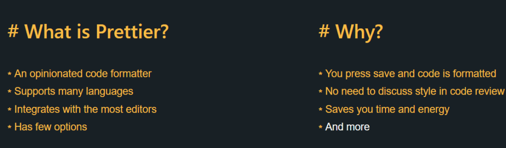

If you have been programming for a while, you would be familiar with the hassles of writing clean code and maintaining consistency across a project on some specific code style guidelines. Even if you spend a few days making everything consistent, some other developer might check-in their changes or disable some flag to quickly get their code in.

Wasting time formatting your code is a monotonous task and Prettier has been designed to solve this problem of wasting time on it. So it helps you overcome formatting fatigue with a very easy setup.

## What does Prettier do?

Prettier is an opinionated code formatter and it automates the process of formatting the entire code base. So, after setting up prettier, you no longer need to argue with coworkers about code formatting rules, semicolons, line breaks, etc. It takes in all your code, removes all formatting, and re-formats the code according to its style guidelines.

Under the hood, all the javascript code is converted into Abstract Syntax Tree and then formatted back. So it ensures that there would not be any breaking changes to the code that was written. For you, everything gets formatted magically and you do not have to worry about it.

For example:

```
foo(reallyLongArg(), omgSoManyParameters(), IShouldRefactorThis(), isThereSeriouslyAnotherOne());
```

gets converted to

```
foo(
  reallyLongArg(),
  omgSoManyParameters(),
  IShouldRefactorThis(),
  isThereSeriouslyAnotherOne()
);
```

If you want to take it for a spin, use the [playground](https://prettier.io/playground) to play with it. To sum it up:



## But I already have ESLint!

This is one of the most commonly asked questions and the brief answer is that ESLint is a code quality tool (no unused variables, no global variables, prefer promises, etc.). On the other hand, Prettier is only concerned about formatting the file (maximum length, mixed tabs, and spaces, quote style, etc.). You can integrate prettier with ESLint to have a win-win combo.

## What about Editorconfig?

Prettier version 1.9 onwards reads from [editorconfig](https://www.wisdomgeek.com/programming/editorconfig/) if it is present. The properties that are respected are: indent_style, indent_size/tab_width and max_line_length.

## How do I set it up?

You can setup Prettier at one of the following levels:

- Editor plugins

- CLI

- Pre-commit hooks

## For editors

To install it in your IDE/Editor, go to the [integrations](https://prettier.io/docs/en/editors.html) page on the website and download the corresponding plugin. It should be a pretty simple process. For Visual Studio Code, all you need is to download it from the marketplace. After that, I put in a preference in my user settings (`"editor.formatOnSave": true`). And it just worked! (I also have the `"prettier.singleQuote": true` setting turned on, but that is a personal preference.) Other editor level configuration can be set here too.

## For projects

You need to install the prettier CLI first. We will add it as a dev dependency. (`yarn add prettier --dev --exact` or `npm install --save-dev --save-exact prettier`). Prettier recommends installing the exact version in your project since they tend to introduce stylistic changes in patch releases. After installation succeeds, to run against a specific file, all you need to do now is run the command `yarn prettier --write index.js`. This will pretty print the index.js file in its place itself.

You can configure other options that you want prettier to work with, but usually, a configuration file is used for it. These can be added to a .prettierrc file in the root folder of your project. The available [options](https://prettier.io/docs/en/options.html) can be found on the website.

You can then add this command to your NPM scripts passing in your src folder as a glob to it instead of a single file. The script for formatting would look like: `prettier --write './src/**/*.{ts,js,css,json}'`

You can either specify the options using command line arguments here if you are not using multiple of those, or use the .prettierrc file.

And then you can invoke this as a part of your build step. And this will make all the changes in place.

You can go one more step further and integrate prettier as a pre-commit hook in the project. You will need to install husky for this along with either lint-staged or pretty-quick. (Use lint-staged if you are using other tools on top of prettier like ESLint.) After installing these  packages as dev dependencies from NPM, you can add the following configuration to your package.json file:
For pretty-quick:

```
"scripts": {
    "precommit": "pretty-quick --staged"
  }
```

For lint-staged:

```
"scripts": {
   "precommit": "lint-staged",
   "lint-staged": {
    "*.{ts,js,css,json}": [
       "prettier --write", 
       "git add"
     ]
  }
}
```

Do note that when you have prettier running as a pre-commit hook, it breaks staging hunks. A workaround (suggested on Reddit by [gocarsno](https://www.reddit.com/r/javascript/comments/7xqvae/using_prettier_to_format_your_javascript_code/dubchuc/)) would be to stashing all unstaged changes before committing (`git stash -k`)

You can go even further by adding another check in the build step of your project. Facebook does this step and I saw it in one of the employees mention it in a conference talk. You can run prettier on the CI/CD server on the files and if the files output by prettier is different than what is checked in, the server fails the build because of it. It all depends on how aggressively you want to use it.

So what are you waiting for? Go ahead, set up prettier now! And say goodbye to formatting things manually. Let the machine do it for you.

Also, do share this post and let more people discover about prettier. 😉
