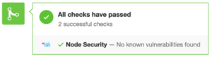

Since npm is an open platform, anyone can publish packages to it. And thus the security impact of using npm in an application can make some people paranoid. Since a lot of projects today are written using node, node.js security should become an important part of your workflow. [Node security platform](https://nodesecurity.io/) is one such tool that provides a method to check the npm packages that you have installed for known vulnerabilities. You can also use retire.js but a security scanner from node would be preferred by most.

For using node security platform, all you need to do is use the command `nspcheck` in your command line . And the command line will report any known vulnerabilities if they are found in the project. To install it, you just need to run the command `npm install –g nsp` or if you are using yarn, `yarn global add nsp`. After that, a simple `nsp check` in the project directory will check the packages installed for known security vulnerabilities, and report them if found.

This step can be integrated as a build step in your project. The integration ensures that the check is run at some point in the development workflow ensuring any new package that gets added does not introduce any security vulnerabilities. When to run the check for security scanning is also a decision point. But it is one that needs to be made to ensure better node.js security. The options of when to run and the shortcomings with them are as follows:

- On npm install: A good option, but vulnerabilities can be introduced when packages are updated.

- Giving production builds: Expensive operation since the package would already have been used in the project and changing it would be an expensive process.

- On running npm start: Makes project start a bit slower and also makes the start process require an internet connection to run.

When you make node.js security scanning project a part of the build process, you also get the advantages of not having to install node security project globally. So, whatever you choose out of the three above options, do ensure that you do include the security check for vulnerabilities at some point in your build/development process since it is easy to forget to do it manually. Node Security Project is free for open source projects, and the first private repository. Beyond that, they charge 1$ per month per private repository. Integration in GitHub gives messages like this:

 

So go and integrate node.js security check in your project right now. And save yourself the hassle of being vulnerable!
