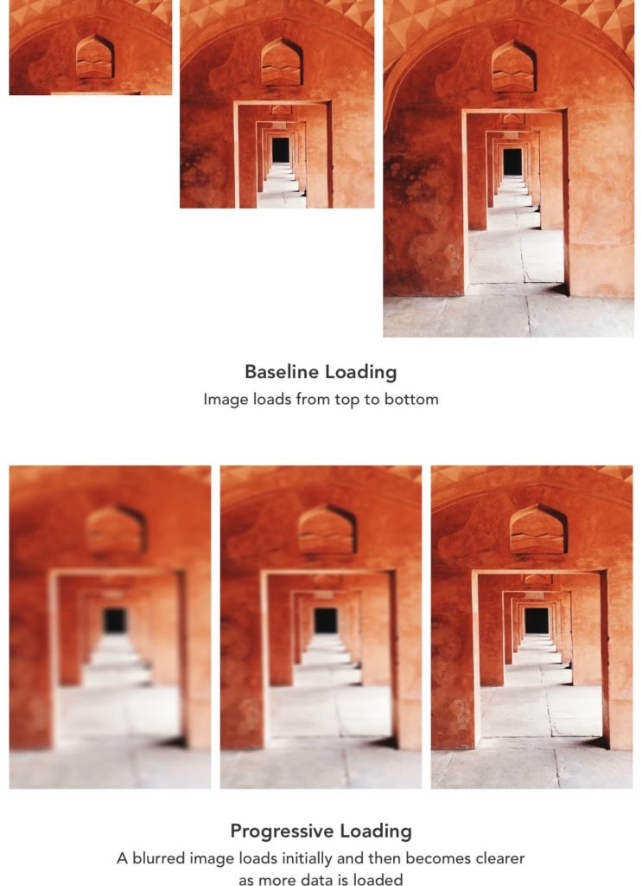
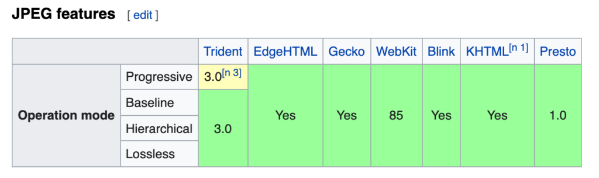

A progressive JPEG image is a JPEG image that is encoded in a different manner than a baseline JPEG. It loads in waves until a clear picture is loaded. This can improve the performance of a website as the image appears to be loading faster.

## The difference between Progressive JPEG and baseline JPEG

The differences between Progressive JPEG and baseline JPEG are mostly in the encoding and compression. And they are most visible on a slower internet connection.

The baseline format loads one line at a time, top to bottom. whereas the progressive JPEG one appears blurry and pixelated at first and then loads into a clearer image.

Source: https://docs.imagekit.io/features/progressive-jpegs

As can be seen, the user experience drastically improves with Progressive JPEGs.

## Converting images

While there are quite a lot of tools, both applications, and web-based, web developers want a CLI to be able to do so. And jpegtran is exactly that.

```
jpegtran -progressive old.jpeg > new.jpeg
```

There is also an [NPM package](https://www.npmjs.com/package/jpegtran) for it.

It is also worth noting that all major browsers support Progressive JPEG:



The exception, Safari, will render the image all at once. So progressive JPEGs work for Safari too, not how it works everywhere else. But at least it is not broken!

And that is all that there is to share about Progressive JPEGs. Start using them in your applications, now!
