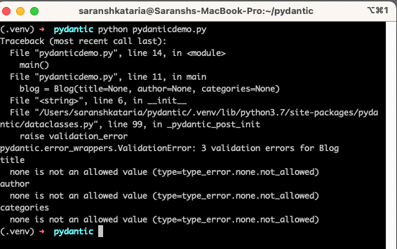

The introduction of type hinting opened the gates for many great new features in Python. And data validation and parsing became easier to do with the use of type hints. Pydantic is one such package that enforces type hints at runtime. It throws errors, allowing developers to catch invalid data.

Pydantic not only does type checking and validation but it can also be used to add constraints to properties and create custom validations for Python variables. It guarantees the types and constraints of the model have been applied and that the data is valid.

This is useful, especially when we have complex nested data. We no longer need to parse JSON's to dictionaries. We can use Pydantic to get better typed code and add validators, ensuring fewer errors.

It is important to note that Pydantic is different from Pyright in the sense that it performs validation of the data and parses input data at run-time. Pyright, on the other hand, is a static type checker and it only does that. Both tools can be used together to get more robust Python code.

## Initial setup

As with all things Python, we should setup a [Python virtual environment](https://www.wisdomgeek.com/development/web-development/python/managing-python-dependencies-using-virtual-environments/) for any new project. After doing that, we install Pydantic using pip:

```
python -m pip install pytest
```

Let us first write our code using the dataclass decorator. The dataclass decorator was introduced in Python 3.7 and allows us to reduce boilerplate code such as the init method. They also allow using type hints for our properties. So let us create a Blog data class:

```
from dataclasses import dataclass
from typing import Tuple

@dataclass
class Blog:
    title: str
    author: str
    categories: Tuple[str,...]
```

The Tuple[str,...] means a tuple of type string having a variable number of elements.

Since none of the types are marked Optional, we should not be able to assign None to any of these. That means a blog post needs a title, an author and a category. But if we were to assign None to them, there would not be any error thrown:

```
def main():
    blog = Blog(title=None, author=None, categories=None)
    print(blog)
```

We get the output:

```
Blog(title=None, author=None, categories=None)
```

There are no errors thrown because type hints are an optional feature and Python does not enforce them. And if we were fetching these from an API endpoint, we would want them to be validated first before performing any logic with the data. And that is where Pydantic comes into the picture.

## Creating the Pydantic model

We can replace the dataclass attribute to be imported from pydantic instead and if we run it with just that change, we will see the validation errors.

```
from pydantic.dataclasses import dataclass
```

And this will throw the errors:



Pydantic does support type conversion. So if we pass the value &#8216;2' to an int field, it will be converted and not throw an error.

However, data classes have some limitations. And Pydantic provides a BaseModel class, which we can extend from. Doing so provides us with features like serialization and first-class JSON support. So, we will convert our code to:

```
from pydantic import BaseModel
from typing import Tuple

class Blog(BaseModel):
    title: str
    author: str
    categories: Tuple[str,...]

def main():
    blog = Blog(title=None, author=None, categories=None)
    print(blog)

main()
```

The BaseModel implementation is probably the better way to go because of the additional features. It is important to note though that we should not put both the dataclass decorator and the extend from BaseModel since that will not work.

Another thing to note is that BaseModel requires keyword arguments, so while this would have worked with dataclass:

```
blog=Blog("Hello World","Saransh Kataria",("Wisdom","Geek"))
```

With BaseModel, keyword arguments need to be explicit:

```
blog=Blog(title="Hello World",author="Saransh Kataria",categories=("Wisdom","Geek"))
```

Or we can use **kwargs to do so.

## Pydantic and JSON features

We can convert the Pydantic model to a JSON string using the json() function:

```
print(blog.json())

# {"title": "Hello World", "author": "Saransh Kataria", "categories": ["Wisdom", "Geek"]}
```

And we can parse a JSON to a Pydantic model using the `parse_raw` function:

```
blog = Blog.parse_raw('{"title": "Hello World", "author": "Saransh Kataria", "categories": ["Wisdom", "Geek"]}')
print(blog.title)

# Hello World
```

And all of the validations will be performed while doing the JSON parsing. And if there are any errors during parsing, `ValidationError` with friendly messages will be thrown for those. 

## Adding custom validations

Let us say we want the authors to be only able to publish 5 posts at a maximum. We will add a number_of_posts field and impose that validation. For doing so, we need to make use of the Field function from Pydantic.

Then, we want to use this Field function, which accepts the first parameter as the default value we want to provide to the variable. We can specify a default one or use "..." to specify that it is a required field. In our case, we will specify 0. The rest of the parameters can be validations that we want to specify that should be checked on the field. We will use `gt=0` and `lt=5` for specifying that the value should be greater than or equal to zero and less than equal to 5.

```
from pydantic import BaseModel, Field

class Blog(BaseModel):
    number_of_posts: int = Field(0,gt=0,lt=5)

def main():
    blog=Blog(number_of_posts=2)
    print(blog.json())

main()

# {"number_of_posts": 2}
```

But if we run it with

```
blog=Blog(number_of_posts=2)

Traceback (most recent call last):
  File "pydanticdemo.py", line 10, in 
    main()
  File "pydanticdemo.py", line 7, in main
    blog=Blog(number_of_posts=10)
  File "/Users/saranshkataria/pydantic/.venv/lib/python3.7/site-packages/pydantic/main.py", line 400, in __init__
    raise validation_error
pydantic.error_wrappers.ValidationError: 1 validation error for Blog
number_of_posts
  ensure this value is less than 5 (type=value_error.number.not_lt; limit_value=5)
```

We see a value error since our validation failed. If we want our own custom checks apart from the built in ones, we can import the validator decorator. Then we can create a function that we want to use to validate a property. The validator decorator needs the name of the property to be validated and then the function will receive the class and the property as parameters.

```
from pydantic import BaseModel, validator

class Blog(BaseModel):
    name: str

    @validator('name')
    def check_name_length(cls, name):
        if(len(name) 3):
            raise ValueError('name too short')
        return name

def main():
    blog=Blog(name="SK")
    print(blog.json())

main()
```

We are imposing that the name field should have a length greater than 3. And since it is not in this case, we get the error:

```
Traceback (most recent call last):
  File "pydanticdemo.py", line 16, in 
    main()
  File "pydanticdemo.py", line 13, in main
    blog=Blog(name="SK")
  File "/Users/saranshkataria/pydantic/.venv/lib/python3.7/site-packages/pydantic/main.py", line 400, in __init__
    raise validation_error
pydantic.error_wrappers.ValidationError: 1 validation error for Blog
name
  name too short (type=value_error)
```

## Wrap Up

And that is just scratching the surface of how Pydantic can be used to validate our data classes and object models. There is a lot more that can be done using Pydantic and you should definitely go and check the [docs](https://pydantic-docs.helpmanual.io/) to learn more! If you have any questions, feel free to get in touch.
