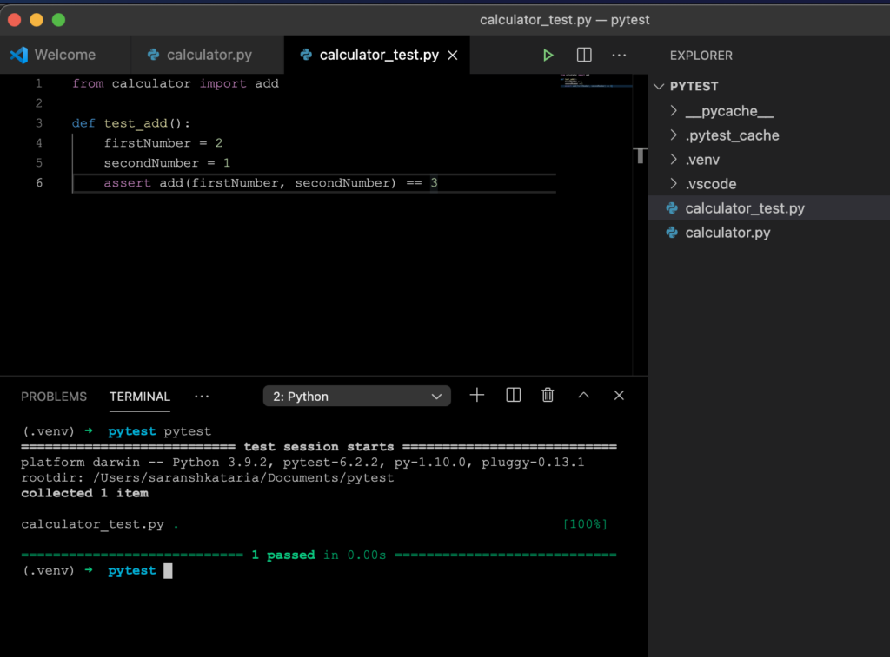

Testing our code brings in a variety of benefits, including building confidence in the code's functioning and having lesser regressions. Writing and maintaining tests requires some additional work, and that is why we want to leverage tools as much as we can. Python does provide inbuilt tools such as [unittest](https://docs.python.org/3/library/unittest.html) for supporting testing, but it involves writing a lot of boilerplate code. It also has a limited ability to reuse components (or fixtures in PyTest). Therefore we will be testing Python applications using Pytest instead of other tools. Pytest is the most popular tool among other alternatives as well.

(We will be using Python 3 in this tutorial.)

## Why Pytest?

Pytest is one of the most popular libraries dedicated to unit and functional testing. But what makes it so popular?

- Less boilerplate

- Setup code can be reused by making use of fixtures

- Filtering of tests while executing (to run only a specific set of test(s) at a time)

- Parameterizing tests (to provide different input values to the same test allowing testing of various scenarios making use of one test)

- Plugin-based architecture that enables flexibility and wider adoption

- Allows parallel execution of tests

## Installing Pytest

Pytest is a dependency that we will need to add to our project. As we know from our previous post on [managing python virtual environments](https://www.wisdomgeek.com/development/web-development/python/managing-python-dependencies-using-virtual-environments/), we always want to be working in one.

```
$ mkdir pytest-demo
$ cd pytest-demo
$ python3 -m venv .venv
$ source .venv/bin/activate
```

And then, we will install Pytest.

```
$ pip install pytest
```

This will enable the pytest command in our installation environment. This completes our first step in testing Python applications using Pytest. Let us move on to the next step.

## Naming conventions

As with any test framework, Pytest has a few places that it automatically looks for test files.

The file name should start with "test" or end with "_test.py".

The test functions that are defined should start with "test_". Methods that do not follow this convention do not get executed. To see which tests will get executed without running them, we can use:

```
pytest --collect-only
```

To execute all tests in our pytest-demo directory, we can run:

```
pytest pytest-demo
```

Pytest will run in the current directory by default if we do not specify the directory. Or we can specify individual files if we want to do that.

Or if we want to ignore a directory (such as the virtual environment), we can use:

```
pytest --ignore .venv
```

## Code setup

Now that we know the basics let us set up the code we will be testing. We can use a complex code block and write multiple test cases around it, but this post is more about Pytest than writing test cases. So, we will stick to a simple addition and subtraction problem.

```
# calculator.py

def add(firstNumber, secondNumber):
    return firstNumber + secondNumber

def subtract(firstNumber, secondNumber):
    return firstNumber - secondNumber
```

## Testing Python applications using Pytest

Now that we have our minimal piece of code, we can start with our basic test. We will be doing a calculation of 2+1 = 3. For this, we will define our test as:

```
# calculator_test.py
from calculator import add

def test_add():
    firstNumber = 2
    secondNumber = 1
    assert add(firstNumber, secondNumber) == 3
```

The assert keyword compares the two values it gets and returns True or False based on their equality. We can also have detailed assertions, which can be helpful in debugging. They can be written as:

```
assert True == False, "This is a demo with a failed assertion and a detailed message."
```

Detailed assertions can be useful for debugging purposes.

And we can run our test using the command:

```
pytest
```



Similarly, we can write a test for our subtract method as well.

```
# calculator_test.py
from calculator import add

def test_add():
    firstNumber = 2
    secondNumber = 1
    assert subtract(firstNumber, secondNumber) == 1
```

## Verbosity level of Pytest

We can pass in a parameter while running the tests to increase/decrease the verbosity of the output generated by Pytest. The following options are available:

-v: increases verbosity
-q: quiter output
-r: summary of tests
-rp: summary of passed tests
-rp: summary of failed tests

And that is a quick introduction to testing Python applications using Pytest. We will cover fixtures and parameterized functions in our next post. Until then, if you have any questions, drop a comment below; we would be happy to help you!
