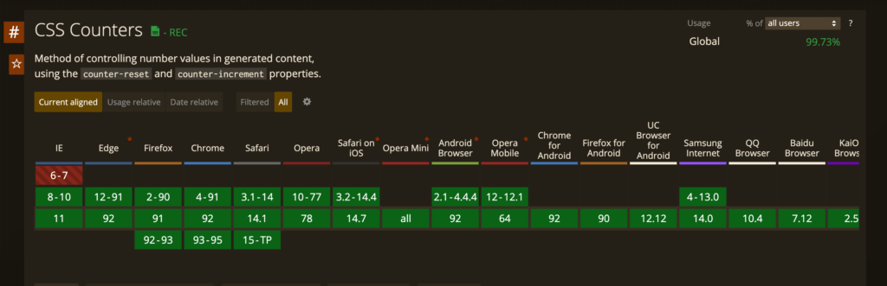

Ordered lists have been an important part of web design for quite a while now. If we needed more control over the appearance of numbers, we had to add more HTML and/or JavaScript to do so until now. Counters in CSS save us much of that trouble.

## Challenges with ol

An ordered list can be rendered as:
1. Item one
2. Item one
3. Item one

What if we wanted complex numbering? What if we wanted dynamic pagination? Or style the numbers in a particular manner?

Instead of doing `<li>Item one</li>`, we would have had to replace it by `<div><span>1.</span>Item one</div>` instead.

And then apply styles to the span tags. But we are developers. We don't like hard-coded numbers and repetition! Counters in CSS come to our rescue.

## Counters in CSS

CSS counters are variables whose values can be changed by using CSS rules. They are scoped to the current web page.

Before using counters in CSS, we need to understand its properties. `counter-reset`, `counter-increment` and `counter()` properties are what make the dynamic nature of counters a possibility. There are a couple of other properties as well, but these are sufficient for a basic counter.

- counter-reset is used to reset or initialize the counter. A counter needs to be created with this property in order for it to be used.

- counter-increment is used to increment the value of a counter.

- counter does the heavy lifting. It should be used inside the content property in a `:before` or `:after` pseudo selector to increment counts.

Putting these together, we will first initialize our list:

```
div.list {
  counter-reset: numbered-list;
}
```

We are creating a variable called numbered-list to store our counters. Next, we want to increment the variable value every time we encounter a div inside this list. To do that, we will do:

```
div.list div {
  counter-increment: list-number;
}
```

This sets up our counter. We need to now add it to the DOM using the content property. 

```
div.list div:before {
  content: counter(numbered-list);
}
```

And if we apply this CSS to a list:

```
div class="list">
  div>Item 1div>
  div>Item 2div>
div>
```

We get the output:
1Item 1
2Item 2

We can then style the div.list div:before section of the element as we saw fit.

We can even specify a custom starting point to the counter by initializing it as:

```
counter-reset: list-number 10;
```

Or specify the increment value:

```
counter-increment: list-number 10;
```

Browser support for counters is pretty good too:



So we can start counters in CSS without much hassle.

There are other functions such as counters() which allow nested counters and the counter function also takes a second parameter to specify the format of the counter which are good additions if you are looking for them.

And that is all you need to know about counters in CSS. Feel free to drop a comment below if you have any questions.
