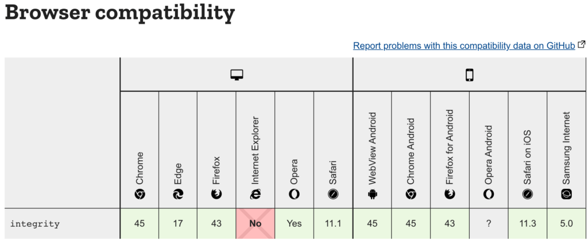

Sub Resource Integrity (SRI) is a security feature that can be used to validate that the resources that the browser is fetching have not been manipulated.

But why do you need it? Remember that script tag that you keep throwing at random places in your code? What if someone got access to the CDN/third-party server where it was hosted and modified the JavaScript being served? It would be a serious security breach that can cause a lot of issues.

Sub Resource Integrity allows providing a hash of the file which must match when the browser fetches the file.

## How to use Sub Resource Integrity

As mentioned before, a hash needs to be added to the script tag. The browser then compares the script filed that gets downloaded has the same hash or not.

```
script src="https://example.com/example-framework.js"
        integrity="sha384-oqVuAfXRKap7fdgcCY5uykM6+R9GqQ8K/uxy9rx7HNQlGYl1kPzQho1wx4JwY8wC"
        crossorigin="anonymous">script>
```

Integrity is a base64-encoded cryptographic hash that can be generated (more on this below). It is also important to know that crossorigin needs to be enabled on the vendor server.

If the script or stylesheet does not match the associated integrity value, the browser will not execute the file/ render the stylesheet. The browser throws a network error instead.

This avoids tampering of the file and man in the middle attacks. But it is the developer's responsibility to ensure that the file is free of other vulnerabilities.

## Generating SRI

Sub Resource Integrity can be generated using OpenSSL. The file's contents need to be passed to the OpenSSL command as an input and a digest needs to be created using sha384. The digest then needs to be passed to another OpenSSL command to base64 encode it. To do it in a single command:

```
cat example-framework.js | openssl dgst -sha384 -binary | openssl base64 -A
```

Or there are [online tools](https://www.srihash.org/) available to do so as well.

## SRI and Webpack

As with all things Webpack, there is a plugin to generate Sub Resource Integrity tags automatically. Since we avoid adding tags manually when using Webpack any way, this plugin  becomes useful in handling the hash generation process.

Install the plugin:

```
npm install webpack-subresource-integrity — save-dev
```

or

```
yarn add --dev webpack-subresource-integrity
```

In the webpack.config.js file, add:

```
import SRIPlugin from 'webpack-subresource-integrity';

const compiler = webpack({
  output: { 
    crossOriginLoading: 'anonymous'
  },
  plugins: [
    new SRIPlugin({
      hashFuncNames: ['sha256', 'sha384'],
      enabled: process.env.NODE_ENV === 'production',
    }),
  ],
});
```

## Browser Support

All major browsers (no, IE is not included in that list) support SRI. It does not break in IE though, so it is definitely a must-have tool to avoid security risks.



And that is all you need to know about Sub Resource Integrity and how to use it!
