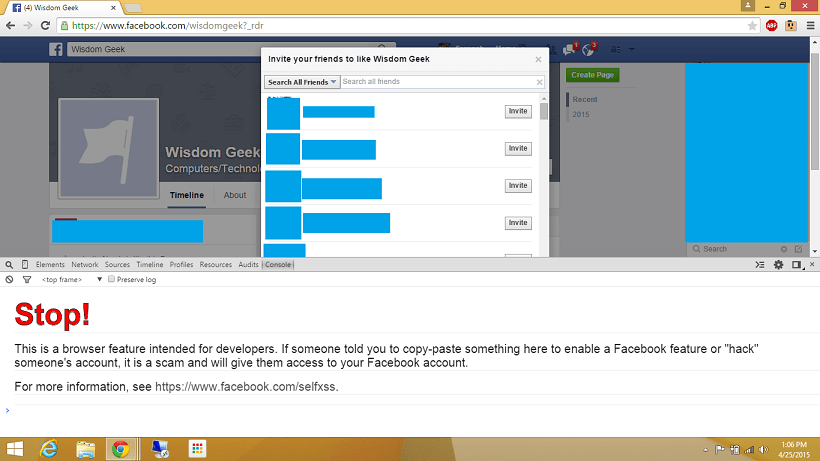
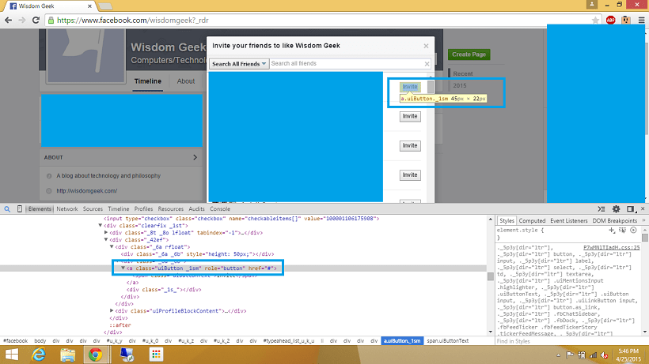

I recently created the Facebook page for Wisdom Geek. And obviously, the first step was going to be inviting all my Facebook friends to like the page! But lazy me wanted to keep the trouble of clicking invite manually away and having done so successfully via VB script and javascript in the past, this time, was not going to be any different. I googled the script and found that Facebook keeps changing the tag name of the links it creates in order to avoid people from automating this process. So instead of just putting the code to invite all friends on Facebook, I will explain how javascript works and what the code is doing. So that you can use it at any point in the future even if Facebook changes the classes and tag names. I am explaining the technique and what the code means so that you can easily do it on your own next time.

- Open the Facebook page in a new tab/window.

- Click on the invite friends to like page button present in the left pane.

- A list of about 50 friends will be displayed, scroll till the very end of the list in the pop-up to ensure all your friends are listed here in (The lazy ones can just press anywhere in the middle of the pop up and keep page down pressed endlessly till the time you reach the end).

- Open the console of your browser ([here](https://webmasters.stackexchange.com/questions/8525/how-to-open-the-javascript-console-in-different-browsers) is a list of keyboard shortcuts if you are unaware of how to do this).

You'll get a message like this saying:

It's just a precautionary step; I have no intentions of hacking any accounts and the script presented below is merely clicking buttons for you. Anyone with a fair knowledge of javascript will be able to tell you that. If you are still skeptical, don't try it out. But a little bit of javascript knowledge won't harm you, eh?
Paste in the script in the console:

`javascript:var inputs = document.getElementsByClassName('_1sm'); for(var i=0;i<inputs.length;i++) { inputs[i].click(); }`
- Once you press enter, the script will start clicking all invite buttons present on the page for you. All you need to do is sit back and relax. It might take a few minutes depending on the number of friends you have.

The script explained:

document.getElementsByClassName searches the whole HTML page for elements that contain the parameter passed in and returns an array of objects that match it. You then simply are iterating over these in a for loop and clicking them programmatically. So the next time you try it, and if it returns ILLEGAL or unexpected token ILLEGAL or something else (doesn't work in short), just right click and inspect element on a button. Check the class attached to the <a href=""> tag of the button and replace &#8216;_1sm' with the ending instead. And if it still is ends in &#8216;_1sm', just remove the quotes and type them in again. Many times the encoding of characters gets changed when copying quotes.

That's how you can mass invite Facebook friends to like a page. And if you have any troubles let us know in comments!

PS don't forget to like the [Facebook Page for WisdomGeek](https://www.facebook.com/wisdomgeek). Cheers!
