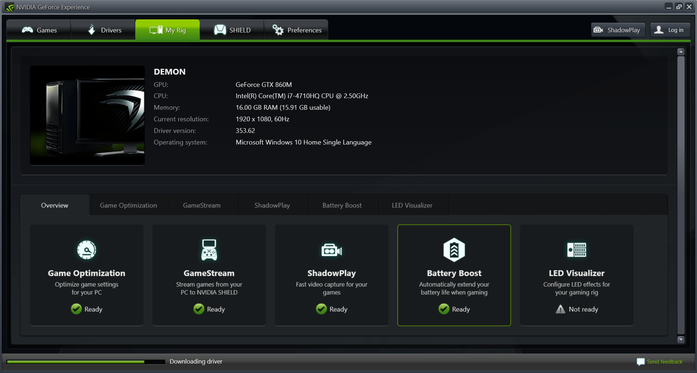
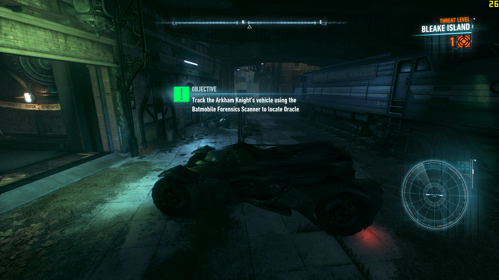
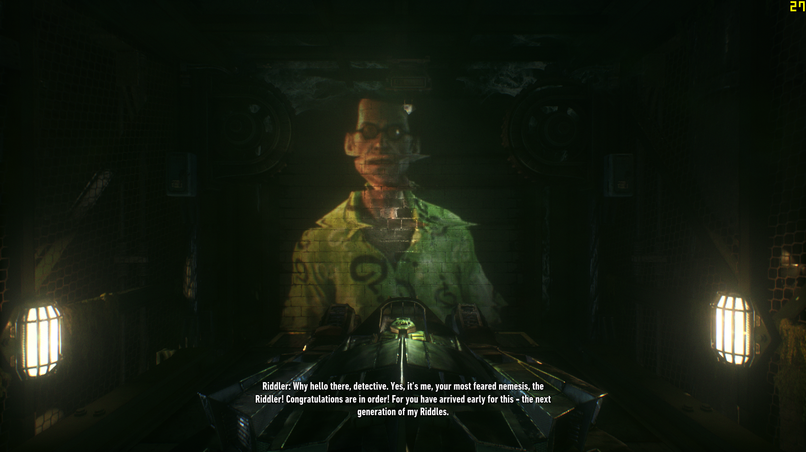
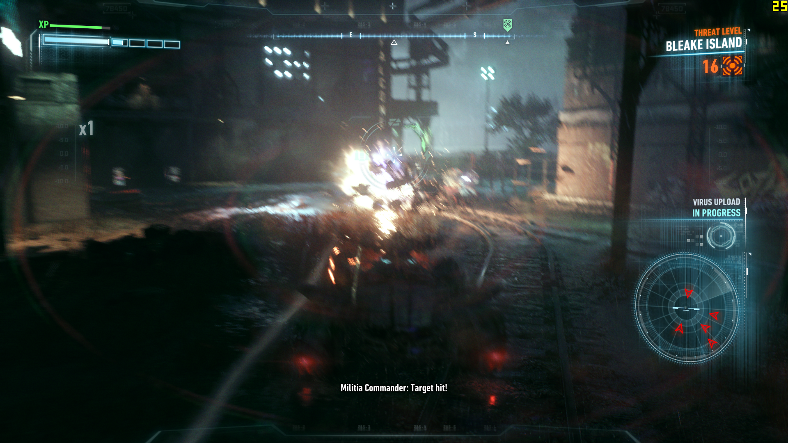
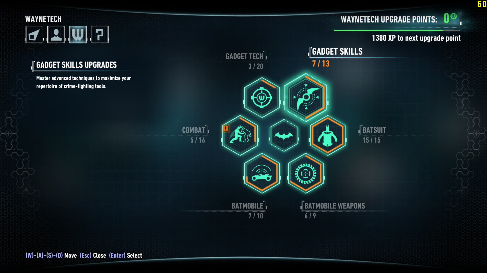
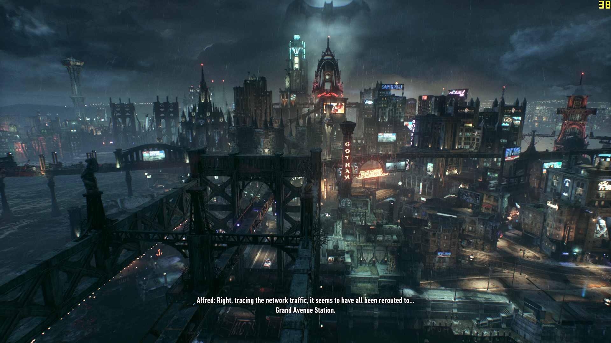
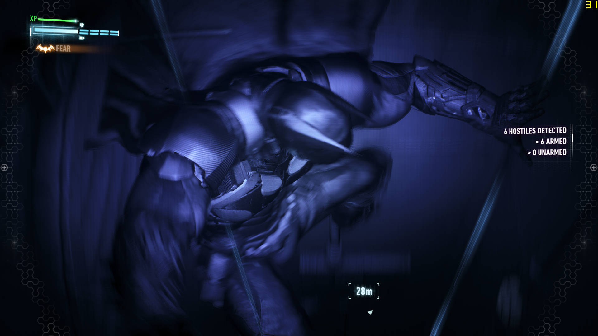
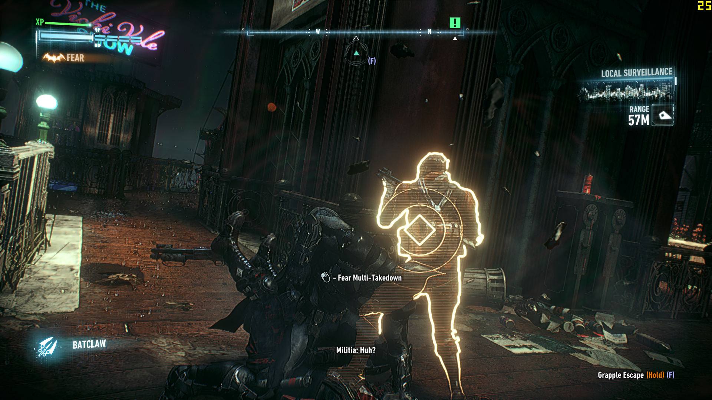
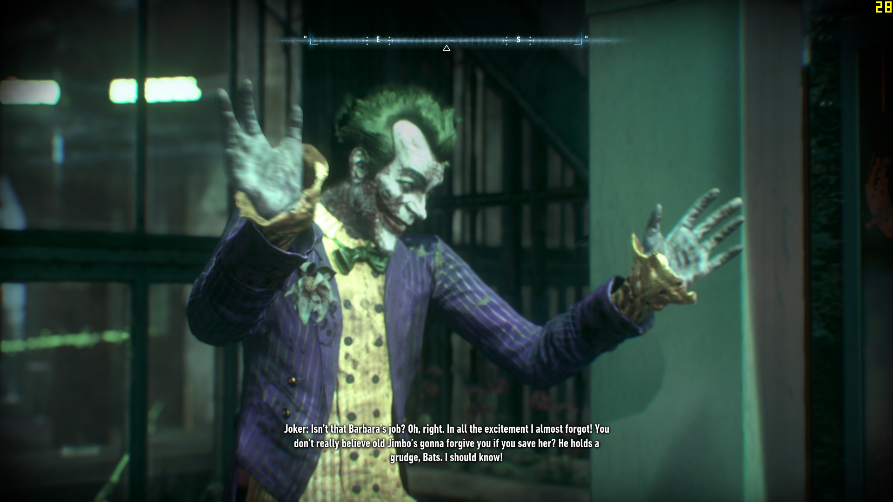
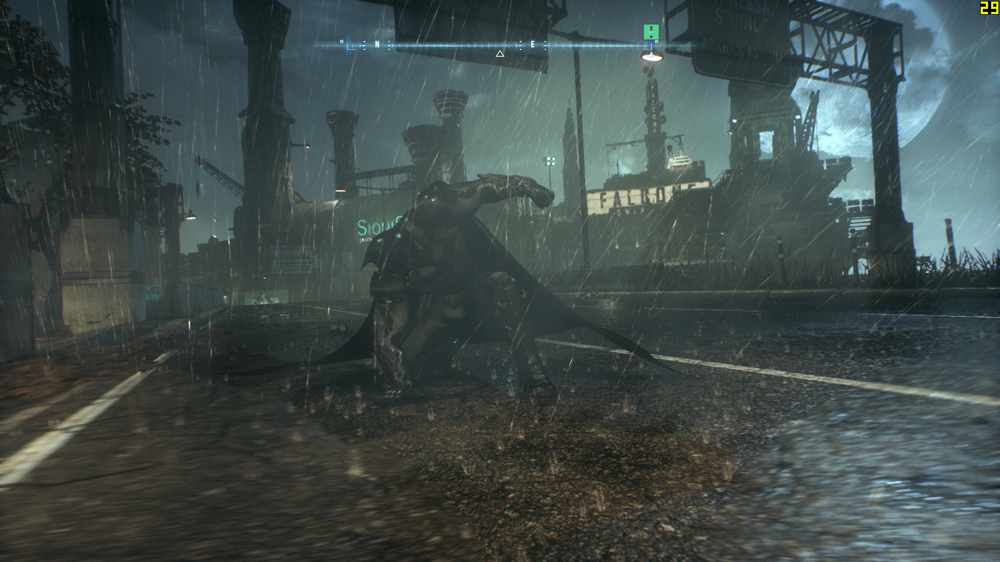

Hey gamers, it's time for a game review! The Arkham Series is one of the most epic game series till date. Why? Because BATMAN! That is way more than enough for a reason. Who doesn't want to adorn the black cape and be a vigilante?

Getting back to the game review, I will focus on the latest and the last installment to the series, "Batman: Arkham Knight". There is an introduction to a totally new character known as (yeah you guessed it correctly) Arkham Knight. Though I will not tell you who it is, but still let us get on with how the game overall is.

Firstly, after the initial release, there were a lot of complaints regarding the PC version, but frankly, I was not too pesky and bought myself a copy of the PC version.

I ran it on my laptop (Lenovo Y50-70, GTX860M 4GB GDDR5, 16GB RAM) and it ran almost like a dream, though there were a few stutters but it was playable. My framerate didn't drop below 25 but with a frame-cap of 30, I think I can live with that.

We are very much well-versed with the Arkham Games combat system, (Left Click-Attack, Right Click- Counter) but things became interesting with the introduction of the Fear-Takedowns. When you upgrade to them, they allow you to take down 4-5 enemies at once in a couple of seconds with points where the whole game slows down for you giving you precious seconds to decide the next victim of your attack.

As far as new additions in this version go, The new suit is simply amazing. Add Ironman to Batman, that's kind of how I can describe the suit of Batman in this game. Another addition is, the Batmobile. I mean, we have all been waiting for this moment, to drive that beast. In batman Origins, the map was huge and it did feel like we needed the Batmobile. It looks like Rocksteady granted us our wish with it in the latest one. Although it becomes boring when you have to fight off tanks in your Batmobile again and again whether you like it or not.

Next up, is graphics. OH MY GOD!!

I think someone sits there in Rocksteady studios who can amp-up the power of Unreal Engine 3. At first look, I felt it was made using the Unreal Engine 4, but they utilized the third one to it's max (maybe, Rocksteady, we want more) and the graphics have never been more gorgeous than this.

From the cloth simulation of Batman's cape to the tiny droplets of water that go flying off from his cape, destructible environment, dust particle quality, the texture resolution is just too amazing. Thanks to my system, I could run this at "High" setting. I can only imagine the quality on a console if I am so much amazed just playing the Batman Arkham Knight PC edition.
Voice acting is also amazing,

Bruce Wayne- Kevin Conroy

Commissioner Gordon- Jonathan Banks

Scarecrow- John Noble

Arkham Knight- I won't reveal that, else you will curse me for spoiling 😛
Those were the up-sides, now let's move on to the down-side.

In my opinion, you will not feel like playing the game again, once you get to know who is this Arkham Knight (trust me when I say it, you will not). The re playability of this game goes from 100 ( before you know who he is) to 0 ( after the reveal). Riddler puzzles, you will solve them but to find the trophies, it takes a lot if time. You would have the urge to find all of them, but in the end you will give up. Though people have found all and unlocked a secret ending, but still, it takes a hell lot of a time.

The final verdict:

The game is a good conclusion to the Arkham series. There are plenty of easter eggs and I missed a big thing, Joker. (I should not say anything more than that, find out yourself). Enjoy being Batman for one last time to save the city of Gotham, from Scarecrow and Arkham Knight to reveal who he is! PLAY TO FIND OUT!!
P.S.- An update allows the user to set the desired frame-rate lock i.e., 30,60 and 90

I kept mine locked at 30, I prefer a fixed framerate rather than a variable one, my system can go up to 60, but averages between 45-50, so I guess, I'll stick with 30 for now.

And while you are at it, here are some screenshots:

The Batmobile

 

Same Old Riddler 

 

Tank Battle (Mandatory)

 

Upgrades

Miagani Island

Grapple Into Grates

Fear Multi-Takedown

 

 

 

Surprise!!](https://wisdomgeek.com/wp-content/uploads/2015/09/BatmanAK-2015-09-06-18-10-34-59.bmp)

Style Bro!!](https://wisdomgeek.com/wp-content/uploads/2015/09/BatmanAK-2015-09-06-18-21-48-53.bmp)

 

What are you doing here now? Go and play Batman Arkham Knight now!
