It has been a while since I did a game review. Unfortunately, I did not get the opportunity to play any game that I wanted to review. But DOOM 4 was one game I definitely wanted to write about! So here is a review about the new Doom.

## History of Doom

Doom, the grandfather of all FPS games, the progenitor of this genre of video games, was first released in 1993 on MS-DOS. It was the most installed software on PCs apart from windows at that time. It was so popular that even [Bill Gates](https://www.youtube.com/watch?v=_JokM_fExpI) did a video on DOOM. After this, they made a port of Doom for windows 95. And Bill Gates even tried purchasing Id Software (Developer of the Doom and Quake series), but that did not happen.

Being a metalhead, this game was like a dream for me. Doom had the metal scores from all influential songs of that time,the most iconic of all being [At Doom's Gates](http://wisdomgeek.com/wp-content/uploads/2016/06/d_e1m1.mid). Doom was the perfect game in its own time with the hordes of demons coming to kill you and you. And you had a small arsenal of 9 weapons to save yourself. The most known one of these was the BFG 9000 (BFG literally means Big F****g Gun. And just for your information, I am not joking. This is a fact).

After the success of the game, Id Software wanted a sequel and thus came Doom 2 in 1994 which was kind of a conclusion to one of the most epic games at the time. Thereafter came Doom 3, which was good enough for its generation of games. But it could not capture the original doom feel and thus did not feel great by its own standards. In 2012, there was a rumor of a Doom 4 trapped in development hell. The game was kind of like Call Of Doom which you can see [here.](https://www.youtube.com/watch?v=XotQtkwowTQ) It was more of a generic shooter game, not at all DOOM. So, that project got scrapped and then came the masterpiece Doom 4, which has given life to the dying franchise. And hopefully, we will get to see a sequel too!

## Gameplay of Doom 4

Jumping to the gameplay, it is hard as nails on Ultra-violence (yes, that has been taken from the original thing). And you will have a hard time playing through Doom 4 if you are used to playing Call Of Duty or Battlefield. It simply is just not like those games. The play style can be summarized as a &#8216;Running and Gunning' shooter. You cannot afford to stand at one place and think that you would survive by shooting by standing at a single point. Doing so would be your biggest mistake.You have to run and aim on the go, jump in the air and aim, take a head shot while jumping or moving.

Doom 4 has a bit of old Doom mixed with the newer elements. There is no reload mechanism in the game (except for the super-shotgun). That is, if you have 200 bullets from you machine gun, you can empty all of it by keeping the button pressed. No reload required, or anything! Which is a pretty cool thing in my opinion. There are upgrades to be found in the game, just like the older games. Every level has a secret to be unlocked which gives you a weapon upgrade. These upgrades can be used to upgrade different weapon modules that can be found across the maps (do keep an eye out for these). And there are 2 Doomguy small models in every level which you have to find. And just a hint, they would not be present in the obvious places.

## What is new in Doom 4

On top of these, there is a suit upgrade, wherein your suit can have additional perks. For example, the suit will show the time your powerup will stay and other similar perks. And there is an &#8216;Argent Energy Upgrade', wherein you can max-out either your health/ammo/armor. For each Argent cell you get, you can upgrade any one of these by only one bar. And there are some secrets in the levels, which again will not be present in the obvious places (Not giving any spoilers on the secrets in this post).

Lastly, every level of Doom 4 will have a secret classic level somewhere in the game level which will be unlocked by a lever. Keep an eye out for demons as well as these levers and for your Praetor suits upgrades.

To take things further on the difficulty scale, the game includes a nightmare mode which is way more difficult than anything I have ever played! The mode includes dark souls. You can overcome a boss after your player level increases, but it is an altogether different story in nightmare mode in Doom 4. I have been playing Doom 4, the 2016 reboot for 49 hours and yet I have not managed to pass the tutorial type level of doom in nightmare mode. To make things even worse, you cannot switch difficulty as you can in other modes before this (namely- I'm too young to die, Hurt Me Plenty and Ultra-Violence). On the same note, there is another difficulty known as Ultra-Nightmare. And as the name suggests, this difficulty level in Doom 4 is as difficult as the nightmare mode only with a twist. It has permadeath, which means, you cannot afford death. If you die, well, game over. Start from the first level again.

The new Doom has got a feature known as glory kill. In this mode, when you stagger a demon, it will have a blue hue to it, to tell you that it has been staggered. And it also signifies that now is your chance to head in close and hit the glory kill button to fill yourself with satisfaction. This glory kill system is contextual, that is, every single kill would be different from the last one, depending on where you perform it and on which demon you are killing.

Onto the graphics of the game, they will leave you awestruck. Id Software has been a master at creating amazing textures since day 1, as can be seen from RAGE as well. But Doom 4 just blows it all away. The textures are so beautiful and this game has been coined as the most realistic any game can get in terms of graphics. The game utilizes the id Tech 6 engine, developed by John Carmack, the co-founder of Id Software.

Also, the music has also changed and feels much more aggressive as compared to the older version. Here's the new version of the same song [At Doom's Gate's](https://www.youtube.com/watch?v=j05hzwQf8pA), this is just a trailer, hear this out if you're an EDM or metal fan and then just do the math, that if this is just the intro song, what more the game will throw at you.

Comparision

At Doom Gate's- [OLD](http://wisdomgeek.com/wp-content/uploads/2016/06/d_e1m1.mid), [NEW](https://www.youtube.com/watch?v=j05hzwQf8pA)

## Similarities with the old Doom series

Alongside these, it is worthwhile to mention that we have 2 old friends back in this game. We have the Chainsaw and the good old trusty BFG-9000 back in the new Doom. They are not part of the standard arsenal and are special weapons with limited amount of ammo. Chainsaw has a fuel count of 3 to 7 and BFG has a count of 3. Whenever you are out of ammo, pull out your chainsaw and slice any demon you see. The chainsaw killings depend on your fuel, and each requires a different amount of it. On killing the demon with the chainsaw, you will see ammo flying out of the demon and refilling your stock which is an interesting piece of visual content for a gamer. Or if you are in a tight situation where you are being overwhelmed with demons, pull out your BFG and BANG! All demons will go back to the pits from where they crawled out.

Though there is no great revelation in the game, (as well all know what the story of doom is) but there are a few new things for you to see and feel. You will also have powerups on your way, like the old &#8216;Berserk', &#8216;Quad Damage' and a few new ones as &#8216;Haste' to speed you up. This is what I can tell you about the game without spoiling it. There are videos showing all the good old demons returning on YouTube if you want to check them out. Otherwise, just go and start playing the game to experience it. And it is worth noting that the game does not have recharging health bar or a rechargeable armor. You need to collect armor shards and health during the combat. So you need to plan out how to go about the arena and when to pick it up.

Multiplayer game is also pretty awesome. Multiplayer mode in Doom 4 is a fast-paced shooter, which is more like Halo with health, weapon pickups and armor. As in any other game, thearmor shards and health pickups respawn in multiplayer mode, but not in single player campaign. I have reached level 17  in multiplayer mode, just to give you a hint that there is a fair amount of levels in this mode.

## A great new addition to the game

There is a new addition in the game known as Doom SnapMap. This level editor helps players to create their own maps and publish them for others to play. You can recreate the E1M1:Hanger if you want, and you can let your imagination loose to see what weird levels you are capable of creating. Monsters, pickups, weapons, health and all other things including environment items can be placed according to your wish. And this is available on both PC and consoles and works similarly for both of these.

So, what are you waiting for? Doom 4 is the FPS we all deserve to play after a long time. And after 12 years of wait, our call has been answered finally and we have been greeted with the beautiful masterpiece. Here are a few screenshots in case you are still thinking of how the game looks like.

		
			#gallery-1 {
				margin: auto;
			}
			#gallery-1 .gallery-item {
				float: left;
				margin-top: 10px;
				text-align: center;
				width: 33%;
			}
			#gallery-1 img {
				border: 2px solid #cfcfcf;
			}
			#gallery-1 .gallery-caption {
				margin-left: 0;
			}
			/* see gallery_shortcode() in wp-includes/media.php */
		
		
			
				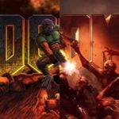
			
				
				DOOM 1993/2016
				
			
				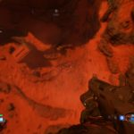
			
				
				No Fall Damage
				
			
				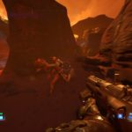
			
				
				Fast Paced Combat
				
			
				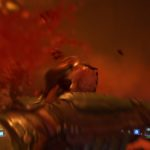
			
				
				Glory Kill
				
			
				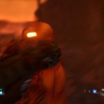
			
				
				Glory Kill IMP
				
			
				
			
				
				Map
				
			
				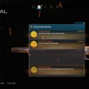
			
				
				Weapon Upgrade
				
			
				
			
				
				Praetor Suit Upgrade
				
			
				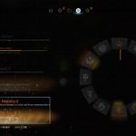
			
				
				Runes
				
			
				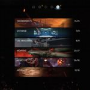
			
				
				The Data Log
				
			
				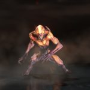
			
				
				Imp
				
			
				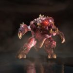
			
				
				Pinky
				
			
				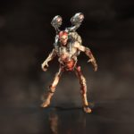
			
				
				Revenant
				
			
				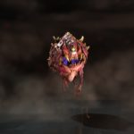
			
				
				Cacodemon
				
			
				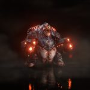
			
				
				Mancubus
				
			
				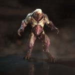
			
				
				Hell Knight
				
			
				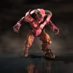
			
				
				Baron Of Hell
				
			
				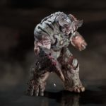
			
				
				CyberDemon
				
			
				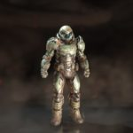
			
				
				Our Hero
				
			
				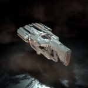
			
				
				BFG-9000
				
			
				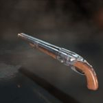
			
				
				Super Shotgun
				
			
				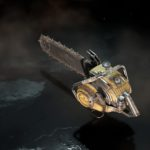
			
				
				Chainsaw
				
			
				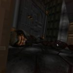
			
				
				Easter Egg
				
			
				
			
				
				Doom Guy Collectibles
				
		

Here is a look of what the game Doom 2016 looks like and you can get a feel of the gameplay in here:

https://www.youtube.com/watch?v=IKn3IPp6eS8

Now, go, play and send the legions of hell back to where they came from! Test out your FPS skills. And if you think you are awesome at playing a FPS game, try Doom 4 and see how much of it can you play. I dare you!

Hope you enjoy playing the game. Do let us know your favorite parts in the comments section below!
