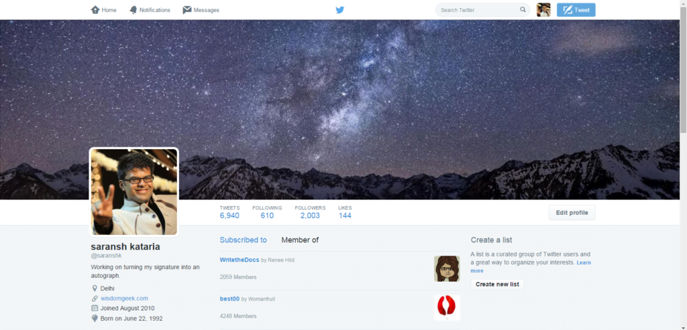

Lists are often ignored by most people on Twitter. Twitter lists can be a great way to organize your contacts. More often than not, they are not used for that purpose.

Someone recently added me to a Twitter list which was not appropriate for my account. There was no way to remove me from the list since it was not created by me. Hence I googled about a way to remove myself from the list and on finding not many articles, I wrote this post.

To know which lists you are subscribed to, you can simply go to your profile on the web, and click lists in the menu that shows on clicking your profile picture towards the right of your top bar. A page shows up wherein it shows tabs named "subscribed to" and "Member of".

## The steps to remove yourself from another person's Twitter list are pretty simple:

- Go to the list you have been added to

- Visit the profile of the person who created the list

- Block them for a few seconds

- Unblock them (if you wish to)

The steps mentioned are easy to follow. This will lead to you both unfollowing each other. Also, it is worth noting that this will remove you from all lists of the person's account. So if there is some list from the person you want to stay on, and some you don't, you might request the person to remove you instead of blocking them.

Another thing worth noting is that if the person deleted their account after creating the list, you need to [contact Twitter](https://help.twitter.com/en/contact-us) for assistance on the matter or wait for 90 days for the list to be removed (provided the person does not re-login in between).
