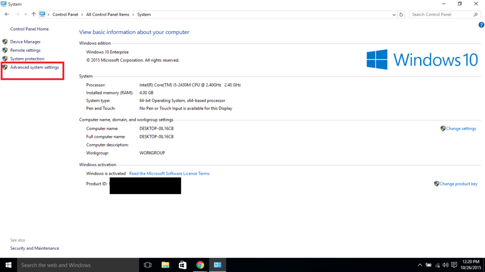
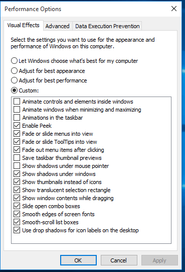

Everyone quickly jumped to Windows 10 considering it was a free upgrade and most of the response for the operating system has been good in comparison to what it was for the previous editions of Windows. But I personally found it to be a bit slow or maybe it was the fact that I ran Windows 10 on a machine which had lower RAM than the one which had Windows 7. Either ways, I was looking for ways to speed it up and I found a way to disable the animations in the operating system.

I am no fan of animations either, waiting for the nice touch of animations to roll in, feels more like a waste of time and might be user friendly to some people. But for me, it is a few annoying seconds added to loading something up. So if you are like me, and want the animations gone, thankfully you have the option to do so! Just go to Control Panel >  System > Advanced system Settings. In the Performance section, click on the settings button and play around with the animations you don't really want.

I disabled the first few animations and it did speed up a bit of my system. You can un-check others if you don't want them as well. They are self explanatory.

Once you are done, hit the start button and see how quickly it opens. This only helps if you are on a machine with lower RAM, if your system boasts of a huge RAM, you are better with the animations as they appeal nicely to most people.
