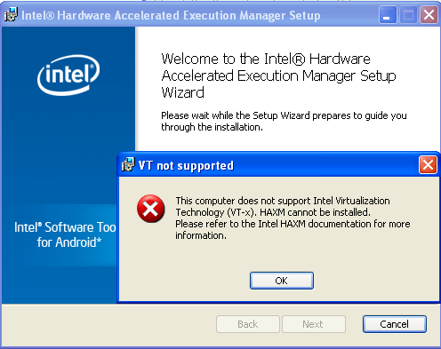
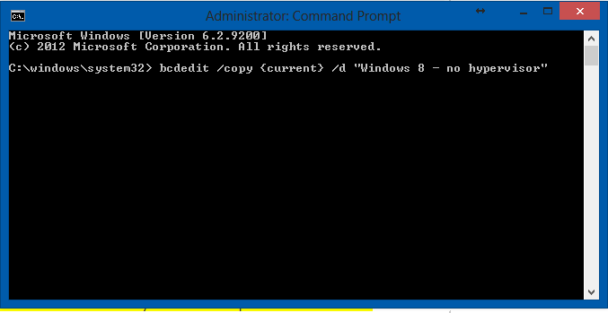

If you are into mobile application development and wanted to install both Hyper-V (Microsoft's hardware virtualization component) and HAXM (Intel's Hardware Execution Manager) on the same machine, chances are you probably faced an error on installing the second one after installing one. And who likes working on slow emulators when you can give them adrenaline shots using virtualization? Even though your computer supports virtualization, you might get an error saying you need to enable hardware assisted virtualization.

In my case, the error shown every time I installed HAXM was:

HAXM cannot be installed until VT-x is enabled

 

But my computer obviously did support virtualization since I was running Hyper-V. The problem was that HAXM and Hyper-V couldn't be installed at the same time. They both use hardware virtualization and only one can be active at a time since they both lock vt-x.

But I wanted a way which involved using both the virtualizations hyper-v and haxm. I did not want to completely disable one and work on the other only.

The solution to this problem was that I had to create a new boot entry to start Windows without hyper threading turned on in it. By doing so, I was able to resolve this error. I could have disabled Hyper-V altogether for this. But I had to do Windows Phone development at times too. Hence, I wanted both the options available on demand so as to be able to juggle between the two easily.

Essentially, what you have to do is edit your boot.ini file and add another option to start windows with Hyper-V turned off. Using this method, you can switch to the profile you want on boot, depending on whether you wish to do android development or Windows Phone development. Both emulators will be accelerated using the respective virtualization according to the entry selected.

Steps to do so are:

1. $1

Put in the command

bcdedit /copy {current} /d "Windows with hypervisor"

This step copies your current boot entry into a new one with a different name. You can name this profile to whatever you wish to, this is just the display name in the booting up section.
You can then type in the next command as

bcdedit /set "{current}" hypervisorlaunchtype off

which sets the hypervisor off for the current boot entry and then you can install HAXM for android development on this boot entry.

So after these steps, you can decide which profile to load at boot and then work accordingly on Android or Windows Phone development. Let us know any alternative ways in comments if you have any!
